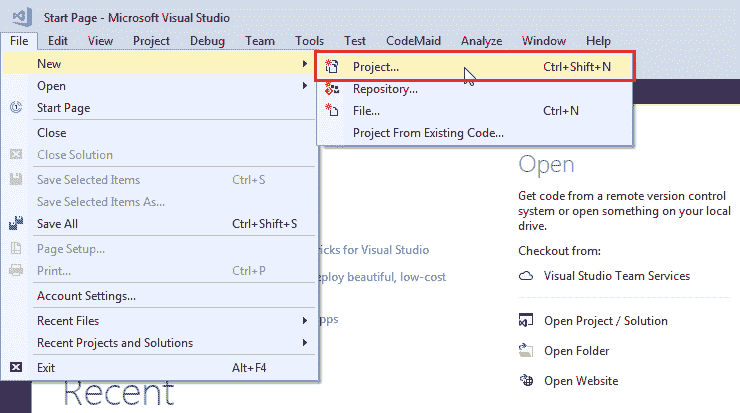
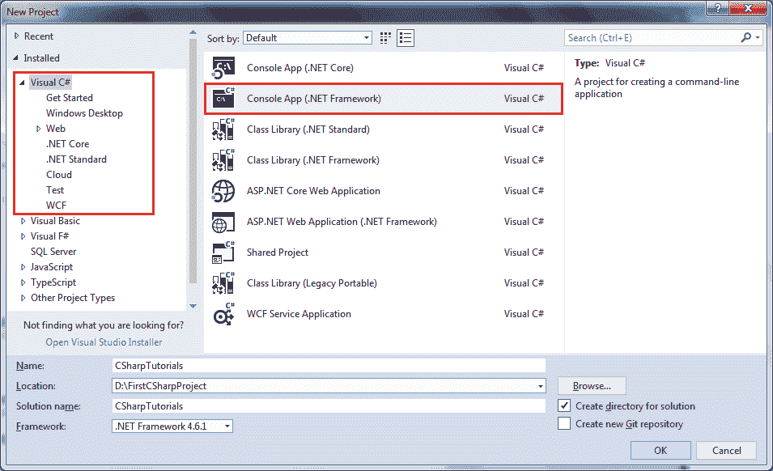
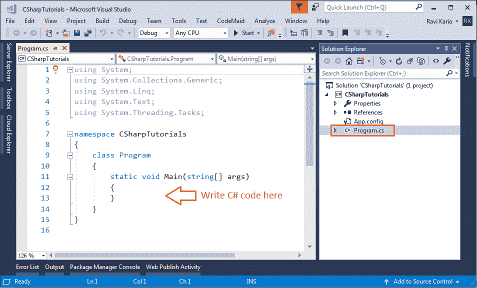
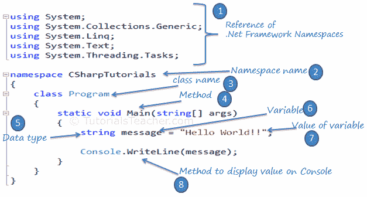

# 第一个 C# 程序

> 原文:[https://www . tutorial stearner . com/cs harp/first-cs harp-program](https://www.tutorialsteacher.com/csharp/first-csharp-program)

在这里，您将学习用 C# 创建一个简单的控制台应用程序，并了解控制台应用程序的基本构造块。

C# 可以用在基于窗口、基于 web 或控制台的应用程序中。首先，我们将创建一个控制台应用程序来使用 C#。

打开安装在本地计算机上的 Visual Studio (2017 或更高版本)。单击文件->新建项目...如下所示。

[](../../Content/images/csharp/create-project-in-visualstudio.png) 

Create a New Project in Visual Studio 2017


从如下所示的**新项目**弹出窗口中，选择左侧面板中的 Visual C# 并选择右侧面板中的控制台应用程序。

[](../../Content/images/csharp/create-csharp-console-project.png) 

Select Visual C# Console App Template


在“名称”部分，给出任何适当的项目名称、要创建所有项目文件的位置以及项目解决方案的名称。

单击“确定”创建控制台项目。 **Program.cs** 将在 Visual Studio 中默认创建一个 C# 文件，在这里可以在 Program 类中编写 C# 代码，如下图所示。(The。cs 是 C# 文件的文件扩展名。)

[](../../Content/images/csharp/csharp-program.png) 

C# Console Program


每个控制台应用程序都从`Program`类的`Main()`方法开始。以下示例显示“你好，世界！!"在控制台上。

Example: C# Console Application

```
using System;
using System.Collections.Generic;
using System.Linq;
using System.Text;
using System.Threading.Tasks;

namespace CSharpTutorials
{
    class Program
    {
        static void Main(string[] args)
        {
            string message = "Hello World!!";

            Console.WriteLine(message);
        }
    }
} 
```

下图说明了上述示例的重要部分。

[](../../Content/images/csharp/csharp-code-structure.png) 

C# Code Structure


让我们了解一下上面的 C# 结构。

1.  每一个。NET 应用程序引用了必要的。NET framework 命名空间，计划将其与`using`关键字一起使用，例如`using System.Text`。
2.  使用`namespace`关键字声明当前类的名称空间，例如`namespace CSharpTutorials.FirstProgram`
3.  然后我们使用`class`关键字`class Program` 声明了一个类
4.  `Main()`是`Program`类的一个方法，是控制台应用程序的入口点。
5.  `String`是数据类型。
6.  一个`message`是一个[变量](/csharp/csharp-variable)，它保存一个指定的[数据类型](/csharp/csharp-data-types)的值。
7.  `"Hello World!!"`是消息变量的值。
8.  `Console.WriteLine()`是一个静态方法，用于在控制台上显示一个文本。

*Note:**Every line or statement in C# must end with a semicolon (;).* *## 编译并运行 C# 程序

要查看上述 C# 程序的输出，我们必须编译它并运行它，方法是按 Ctrl + F5 或单击“运行”按钮，或者单击“调试”菜单并单击“开始而不调试”。您将在控制台中看到以下输出:

Output:<samp>Hello World!!</samp>

这是您可能会在每个 C# 代码中使用的基本代码项。*