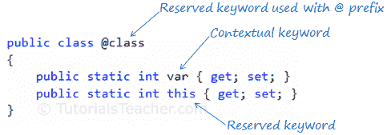

# C# 关键字

> 原文：<https://www.tutorialsteacher.com/csharp/csharp-keywords>

C# 包含对编译器有特殊意义的保留字。这些保留的词被称为“关键字”。关键字不能用作标识符(变量、类、接口等的名称。).

C# 中的关键字分为以下几类:

## 修饰符关键字

修饰符关键字是指示谁可以修改类型和类型成员的特定关键字。修饰符允许或阻止程序的某些部分被其他部分修改。

| 修饰符关键字 |
| --- |
| 摘要 |
| 异步ˌ非同步(asynchronous) |
| 常数 |
| [事件](/csharp/csharp-event)T2】 |
| 走读生 |
| 新的 |
| 推翻 |
| [偏](/csharp/csharp-partial-class)T2】 |
| 只读的 |
| 密封的 |
| [静](/csharp/csharp-static)T2】 |
| 危险的 |
| 虚拟的 |
| 不稳定的 |

## 访问修饰符关键字:

访问修饰符应用于类、方法、属性、字段和其他成员的声明。它们定义了类及其成员的可访问性。

| 访问修饰符 | 使用 |
| --- | --- |
| 公众的 | Public 修饰符允许同一程序集或另一个程序集中的程序的任何部分访问该类型及其成员。 |
| 私人的 | Private 修饰符限制程序的其他部分访问该类型及其成员。只有同一类或结构中的代码才能访问它。 |
| 内部的 | 内部修饰符允许同一程序集中的其他程序代码访问该类型或其成员。如果未指定修饰符，这是默认的访问修饰符。 |
| 保护 | Protected 修饰符允许同一类或从该类派生的类中的代码访问该类型或其成员。 |

## 语句关键字

语句关键字与程序流相关。

| 语句关键字 |
| --- |
| [如果](/csharp/csharp-if-else)T2】 |
| [其他](/csharp/csharp-if-else)T2】 |
| [开关](/csharp/csharp-switch) |
| 情况 |
| [做](/csharp/csharp-do-while-loop)T2】 |
| [为](/csharp/csharp-for-loop) |
| 为每一个 |
| 在 |
| [而](/csharp/csharp-while-loop)则是 |
| 破裂 |
| 继续 |
| 系统默认值 |
| 转到 |
| 返回 |
| 产量 |
| [扔](/csharp/throw-csharp)T2】 |
| 尝试 |
| 捕捉 |
| 最后 |
| 检查 |
| 未加抑制的 |
| 固定的；不变的 |
| 锁 |

## 方法参数关键字

这些关键字应用于方法的参数。

| 方法参数关键字 |
| --- |
| 参数 |
| 裁判员 |
| [灭](/articles/out-keyword-in-csharp "Learn how to use out keyword in C#")T2】 |

## 命名空间关键字

这些关键字与名称空间和相关运算符一起应用。

| 命名空间关键字 |
| --- |
| 使用 |
| 。操作员 |
| *操作员 |
| 外部别名 |

## 操作员关键字

操作员关键字执行各种操作。

| 操作员关键字 |
| --- |
| 如同 |
| 等待 |
| 存在 |
| 新的 |
| 西泽夫 |
| 类型 |
| 斯戴克 |
| 检查 |
| 未加抑制的 |

## 访问关键字

访问关键字用于访问对象或类的包含类或基类。

| 访问关键字 |
| --- |
| 基础 |
| 这 |

## 文字关键字

文字关键字应用于对象的当前实例或值。

| 文字关键字 |
| --- |
| 空 |
| 错误的 |
| 真实的 |
| 价值 |
| 空的 |

## 键入关键字

类型关键字用于数据类型。

| 键入关键字 |
| --- |
| 弯曲件 |
| 字节 |
| 茶 |
| 班级 |
| 小数 |
| 两倍 |
| 列举型别 |
| 漂浮物 |
| （同 Internationalorganizations）国际组织 |
| 长的 |
| sbyte(字节) |
| 短的 |
| 线 |
| 结构体 |
| 无符号整型 |
| 乌龙！乌龙 |
| 乌肖特 |

## 上下文关键字

上下文关键字被认为是关键字，只有在特定的上下文中使用。它们不是保留的，因此可以用作名称或标识符。

| 上下文关键字 |
| --- |
| 增加 |
| 定义变量 |
| 动态的 |
| 全球的 |
| 设置 |
| 价值 |

当上下文关键字在 visual studio 中用作标识符时，不会转换为蓝色(Visual Studio 中关键字的默认颜色)。例如，下图中的 var 不是蓝色的，而它的颜色是蓝色。所以 var 是一个上下文关键字。

[](../../Content/images/csharp/keywords-in-vs.png "C# Keywords color in Visual Studio") 

C# Keywords


## 查询关键字

查询关键字是 LINQ 查询中使用的上下文关键字。

| 查询关键字 |
| --- |
| 从 |
| 在哪里 |
| 挑选 |
| 组 |
| 到…里面 |
| 排序依据 |
| 加入 |
| 让 |
| 在 |
| 在 |
| 等于 |
| 经过 |
| 上升的 |
| 下降 |

如上所述，关键字不能用作标识符(变量、类、接口等的名称。).但是，它们可以与前缀“@”一起使用。例如，类是一个保留的关键字，因此不能用作标识符，但是可以使用@class，如下所示。

Example: Use Keyword as Identifier

```
public class @class
{
    public static int MyProperty { get; set; }
}

@class.MyProperty = 100; 
```

访问 MSDN 了解更多关于[关键字](https://msdn.microsoft.com/en-us/library/x53a06bb.aspx "Keywords on MSDN")的信息。