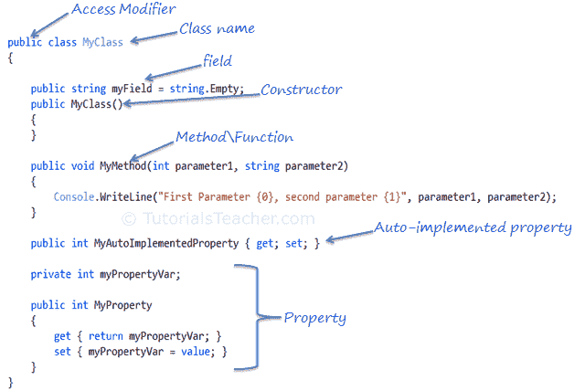

# C# 类

> 原文:[https://www.tutorialsteacher.com/csharp/csharp-class](https://www.tutorialsteacher.com/csharp/csharp-class)

一个类就像一个特定对象的蓝图。在现实世界中，每个物体都有一些颜色、形状和功能——例如，豪华汽车法拉利。法拉利是豪华车类型的一个对象。豪华车是指速度、颜色、外形、内饰等特征的一类。因此，任何一家制造符合这些要求的汽车的公司都是豪华车类型的对象。例如，宝马、兰博基尼、凯迪拉克的每一辆车都是“豪华车”的对象。在这里，‘豪华车’是一个阶级，每一辆实体车都是豪华车阶级的对象。

同样，在面向对象编程中，类定义了一些属性、字段、事件、方法等。类定义了数据的种类和它们的对象将具有的功能。

类使您能够通过对其他类型、方法和事件的变量进行分组来创建自定义类型。

在 C# 中，可以使用 class 关键字定义一个类。

Example: C# Class

```
public class MyClass
{
    public string  myField = string.Empty;

    public MyClass()
    {
    }

    public void MyMethod(int parameter1, string parameter2)
    {
        Console.WriteLine("First Parameter {0}, second parameter {1}", 
                                                    parameter1, parameter2);
    }

    public int MyAutoImplementedProperty { get; set; }

    private int myPropertyVar;

    public int MyProperty
    {
        get { return myPropertyVar; }
        set { myPropertyVar = value; }
    } 
} 
```

下图显示了 C# 类的重要构建块。

<figure>[](../../Content/images/csharp/csharp-class.png)

<figcaption>C# Class</figcaption>

</figure>

## C# 访问修饰符

访问修饰符应用于类、方法、属性、字段和其他成员的声明。它们定义了类及其成员的可访问性。公共、私有、受保护和内部是 C# 中的访问修饰符。我们将在[关键词](/csharp/csharp-keywords "C# keywords")部分了解。

## C# 字段

该字段是保存值的类级变量。通常，字段成员应该具有私有访问修饰符，并与属性一起使用。

## C# 构造函数

一个类可以有参数化或无参数的构造函数。创建类的实例时，将调用构造函数。可以使用访问修饰符和类名来定义构造函数:`<access modifiers> <class name>(){ }`

Example: Constructor in C#

```
class MyClass
{
    public MyClass()
    {

    }
} 
```

## C# 方法

可以使用以下模板定义方法:

`{access modifier} {return type} MethodName({parameterType parameterName})`

Example: Method in C#

```
public void MyMethod(int parameter1, string parameter2)
{
    // write your method code here.. 

} 
```

## 财产

属性可以使用 getters 和 setters 来定义，如下所示:

Example: Property in C#

```
private int _myPropertyVar;

public int MyProperty
{
    get { return _myPropertyVar; }
    set { _myPropertyVar = value; }
} 
```

属性封装一个私有字段。它提供 getter(get { })来检索基础字段的值，并提供 setter(set { })来设置基础字段的值。在上面的例子中，_myPropertyVar 是一个不能直接访问的私有字段。它只能通过 MyProperty 访问。因此，MyProperty 封装了 _myPropertyVar。

您还可以在 get 和 set 中应用一些额外的逻辑，如下例所示。

Example: Property in C#

```
private int _myPropertyVar;

public int MyProperty
{
    get {
        return _myPropertyVar / 2;
    }

    set {
        if (value > 100)
            _myPropertyVar = 100;
        else
            _myPropertyVar = value; ;
    }
} 
```

## 自动实现的属性

从 C# 3.0 开始，如果您不想在 get 或 set 中应用一些逻辑，那么属性声明就变得很容易了。

以下是自动实现的属性的示例:

Example: Auto implemented property in C#

```
public int MyAutoImplementedProperty { get; set; } 
```

请注意，在上面的属性示例中没有私有后备字段。后备字段将由编译器自动创建。您可以像使用类的普通属性一样使用自动属性。当属性访问器中不需要额外的逻辑时，自动实现的属性只是为了方便地声明属性。

## 命名空间

命名空间是一组相关类和命名空间的容器。命名空间还用于为命名空间名称中的类赋予唯一的名称。命名空间和类用点(。).

在 C# 中，可以使用 namespace 关键字定义命名空间。

Example: Namespace

```
namespace CSharpTutorials
{
    class MyClass
    {

    }
} 
```

在上例中，`MyClass`的全限定类名为`CSharpTutorials.MyClass`。

一个命名空间可以包含其他命名空间。内部命名空间可以使用(。).

Example: Namespace

```
namespace CSharpTutorials.Examples
{
    class MyClassExample
    {

    }
} 
```

在上例中，`MyClassExample`的全限定类名为`CSharpTutorials.Examples.MyClassExample`。