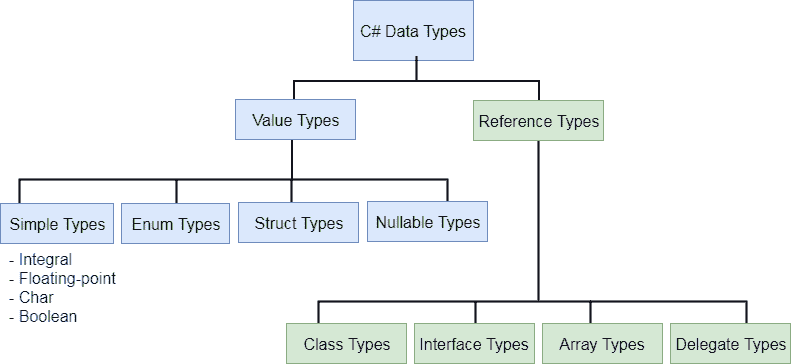

# C# 数据类型

> 原文：<https://www.tutorialsteacher.com/csharp/csharp-data-types>

C# 是一种强类型语言。这意味着我们必须声明一个变量的类型，该类型指示它将要存储的值的种类，例如整数、浮点、十进制、文本等。

下面声明并初始化了不同数据类型的变量。

Example: Variables of Different Data Types

```cs
string stringVar = "Hello World!!";
int intVar = 100;
float floatVar = 10.2f;
char charVar = 'A';
bool boolVar = true; 
```

C# 主要将数据类型分为两类:值类型和引用类型。值类型包括简单类型(如 int、float、bool 和 char)、枚举类型、结构类型和可空值类型。引用类型包括类类型、接口类型、委托类型和数组类型。下一章详细了解[值类型和引用类型](/csharp/csharp-value-type-and-reference-type)。



## C# 中的预定义数据类型

C# 包括一些预定义的值类型和引用类型。下表列出了预定义的数据类型:

| 类型 | 描述 | 范围 | 后缀 |
| --- | --- | --- | --- |
| 字节 | 8 位无符号整数 | 0 到 255 |  |
| sbyte(字节) | 8 位有符号整数 | -128 到 127 |  |
| 短的 | 16 位有符号整数 | -32，768 至 32，767 |  |
| 乌肖特 | 16 位无符号整数 | 0 至 65，535 |  |
| （同 Internationalorganizations）国际组织 | 32 位有符号整数 | -2，147，483，648
至
2，147，483，647 |  |
| 无符号整型 | 32 位无符号整数 | 0 至 4，294，967，295 | u |
| 长的 | 64 位有符号整数 | -9，223，372，036，854，775，808
至
9，223，372，036，854，775，807 | l |
| 乌龙！乌龙 | 64 位无符号整数 | 0 至 18，446，744，073，709，551，615 | 保险商实验所 |
| 漂浮物 | 32 位单精度浮点类型 | -3.402823e38 至 3.402823e38 | f |
| 两倍 | 64 位双精度浮点类型 | -1 比 1。58860 . 88888888861 | d |
| 小数 | 用于金融和货币计算的 128 位十进制类型 | (+或-)1.0 x 10e-28
至
7.9 x 10e28 | m |
| 茶 | 16 位单个 Unicode 字符 | 任何有效的字符，例如，*、\x0058(十六进制)或\u0058 (Unicode) |  |
| 弯曲件 | 8 位逻辑真/假值 | 真或假 |  |
| 目标 | 所有其他类型的基本类型。 |  |  |
| 线 | Unicode 字符序列 |  |  |
| 日期时间 | 表示日期和时间 | 0:00:00am 1/1/01
至
11:59:59pm 12/31/9999 |  |

如上表所示，每个数据类型(除了字符串和对象)都包含值域。如果值超出数据类型的允许范围，编译器将给出一个错误。例如，int 数据类型的范围是-2，147，483，648 到 2，147，483，647。所以如果你赋值的值不在这个范围内，那么编译器会给出一个错误。

Example: Compile time error

```cs
// compile time error: Cannot implicitly convert type 'long' to 'int'.
int i = 21474836470; 
```

无符号整数、长整型、浮点型、双精度型和十进制类型的值必须分别以 u、l、f、d 和 m 作为后缀。

Example: Value Suffix

```cs
uint ui = 100u;
float fl = 10.2f;
long l = 45755452222222l;
ulong ul = 45755452222222ul;
double d = 11452222.555d;
decimal mon = 1000.15m; 
```

## 别名与网络类型

预定义的数据类型是它们的别名 .NET 类型(CLR 类)名称。下表列出了预定义数据类型和相关数据类型的别名 .NET 类名。

| 别名 | 。网络类型 | 类型 |
| --- | --- | --- |
| 字节 | 系统。字节 | 结构体 |
| sbyte(字节) | 系统。资料型别 | 结构体 |
| （同 Internationalorganizations）国际组织 | 系统。Int32 | 结构体 |
| 无符号整型 | 系统。UInt32 | 结构体 |
| 短的 | 系统。Int16 | 结构体 |
| 乌肖特 | 系统。UInt16 | 结构体 |
| 长的 | 系统。Int64 | 结构体 |
| 乌龙！乌龙 | 系统。UInt64 | 结构体 |
| 漂浮物 | 系统。单一的 | 结构体 |
| 两倍 | 系统。两倍 | 结构体 |
| 茶 | 系统。茶 | 结构体 |
| 弯曲件 | 系统。布尔代数学体系的 | 结构体 |
| 目标 | 系统。目标 | 班级 |
| 线 | 系统。线 | 班级 |
| 小数 | 系统。小数 | 结构体 |
| 日期时间 | 系统。日期时间 | 结构体 |

意思是无论定义`int`还是`Int32`的变量，都是一样的。

```cs
int i = 345;
Int32 i = 345;// same as above 
```

## 默认值

每种数据类型都有默认值。数值类型为 0，布尔值为假，字符的默认值为`'\0'`。使用`default(typename)`指定数据类型的默认值，或者从 C# 7.1 开始，使用[默认文字](https://docs.microsoft.com/en-us/dotnet/csharp/language-reference/operators/default#default-literal)。

```cs
int i = default(int); // 0
float f = default(float);// 0
decimal d = default(decimal);// 0
bool b = default(bool);// false
char c = default(char);// '\0'

// C# 7.1 onwards
int i = default; // 0
float f = default;// 0
decimal d = default;// 0
bool b = default;// false
char c = default;// '\0' 
```

## 转换策略

在 C# 中，某些数据类型的值会自动转换为不同的数据类型。这被称为隐式转换。

Example: Implicit Conversion

```cs
int i = 345;
float f = i;

Console.WriteLine(f); //output: 345 
```

在上面的例子中，整型变量`i`的值被分配给浮点型变量`f`，因为这个转换操作是在 C# 中预先定义的。

下面是一个隐式数据类型转换表。

| 隐式转换自 | 到 |
| --- | --- |
| sbyte(字节) | short、int、long、float、double、decimal |
| 字节 | short、ushort、int、uint、long、ulong、float、double、decimal |
| 短的 | int、long、float、double 或 decimal |
| 乌肖特 | int、uint、long、ulong、float、double 或 decimal |
| （同 Internationalorganizations）国际组织 | 长整型、浮点型、双精度型或十进制。 |
| 无符号整型 | long、ulong、float、double 或 decimal |
| 长的 | 浮点、双精度或十进制 |
| 乌龙！乌龙 | 浮点、双精度或十进制 |
| 茶 | ushort、int、uint、long、ulong、float、double 或 decimal |
| 漂浮物 | 两倍 |

从 int、uint、long 或 ulong 到 float 以及从 long 或 ulong 到 double 的转换可能会导致精度损失。没有数据类型隐式转换为字符类型。

但是，并非所有数据类型都隐式转换为其他数据类型。例如，int 类型不能隐式转换为 uint。必须明确指定，如下所示。

Example: Explicit Conversion

```cs
public static void Main()
{
    int i = 100;
    uint u = (uint) i;
    Console.Write(i);
} 
```

在上例中，通过在括号(uint)中指定 uint，整数`i`被显式转换为 uint。这将把一个整数转换成 uint。

*Further Reading* **   [在 C#](/articles/convert-string-to-int) 中将字符串转换为整数。
*   [c# 中的装箱拆箱](/articles/boxing-unboxing-in-csharp)。
*   [转换](https://docs.microsoft.com/en-us/dotnet/csharp/language-reference/language-specification/conversions)*