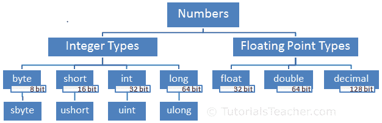

# C# 中的数字

> 原文:[https://www.tutorialsteacher.com/csharp/numbers](https://www.tutorialsteacher.com/csharp/numbers)

一般来说，数字可以分为两种类型:整数类型和浮点类型。

**整数型**数字是没有小数点的整数。它可以是负数或正数。

**浮点型**是有一个或多个小数点的数字。它可以是负数或正数。

C# 根据整数类型和浮点类型在内存中的大小以及存储数字的容量，为它们包含不同的数据类型。

下图说明了 C# 中的数字类型。

<figure>[](../../Content/images/csharp/numbers.PNG) 

<figcaption>Numeric Types</figcaption>

</figure>

## 整数类型

整数类型的数字是不带小数点的正整数或负整数。C# 包含整数的四种数据类型:字节、短整型、整型和长整型。

## 字节

字节数据类型存储从 0 到 255 的数字。它在内存中占据 8 位。字节关键字是. net 中[字节](https://docs.microsoft.com/en-us/dotnet/api/system.byte)结构的别名

sbyte 与 byte 相同，但它可以存储-128 到 127 之间的负数。sbyte 关键字是. net 中 [SByte](https://docs.microsoft.com/en-us/dotnet/api/system.sbyte) 结构的别名

Example: byte, sbyte

```
byte b1 = 255;
byte b2 = -128;// compile-time error: Constant value '-128' cannot be converted to a 'byte'
sbyte sb1 = -128; 
sbyte sb2 = 127; 

Console.WriteLine(Byte.MaxValue);//255
Console.WriteLine(Byte.MinValue);//0
Console.WriteLine(SByte.MaxValue);//127
Console.WriteLine(SByte.MinValue);//-128 
```

## 短的

短数据类型是有符号整数，可以存储-32，768 到 32，767 之间的数字。它占用 16 位内存。短关键字是. NET 中 结构的别名

ushort 数据类型是一个无符号整数。它只能存储 0 到 65，535 之间的正数。ushort 关键字是. NET 中 结构的别名

Example: short, ushort

```
short s1 = -32768;
short s2 = 32767;
short s3 = 35000;//Compile-time error: Constant value '35000' cannot be converted to a 'short'

ushort us1 = 65535;
ushort us2 = -32000; //Compile-time error: Constant value '-32000' cannot be converted to a 'ushort'

Console.WriteLine(Int16.MaxValue);//32767
Console.WriteLine(Int16.MinValue);//-32768
Console.WriteLine(UInt16.MaxValue);//65535
Console.WriteLine(UInt16.MinValue);//0 
```

## （同 Internationalorganizations）国际组织

int 数据类型是 32 位有符号整数。它可以存储从-2，147，483，648 到 2，147，483，647 的数字。int 关键字是. NET. 中 [Int32](https://docs.microsoft.com/en-us/dotnet/api/system.int32) 结构的别名

uint 是 32 位无符号整数。uint 关键字是. NET 中 [UInt32](https://docs.microsoft.com/en-us/dotnet/api/system.uint32) 结构的别名，可以存储 0 到 4，294，967，295 之间的正数。可选地，在数字后使用 U 或 U 后缀将其分配给 uint 变量。

Example: int, uint

```
int i = -2147483648;
int j = 2147483647;
int k = 4294967295; //Compile-time error: Cannot implicitly convert type 'uint' to 'int'.

uint ui1 = 4294967295;
uint ui2 =-1; //Compile-time error: Constant value '-1' cannot be converted to a 'uint'

Console.WriteLine(Int32.MaxValue);//2147483647
Console.WriteLine(Int32.MinValue);//-2147483648
Console.WriteLine(UInt32.MaxValue);//4294967295
Console.WriteLine(UInt32.MinValue);//0 
```

int 数据类型也用于十六进制和二进制数字。十六进制数以 0x 或 0X 前缀开头。从 C# 7.2 开始，二进制数以 0b 或 0B 开头。

Example: Hexadecimal, Binary

```
int hex = 0x2F;
int binary = 0b_0010_1111;

Console.WriteLine(hex);
Console.WriteLine(binary); 
```

## 长的

长类型是 64 位有符号整数。它可以存储从-9，223，372，036，854，775，808 到 9，223，372，036，854，775，807 的数字。使用带数字的 L 或 L 后缀将其赋给长类型变量。long 关键字是. NET 中 结构的别名 [Int64](https://docs.microsoft.com/en-us/dotnet/api/system.int64)

ulong 类型存储从 0 到 18，446，744，073，709，551，615 的正数。如果一个数字以、UL、uL、Ul、Lu、lU、lu 或 LU 为后缀，那么它的类型就是 ulong。uint 关键字是. NET. 中 [UInt64](https://docs.microsoft.com/en-us/dotnet/api/system.uint64) 结构的别名

Example: long, ulong

```
long l1 = -9223372036854775808;
long l2 = 9223372036854775807;

ulong ul1 = 18223372036854775808ul;
ulong ul2 = 18223372036854775808UL;

Console.WriteLine(Int64.MaxValue);//9223372036854775807
Console.WriteLine(Int64.MinValue);//-9223372036854775808
Console.WriteLine(UInt64.MaxValue);//18446744073709551615
Console.WriteLine(UInt64.MinValue);//0 
```

## 浮点类型

浮点数是有一个或多个小数点的正数或负数。C# 包括三种浮点数数据类型:浮点数、双精度浮点数和十进制浮点数。

## 浮动

浮点数据类型可以存储从 3.4e 038 到 3.4e+038 的小数。它在内存中占据 4 个字节。float 关键字是. NET 中 [Single](https://docs.microsoft.com/en-us/dotnet/api/system.single) 结构的别名

使用带有文字的 F 或 F 后缀使其成为浮点类型。

Example: float

```
float f1 = 123456.5F;
float f2 = 1.123456f;

Console.WriteLine(f1);//123456.5
Console.WriteLine(f2);//1.123456 
```

## 两倍

双数据类型可以存储从 1.7e 308 到 1.7e+308 的小数。它在内存中占据 8 个字节。double 关键字是. net 中 [Double](https://docs.microsoft.com/en-us/dotnet/api/system.double) 结构的别名

使用带文字的 D 或 D 后缀，使其为双精度类型。

Example: double

```
double d1 = 12345678912345.5d;
double d2 = 1.123456789123456d;

Console.WriteLine(d1);//12345678912345.5
Console.WriteLine(d2);//1.123456789123456 
```

## 小数

十进制数据类型可以存储从 1.0 x 10-28 到 7.9228 x 1028 的小数。它在内存中占据 16 个字节。小数是. NET. 中[小数](https://docs.microsoft.com/en-us/dotnet/api/system.decimal)结构的关键字别名

十进制类型比浮点和双精度类型具有更高的精度和更小的范围，因此适用于金融和货币计算。

使用带文字的 M 或 M 后缀使其成为十进制类型。

Example: decimal

```
decimal d1 = 123456789123456789123456789.5m;
decimal d2 = 1.1234567891345679123456789123m;

Console.WriteLine(d1);
Console.WriteLine(d2); 
```

## 科学符号

用 E 或 E 表示 10 的幂，作为科学记数法的指数部分，用浮点数、双精度或十进制表示。

Example:

```
double d = 0.12e2;
Console.WriteLine(d);  // 12;

float f = 123.45e-2f;
Console.WriteLine(f);  // 1.2345

decimal m = 1.2e6m;
Console.WriteLine(m);// 1200000 
```