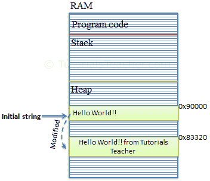
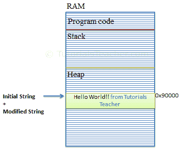

# C# 字符串构建器

> 原文：<https://www.tutorialsteacher.com/csharp/csharp-stringbuilder>

* * *

Updated on: <time datetime="2020-06-26">June 26, 2020</time>

* * *

在 C# 中，字符串类型是不可变的。这意味着字符串一旦创建就不能更改。例如，新字符串`"Hello World!"`将占用堆上的内存空间。 现在，通过将初始字符串`"Hello World!"`更改为`"Hello World! from Tutorials Teacher"`，将在内存堆上创建一个新的字符串对象，而不是在同一内存地址修改原始字符串。 如果原始字符串通过替换、追加、移除或在原始字符串中插入新字符串而多次更改，此行为将会妨碍性能。

[](../../Content/images/csharp/string-memory.png)

Memory Allocation for String Object


为了解决这个问题，C# 在[系统中引入了`StringBuilder`。正文](https://docs.microsoft.com/en-us/dotnet/api/system.text)命名空间。 `StringBuilder`不会在内存中创建新对象，而是动态扩展内存以容纳修改后的字符串。

[](../../Content/images/csharp/stringbuilder-memory.png)

Memory Allocation for StringBuilder Object


## 创建字符串生成器对象

您可以使用`new`关键字并传递初始字符串来创建`StringBuilder`类的对象。 以下示例演示了创建`StringBuilder`对象。

Example: StringBuilder

```cs
using System.Text; // include at the top

StringBuilder sb = new StringBuilder(); //string will be appended later
//or
StringBuilder sb = new StringBuilder("Hello World!"); 
```

或者，您也可以使用重载构造器指定`StringBuilder`对象的最大容量，如下所示。

Example: StringBuilder

```cs
StringBuilder sb = new StringBuilder(50); //string will be appended later
//or
StringBuilder sb = new StringBuilder("Hello World!", 50); 
```

上图中，C# 在内存堆中顺序分配最多 50 个空间。一旦达到指定容量，该容量将自动翻倍。您也可以使用`capacity`或`length`属性来设置或检索`StringBuilder`对象的容量。

您可以使用循环的[来迭代，以获取或设置指定索引处的字符。](/csharp/csharp-for-loop)

Example: StringBuilder Iteration

```cs
StringBuilder sb = new StringBuilder("Hello World!");

for(int i = 0; i < sb.Length; i++)
    Console.Write(sb[i]); // output: Hello World! 
```

## 从字符串生成器中检索字符串

`StringBuilder`不是`string`。 使用`ToString()`方法从`StringBuilder`对象中检索一个`string`。

Example: Retrieve String from StringBuilder

```cs
StringBuilder sb = new StringBuilder("Hello World!");

var greet = sb.ToString(); //returns "Hello World!" 
```

## 向字符串生成器添加/追加字符串

使用`Append()`方法在当前`StringBuilder`对象的末尾追加一个字符串。如果一个`StringBuilder`还没有包含任何字符串，它会添加它。 方法在末尾追加一个带有换行符的字符串。

Example: Adding or Appending Strings in StringBuilder

```cs
StringBuilder sb = new StringBuilder();
sb.Append("Hello ");
sb.AppendLine("World!");
sb.AppendLine("Hello C#");
Console.WriteLine(sb); 
```

输出：

```cs
Hello World!
Hello C#.
```

## 将格式化字符串追加到字符串生成器

使用`AppendFormat()`方法将输入字符串格式化为指定的格式并追加。

Example: AppendFormat()

```cs
StringBuilder sbAmout = new StringBuilder("Your total amount is ");
sbAmout.AppendFormat("{0:C} ", 25);

Console.WriteLine(sbAmout);//output: Your total amount is $ 25.00 
```

## 将字符串插入字符串生成器

使用`Insert()`方法在`StringBuilder`对象的指定索引处插入一个字符串。

Example: Insert()

```cs
StringBuilder sb = new StringBuilder("Hello World!");
sb.Insert(5," C#"); 

Console.WriteLine(sb); //output: Hello C# World! 
```

## 删除字符串生成器中的字符串

使用`Remove()`方法从指定的索引中删除一个字符串，直到指定的长度。

Example: Remove()

```cs
StringBuilder sb = new StringBuilder("Hello World!",50);
sb.Remove(6, 7);

Console.WriteLine(sb); //output: Hello 
```

## 在字符串生成器中替换字符串

使用`Replace()`方法，用指定的替换字符串替换所有指定的字符串。

Example: Replace()

```cs
StringBuilder sb = new StringBuilder("Hello World!");
sb.Replace("World", "C#");

Console.WriteLine(sb);//output: Hello C#! 
```

  Points to Remember :

1.  `StringBuilder`是可变的。
2.  `StringBuilder`追加多个字符串值时，执行速度比字符串快。
3.  当您需要追加三个或四个以上的字符串时，请使用 StringBuilder。
4.  使用`Append()`方法向`StringBuilder`对象添加或追加字符串。
5.  使用`ToString()`方法从`StringBuilder`对象中检索字符串。