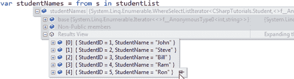

# C# 匿名类型

> 原文：<https://www.tutorialsteacher.com/csharp/csharp-anonymous-type>

* * *

Updated on: <time datetime="2020-05-02">May 2, 2020</time>

* * *

在 C# 中，匿名类型是没有任何名称的类型(类)，只能包含公共只读属性。它不能包含其他成员，如字段、方法、事件等。

您可以使用带有[对象初始值设定项](/csharp/csharp-object-initializer)语法的*新*运算符创建匿名类型。 [隐式类型变量- var](/csharp/csharp-var-implicit-typed-local-variable) 用于保存匿名类型的引用。

以下示例演示如何创建匿名类型变量`student`，该变量包含三个名为`Id`、`FirstName`和`LastName`的属性。

Example: Anonymous Type

```
var student = new { Id = 1, FirstName = "James", LastName = "Bond" }; 
```

匿名类型的属性是只读的，不能用 null、匿名函数或指针类型初始化。可以使用 dot()访问这些属性。)符号，与对象属性相同。但是，不能更改属性值，因为它们是只读的。

Example: Access Anonymous Type

```
var student = new { Id = 1, FirstName = "James", LastName = "Bond" };
Console.WriteLine(student.Id); //output: 1
Console.WriteLine(student.FirstName); //output: James
Console.WriteLine(student.LastName); //output: Bond

student.Id = 2;//Error: cannot chage value
student.FirstName = "Steve";//Error: cannot chage value 
```

一个匿名类型的属性可以包含另一个匿名类型。

Example: Nested Anonymous Type

```
var student = new { 
                    Id = 1, 
                    FirstName = "James", 
                    LastName = "Bond",
                    Address = new { Id = 1, City = "London", Country = "UK" }
                }; 
```

您也可以创建匿名类型的数组。

Example: Array of Anonymous Types

```
var students = new[] {
            new { Id = 1, FirstName = "James", LastName = "Bond" },
            new { Id = 2, FirstName = "Steve", LastName = "Jobs" },
            new { Id = 3, FirstName = "Bill", LastName = "Gates" }
    }; 
```

匿名类型将始终位于定义它的方法的本地。它不能从方法中返回。但是，匿名类型可以作为对象类型参数传递给方法，但不建议这样做。如果需要将其传递给另一个方法，则使用 struct 或 class，而不是匿名类型。

大多数情况下，匿名类型是使用 LINQ 查询的 [Select](/linq/linq-projection-operators) 子句创建的，以返回集合中每个对象的属性子集。

Example: LINQ Query returns an Anonymous Type

```
class Program
{
    static void Main(string[] args)
    {
        IList<Student> studentList = new List<Student>() { 
            new Student() { StudentID = 1, StudentName = "John", age = 18 },
            new Student() { StudentID = 2, StudentName = "Steve",  age = 21 },
            new Student() { StudentID = 3, StudentName = "Bill",  age = 18 },
            new Student() { StudentID = 4, StudentName = "Ram" , age = 20  },
            new Student() { StudentID = 5, StudentName = "Ron" , age = 21 } 
        };

        var students = from s in studentList
                       select new { Id = s.StudentID, Name = s.StudentName };

        foreach(var stud in students)
            Console.WriteLine(stud.Id + "-" + stud.Name);
    }
}

public class Student
{
    public int StudentID { get; set; }
    public string StudentName { get; set; }
    public int age { get; set; }
} 
```

输出：

```
1-John
2-Steve
3-Bill
4-Ram
5-Ron
```

在上面的示例中，LINQ 查询中的 select 子句仅选择`StudentID`和`StudentName`属性，并将其分别重命名为`Id`和`Name`。 因此，它有助于节省内存和不必要的代码。 查询结果集合只包含`StudentID`和`StudentName`属性，如下图调试视图所示。

Visual Studio 支持匿名类型的智能感知，如下所示。

[](../../Content/images/csharp/anonymoustype-debugview.png) 

Anonymous Type Intellisense Support in Visual Studio


在内部，所有的匿名类型都是直接从`System.Object`类派生出来的。编译器生成一个具有自动生成的名称的类，并根据值表达式将适当的类型应用于每个属性。 虽然你的代码无法访问它。使用`GetType()`方法查看名称。

Example: Internal Name of an Anonymous Type

```
static void Main(string[] args)
{
    var student = new { Id = 1, FirstName = "James", LastName = "Bond" };
    Console.WriteLine(student.GetType().ToString());
} 
```