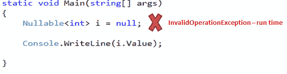
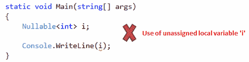

# C# -可空类型

> 原文:[https://www . tutorial stearner . com/cs harp/cs harp-可空-类型](https://www.tutorialsteacher.com/csharp/csharp-nullable-types)

如您所知，值类型不能被赋予空值。例如， *int i = null* 会给你一个编译时错误。

C# 2.0 引入了可空类型，允许您将 null 赋给值类型变量。您可以使用`Nullable<t>` 声明可空类型，其中 T 是一个类型。

Example: Nullable type

```
Nullable<int> i = null; 
```

一个可空类型可以代表其基础值类型的正确值域，加上一个附加的*空*值。例如，可以为可空的< int > 指定-2147483648 到 2147483647 之间的任何值，或者空值。

可空类型是`System.Nullable<T>`结构的实例。把它想象成如下结构。

Example: Nullable struct

```
[Serializable]
public struct Nullable<T> where T : struct
{        
    public bool HasValue { get; }

    public T Value { get; }

    // other implementation
} 
```

类型为 *int* 的可空值与普通的 *int* 相同，加上一个标志表示 *int* 是否有值(是否为空)。剩下的就是将“null”视为有效值的编译器魔法。

Example: HasValue

```
static void Main(string[] args)
{
    Nullable<int> i = null;

    if (i.HasValue)
        Console.WriteLine(i.Value); // or Console.WriteLine(i)
    else
        Console.WriteLine("Null");
} 
```

Output:<samp>Null</samp>

如果对象已被赋值，则`HasValue`返回**真**；如果它没有被赋予任何值或被赋予空值，它将返回**假**。

如果可空类型为 null 或未分配任何值，则使用 NullableType.value 访问该值将引发运行时异常。例如，如果 I 为空，i.Value 将引发异常:

[](../../Content/images/csharp/nullabletype-error.png)

Invalid use of Nullable Type


如果实际值不为空，请使用 GetValueOrDefault()方法获取实际值，如果为空，请使用默认值。例如:

Example: GetValueOrDefault()

```
static void Main(string[] args)
{
    Nullable<int> i = null;

    Console.WriteLine(i.GetValueOrDefault()); 
} 
```

## 可空类型的简写语法

你可以用“？”运算符来简化语法，例如 int？，长？而不是使用可空<t>。</t>

Example: Shorthand syntax for Nullable types

```
int? i = null;
double? D = null; 
```

### ？？操作员

用？?'运算符将可空类型赋给不可空类型。

Example: ?? operator with Nullable Type

```
int? i = null;

int j = i ?? 0;

Console.WriteLine(j); 
```

Output:<samp>0</samp>

在上面的例子中，I 是一个可为 null 的 int，如果你把它赋给不可为 null 的 int j，那么如果 I 为 null，它将抛出一个运行时异常。因此，为了降低异常风险，我们使用了？?'运算符指定如果 I 为 null，则将 0 赋给 j。

### 分配规则

可空类型与值类型具有相同的赋值规则。如果在函数中将可空类型声明为局部变量，则在使用它之前必须为它赋值。如果它是任何类的字段，那么默认情况下它将具有空值。

例如，声明并使用了以下 int 类型的可空值，而没有分配任何值。编译器将给出**“使用未赋值的局部变量‘I’”**错误:

[](../../Content/images/csharp/unassigned-nullabletype.png)

Unassigned nullable type-error


在下面的示例中，int 类型的可空值是类的一个字段，因此它不会给出任何错误。

Example: Nullable type as Class Field

```
class MyClass
{
    public Nullable<int> i;
}
class Program
{
    static void Main(string[] args)
    {
        MyClass mycls = new MyClass();

        if(mycls.i == null)
            Console.WriteLine("Null");
    }
} 
```

Output:<samp>Null</samp>

## 可空助手类

Null 被认为小于任何值。所以比较运算符对 null 不起作用。考虑下面的例子，其中 I 既不小于 j，也不大于 j，也不等于 j:

Example: Nullable Type Comparison

```
static void Main(string[] args)
{
    int? i = null;
    int j = 10;

    if (i < j)
        Console.WriteLine("i < j");
    else if( i > 10)
        Console.WriteLine("i > j");
    else if( i == 10)
        Console.WriteLine("i == j");
    else
        Console.WriteLine("Could not compare");
} 
```

Output:<samp>Could not compare</samp>

可空静态类是可空类型的助手类。它提供了一个比较方法来比较可空类型。它还有一个 GetUnderlyingType 方法，返回可空类型的基础类型参数。

Example: Helper Class

```
static void Main(string[] args)
{
    int? i = null;
    int j = 10;

    if (Nullable.Compare<int>(i, j) < 0)
        Console.WriteLine("i < j");
    else if (Nullable.Compare<int>(i, j) > 0)
        Console.WriteLine("i > j");
    else
        Console.WriteLine("i = j");
} 

```

Output:<samp>i < j</samp>

## 可空类型的特征

1.  可空类型只能用于值类型。
2.  如果值为空，值属性将引发无效操作异常；否则它将返回值。
3.  如果变量包含值，HasValue 属性返回 true，如果为空，则返回 false。
4.  只能使用==和！=可空类型的运算符。对于其他比较，使用可空静态类。
5.  不允许嵌套的可空类型。可空<nullable>> I；会产生编译时错误。</nullable>

  Points to Remember :

1.  可空<t>类型允许将空值赋给值类型。</t>
2.  **？**运算符是可空类型的简写语法。
3.  使用 value 属性获取可空类型的值。
4.  使用*哈希值*属性检查值是否分配给*可空类型*。
5.  *静态可空*类是比较可空类型的辅助类。