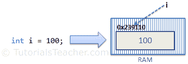
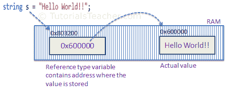
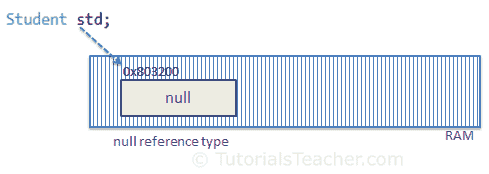

# 值类型和引用类型

> 原文:[https://www . tutorial stearner . com/cs harp/cs harp-值类型和引用类型](https://www.tutorialsteacher.com/csharp/csharp-value-type-and-reference-type)

在 C# 中，这些数据类型根据它们如何在内存中存储它们的值来分类。C# 包括以下几类数据类型:

1.  值类型
2.  参考类型
3.  指针类型

## 值类型

如果数据类型在其自己的内存空间中保存数据值，则它是值类型。这意味着这些数据类型的变量直接包含值。

  All the value types derive from *System.ValueType*, which in-turn, derives from *System.Object*.

例如，考虑整数变量`int i = 100;`

系统将 100 存储在为变量`i`分配的存储空间中。下图说明了 100 是如何存储在内存(0x239110)中某个假设位置的“I”:

<figure>[](../../Content/images/csharp/value-type-memory-allocation.png) 

<figcaption>Memory Allocation of Value Type Variable</figcaption>

</figure>

以下数据类型都是值类型:

*   弯曲件
*   字节
*   茶
*   小数
*   两倍
*   列举型别
*   漂浮物
*   （同 Internationalorganizations）国际组织
*   长的
*   sbyte(字节)
*   短的
*   结构体
*   无符号整型
*   乌龙！乌龙
*   乌肖特

### 传递值类型变量

当您将值类型变量从一个方法传递到另一个方法时，系统会在另一个方法中创建变量的单独副本。如果一个方法中的值改变了，它不会影响另一个方法中的变量。

Example: Passing Value Type Variables

```
static void ChangeValue(int x)
{
    x =  200;

    Console.WriteLine(x);
}

static void Main(string[] args)
{
    int i = 100;

    Console.WriteLine(i);

    ChangeValue(i);

    Console.WriteLine(i);
} 
```

Output:<samp>100
200
100</samp>

在上面的例子中，`Main()`方法中的变量`i`保持不变，即使我们将它传递给`ChangeValue()`方法并在那里改变它的值。

## 参考类型

与值类型不同，引用类型不直接存储其值。相反，它存储存储值的地址。换句话说，引用类型包含指向保存数据的另一个内存位置的指针。

例如，考虑以下字符串变量:

`string s = "Hello World!!";`

下图显示了系统如何为上述字符串变量分配内存。

<figure>[](../../Content/images/csharp/raference-type-memory-allocation.png) 

<figcaption>Memory Allocation of Reference Type Variable</figcaption>

</figure>

如上图所示，系统在内存中为变量`s`选择一个随机位置`(0x803200)`。 变量`s`的值为`0x600000`，是实际数据值的内存地址。因此，引用类型存储的是存储实际值的位置的地址，而不是值本身。

以下是引用类型数据类型:

*   线
*   数组(即使它们的元素是值类型)
*   班级
*   代表

### 传递引用类型变量

当您将引用类型变量从一个方法传递到另一个方法时，它不会创建新的副本；相反，它传递变量的地址。所以，如果我们改变一个方法中变量的值，它也会反映在调用方法中。

Example: Passing Reference Type Variable

```
static void ChangeReferenceType(Student std2)
{
    std2.StudentName = "Steve";
}

static void Main(string[] args)
{
    Student std1 = new Student();
    std1.StudentName = "Bill";

    ChangeReferenceType(std1);

    Console.WriteLine(std1.StudentName);
} 
```

Output:<samp>Steve</samp>

在上面的例子中，我们将`Student`对象`std1`传递给`ChangeReferenceType()`方法。在这里，它实际上传递了`std1`的内存地址。 因此当`ChangeReferenceType()`方法改变`StudentName`时，实际上是在改变`std1`对象的`StudentName`，因为`std1`和`std2`都指向内存中的同一个地址。

[String](/csharp/csharp-string) 是引用类型，但不可变。这意味着一旦我们分配了一个值，它就不能改变。如果我们改变一个字符串值，那么编译器会在内存中创建新的字符串对象，并将一个变量指向新的内存位置。 因此，将字符串值传递给函数将在内存中创建一个新变量，函数中值的任何变化都不会反映在原始值中，如下所示。

Example: Passing String

```
static void ChangeReferenceType(string name)
{
    name = "Steve";
}

static void Main(string[] args)
{
    string name = "Bill";

    ChangeReferenceType(name);

    Console.WriteLine(name);
} 
```

Output:<samp>Bill</samp>

## 空

未初始化时，引用类型变量的默认值为`null`。 `Null`不指代任何物体。

<figure>[](../../Content/images/csharp/null.png) 

<figcaption>Null Reference Type</figcaption>

</figure>

值类型变量不能为空，因为它保存的是值，而不是内存地址。C# 2.0 引入了[可空类型](/csharp/csharp-nullable-types)，使用它可以为值类型变量赋值 null，也可以声明值类型变量而不为其赋值。