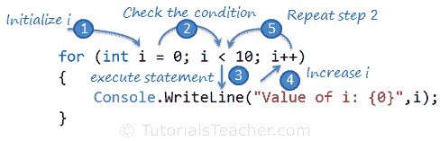

# C# for Loop

> 原文:[https://www.tutorialsteacher.com/csharp/csharp-for-loop](https://www.tutorialsteacher.com/csharp/csharp-for-loop)

* * *

Updated on: <time datetime="2020-06-17">June 17, 2020</time>

* * *

在这里，您将学习如何使用 for 循环、for 循环的结构、嵌套 for 循环多次执行语句或代码块，以及如何退出 for 循环。

`for`关键字表示 C#中的循环。`for`循环重复执行一个语句块，直到指定条件返回假。

Syntax:

```
for (initializer; condition; iterator)
{
    //code block 
}

```

`for`循环包含以下三个可选部分，用分号分隔:

**初始值设定项:**初始值设定项部分用于初始化一个变量，该变量将位于 for 循环的本地，不能在循环外访问。它也可以是零个或多个赋值语句、方法调用、递增或递减表达式，例如+++I 或 i++，以及 await 表达式。

**条件**:条件是一个布尔表达式，将返回真或假。如果表达式的计算结果为真，那么它将再次执行循环；否则，循环退出。

**迭代器**:迭代器定义循环变量的递增或递减。

以下 for 循环将一个代码块执行 10 次。

Example: for Loop

```
for(int i = 0; i < 10; i++)
{
    Console.WriteLine("Value of i: {0}", i);
} 
```

Output:<samp>Value of i: 0
Value of i: 1
Value of i: 2
Value of i: 3
Value of i: 4
Value of i: 5
Value of i: 6
Value of i: 7
Value of i: 8
Value of i: 9</samp>

在上面的例子中，`int i = 0`是一个初始化器，我们在这里定义一个 int 变量`i`并用 0 初始化它。第二部分是条件表达式`i < 10`，如果这个条件返回`true`，那么它将执行一个代码块。执行完代码块后，它将进入第三部分，迭代器。`i++`是一个增量语句，将循环变量`i`的值增加 1。现在，它将再次检查条件表达式，并重复同样的事情，直到条件表达式返回`false`。下图说明了`for`循环的执行步骤。

下图说明了`for`循环的执行步骤。

<figure class="thumbnail center-block">[](../../Content/images/csharp/for-loop.png)

<figcaption class="caption">for Loop Execution Steps</figcaption>

</figure>

如果一个代码块只包含一条语句，那么就不需要把它包装在花括号`{ }`里面，如下图所示。

Example: for Loop

```
for(int i = 0; i < 10; i++)
    Console.WriteLine("Value of i: {0}", i); 
```

初始值设定项、条件和迭代器部分是可选的。你可以在`for`循环之前初始化一个变量，条件和迭代器可以在一个代码块里面定义，如下图所示。

Example: for loop C#

```
int i = 0;

for(;;)
{
    if (i < 10)
    {
        Console.WriteLine("Value of i: {0}", i);
        i++;
    }
    else
        break;
}
```

Output:<samp>Value of i: 0
Value of i: 1
Value of i: 2
Value of i: 3
Value of i: 4
Value of i: 5
Value of i: 6
Value of i: 7
Value of i: 8
Value of i: 9</samp>

由于这三个部分在`for`循环中都是可选的，所以在定义条件和迭代器时要小心。否则，它将是一个无限循环，永远不会结束循环。

Example: Infinite for Loop

```
for ( ; ; )
{
    Console.Write(1);
}
```

Output:<samp>1 1 1 1 1 1 1 1 1 1 1 1 1 1 1 1 1 1 1.....</samp>

for 循环的控制变量可以是任何数字数据类型，如双精度、十进制等。

Example: Decimal for Loop

```
for (double d = 1.01D; d < 1.10; d+= 0.01D)
{
    Console.WriteLine("Value of i: {0}", d);
}
```

Output:<samp>Value of i: 1.01
Value of i: 1.02
Value of i: 1.03
Value of i: 1.04
Value of i: 1.05
Value of i: 1.06
Value of i: 1.07
Value of i: 1.08
Value of i: 1.09</samp>

for 循环中的 steps 部分可以增加或减少变量值。

Example: Reverse for Loop

```
for(int i = 10; i > 0; i--)
{
    Console.WriteLine("Value of i: {0}", i);
} 
```

Output:<samp>Value of i: 10
Value of i: 9
Value of i: 8
Value of i: 7
Value of i: 6
Value of i: 5
Value of i: 4
Value of i: 3
Value of i: 2
Value of i: 1</samp>

## 退出 for 循环

您也可以使用`break`关键字退出 for 循环。

Example: break in for loop

```
for (int i = 0; i < 10; i++)
{
    if( i == 5 )
        break;

    Console.WriteLine("Value of i: {0}", i);
}
```

Output:<samp>Value of i: 0
Value of i: 1
Value of i: 2
Value of i: 3
Value of i: 4</samp>

## 多重表达式

一个`for`循环也可以包含多个初始化器和迭代器语句，用逗号分隔，如下所示。

Example: Multiple Expressions

```
for (int i = 0, j = 0; i+j < 5; i++, j++)
{
    Console.WriteLine("Value of i: {0}, J: {1} ", i,j);
} 
```

Output:<samp>Value of i: 0, J: 0
Value of i: 1, J: 1
Value of i: 2, J: 2</samp>

`for`循环也可以包含作为初始化器和迭代器的语句。

Example: Initializer and Iterator Statements

```
int i = 0, j = 5;
for (Console.WriteLine($"Initializer: i={i}, j={j}"); 
    i++ < j--; 
    Console.WriteLine($"Iterator: i={i}, j={j}"))
    {
    } 
```

Output:<samp>Initializer: i=0, j=5
Iterator: i=1, j=4
Iterator: i=2, j=3
Iterator: i=3, j=2</samp>

## 循环嵌套

C#允许一个 for 循环位于另一个 for 循环内部。

Example: Nested for loop

```
for (int i = 0; i < 2; i++)
{
    for(int j =i; j < 4; j++)
        Console.WriteLine("Value of i: {0}, J: {1} ", i,j);
} 
```

Output:<samp>Value of i: 0, J: 0
Value of i: 0, J: 1
Value of i: 0, J: 2
Value of i: 0, J: 3
Value of i: 1, J: 1
Value of i: 1, J: 2
Value of i: 1, J: 3</samp>