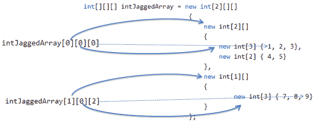

# C# 交错数组：数组的数组

> 原文：<https://www.tutorialsteacher.com/csharp/csharp-jagged-array>

交错数组是数组的数组。交错数组存储数组而不是文字值。

交错数组用两个方括号[]初始化。第一个括号指定数组的大小，第二个括号指定将要存储的数组的大小。

下面的示例声明交错数组。

Example: Jagged Arrays

```
int[][] jArray1 = new int[2][]; // can include two single-dimensional arrays 
int[][,] jArray2 = new int[3][,]; // can include three two-dimensional arrays 
```

在上例中，`jArray1`最多可以存储两个一维数组。`jArray2`最多可以存储三个二维数组，[，]指定二维数组。

Example: Jagged Array

```
int[][] jArray = new int[2][]; 

jArray[0] = new int[3]{1, 2, 3};

jArray[1] = new int[4]{4, 5, 6, 7 }; 
```

您也可以在声明时初始化交错数组，如下所示。

Example: Jagged Array

```
int[][] jArray = new int[2][]{
                new int[3]{1, 2, 3},

                new int[4]{4, 5, 6, 7}
            };

jArray[0][0]; //returns 1
jArray[0][1]; //returns 2
jArray[0][2]; //returns 3
jArray[1][0]; //returns 4
jArray[1][1]; //returns 5
jArray[1][2]; //returns 6
jArray[1][3]; //returns 7 
```

您可以使用两个 `for`循环访问交错数组，如下所示。

Example: Jagged Array

```
int[][] jArray = new int[2][]{
                new int[3]{1, 2, 3},

                new int[4]{4, 5, 6, 7}
            };

for(int i=0; i<jArray.Length; i++)
{
	for(int j=0; j < (jArray[i]).Length; j++)
		Console.WriteLine(jArray[i][j]);
} 
```

以下交错数组存储二维数组，其中第二个括号[，]表示二维数组。

Example: Jagged Array

```
int[][,] jArray = new int[2][,];

jArray[0] = new int[3, 2] { { 1, 2 }, { 3, 4 }, { 5, 6 } };
jArray[1] = new int[2, 2] { { 7, 8 }, { 9, 10 } }; 

jArray[0][1, 1]; //returns 4

jArray[1][1, 0]; //returns 9

jArray[1][1, 1]; //returns 10 
```

如果你再加一个括号，那就是数组数组数组。

Example: Jagged Array

```
int[][][] intJaggedArray = new int[2][][] 
                            {
                                new int[2][]  
                                { 
                                    new int[3] { 1, 2, 3},
                                    new int[2] { 4, 5} 
                                },
                                new int[1][]
                                { 
                                    new int[3] { 7, 8, 9}
                                }
                            };

Console.WriteLine(intJaggedArray[0][0][0]); // 1

Console.WriteLine(intJaggedArray[0][1][1]); // 5

Console.WriteLine(intJaggedArray[1][0][2]); // 9 
```

在上面交错数组的例子中，三个括号[][][]表示数组的数组。所以，`intJaggedArray`将包含两个元素，这意味着两个数组。现在，这些数组中的每一个都包含一个数组(一维)。`intJaggedArray[0][0][0]`指向第一个内部数组的第一个元素。`intJaggedArray[1][0][2]`指向第二个内部数组的第三个元素。下图说明了这一点。

[](../../Content/images/csharp/jagged-array.png) 

Jagged Array

