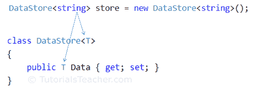

# C# 泛型

> 原文：<https://www.tutorialsteacher.com/csharp/csharp-generics>

通用指的是一般形式，而不是具体形式。在 C# 中，泛型意味着不特定于特定的数据类型。

C# 允许您使用[类型参数](https://docs.microsoft.com/en-us/dotnet/csharp/programming-guide/generics/generic-type-parameters)定义泛型类、接口、抽象类、字段、方法、静态方法、属性、事件、委托和运算符，而无需特定的数据类型。 类型参数是创建泛型类型实例时指定的特定类型的占位符。

泛型类型是通过在类型名称后的尖括号中指定类型参数来声明的，例如`TypeName<T>`，其中`T`是类型参数。

## 通用类

泛型类是使用类名称后面尖括号中的类型参数定义的。下面定义了一个泛型类。

Example: Define Generic Class

```cs
class DataStore<T>
{
    public T Data { get; set; }
} 
```

以上，`DataStore`是一个泛型类。`T`称为类型参数，可用作`DataStore`类中字段、属性、方法参数、返回类型和委托的类型。 例如，`Data`是泛型属性，因为我们使用了类型参数`T`作为其类型，而不是特定的数据类型。

*Note**It is not required to use `T` as a type parameter. You can give any name to a type parameter. Generally, `T` is used when there is only one type parameter. It is recommended to use a more readable type parameter name as per requirement like `TSession`, `TKey`, `TValue` etc. Learn more about [Type Parameter Naming Guidelines](https://docs.microsoft.com/en-us/dotnet/csharp/programming-guide/generics/generic-type-parameters#type-parameter-naming-guidelines)* *您也可以定义由逗号分隔的多个类型参数。

Example: Generic Class with Multiple Type Parameters

```cs
class KeyValuePair<TKey, TValue>
{
    public TKey Key { get; set; }
    public TValue Value { get; set; }
} 
```

## 实例化泛型类

您可以通过在尖括号中指定实际类型来创建泛型类的实例。下面创建了泛型类`DataStore`的一个实例。

```cs
DataStore<string> store = new DataStore<string>(); 
```

上面，我们在创建实例时在尖括号中指定了`string`类型。因此，编译时在整个类中使用`T`时，`T`将被替换为`string`类型。 因此，`Data`房产类型为`string`。

下图说明了泛型是如何工作的。

 

您可以为`Data`属性指定一个字符串值。尝试分配字符串以外的值将导致编译时错误。

```cs
DataStore<string> store = new DataStore<string>();
store.Data = "Hello World!";
//store.Data = 123; //compile-time error 
```

您可以为不同的对象指定不同的数据类型，如下所示。

Example: Generic class

```cs
DataStore<string> strStore = new DataStore<string>();
strStore.Data = "Hello World!";
//strStore.Data = 123; // compile-time error

DataStore<int> intStore = new DataStore<int>();
intStore.Data = 100;
//intStore.Data = "Hello World!"; // compile-time error

KeyValuePair<int, string> kvp1 = new KeyValuePair<int, string>();
kvp1.Key = 100;
kvp1.Value = "Hundred";

KeyValuePair<string, string> kvp2 = new KeyValuePair<string, string>();
kvp2.Key = "IT";
kvp2.Value = "Information Technology"; 
```

### 类属特征

*   泛型类增加了可重用性。类型参数越多，意味着它变得越可重用。然而，过于一般化使得代码难以理解和维护。
*   泛型类可以是其他泛型或非泛型类或抽象类的基类。
*   泛型类可以从其他泛型或非泛型接口、类或抽象类派生。

## 通用字段

泛型类可以包含泛型字段。但是，它无法初始化。

Example: Generic Field

```cs
class DataStore<T>
{
    public T data;
} 
```

下面声明了一个泛型数组。

Example: Generic Array

```cs
class DataStore<T>
{
    public T[] data = new T[10];
} 
```

## 通用方法

用返回类型的类型参数声明的方法称为泛型方法。

Example: Generic Methods

```cs
class DataStore<T>
{
    private T[] _data = new T[10];

    public void AddOrUpdate(int index, T item)
    {
        if(index >= 0 && index < 10)
            _data[index] = item;
    }

    public T GetData(int index)
    {
        if(index >= 0 && index < 10)
            return _data[index];
        else 
            return default(T);
    }
} 
```

以上，`AddorUpdate()`和`GetData()`方法是类属方法。`item`参数的实际数据类型将在实例化`DataStore<T>`类时指定，如下所示。

Example: Generic Methods

```cs
DataStore<string> cities = new DataStore<string>();
cities.AddOrUpdate(0, "Mumbai");
cities.AddOrUpdate(1, "Chicago");
cities.AddOrUpdate(2, "London");

DataStore<int> empIds = new DataStore<int>();
empIds.AddOrUpdate(0, 50);
empIds.AddOrUpdate(1, 65);
empIds.AddOrUpdate(2, 89); 
```

泛型参数类型可以与多个参数一起使用，包括或不包括非泛型参数和返回类型。以下是有效的泛型方法重载。

Example: Generic Method Overloading

```cs
public void AddOrUpdate(int index, T data) { }
public void AddOrUpdate(T data1, T data2) { }
public void AddOrUpdate<U>(T data1, U data2) { }
public void AddOrUpdate(T data) { } 
```

非泛型类可以通过用方法名在尖括号中指定类型参数来包含泛型方法，如下所示。

Example: Generic Method in Non-generic Class

```cs
class Printer
{
    public void Print<T>(T data)
    {
        Console.WriteLine(data);
    }
}

Printer printer = new Printer();
printer.Print<int>(100);
printer.Print(200); // type infer from the specified value
printer.Print<string>("Hello");
printer.Print("World!"); // type infer from the specified value 
```

## 仿制药的优势

1.  泛型增加了代码的可重用性。您不需要编写代码来处理不同的数据类型。
2.  泛型是类型安全的。如果试图使用不同于定义中指定的数据类型，则会出现编译时错误。
3.  泛型具有性能优势，因为它消除了装箱和拆箱的可能性。*