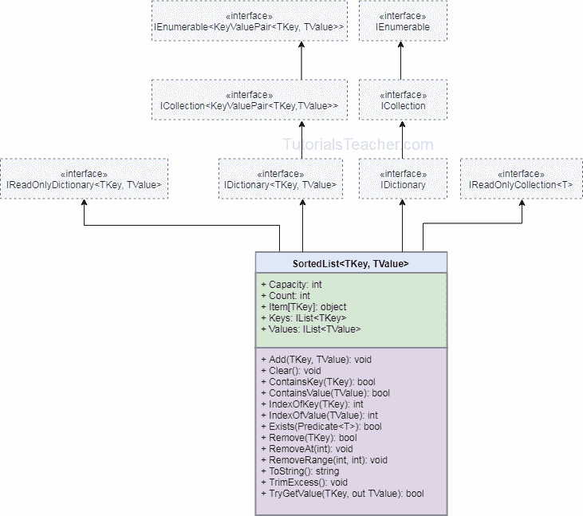

# C# `SortedList`

> 原文：<https://www.tutorialsteacher.com/csharp/csharp-sortedlist>

`SortedList<TKey, TValue>`和`SortedList`是集合类，可以存储基于关联的 [IComparer](https://docs.microsoft.com/en-us/dotnet/api/system.collections.generic.icomparer-1?view=netframework-4.8) 实现按键排序的键值对。 例如，如果键是基本类型，则按键的升序排序。

C# 支持泛型和非泛型`SortedList`。 建议使用通用`SortedList<TKey, TValue>`，因为它比非通用`SortedList`执行更快，更不容易出错。

## `SortedList`特征

*   `SortedList<TKey, TValue>`是按键排序的键值对数组。
*   元素一添加就排序。基于[比较器<T>T1 对基本类型键和对象键进行升序排序。](https://docs.microsoft.com/en-us/dotnet/api/system.collections.generic.icomparer-1?view=netframework-4.8)
*   属于`System.Collection.Generic`命名空间。
*   密钥必须是唯一的，不能为空。
*   值可以为空或重复。
*   通过传递索引器中的关联键`mySortedList[key]`可以访问一个值
*   包含类型为[键值对< TKey、tValue>T1 的元素](https://docs.microsoft.com/en-us/dotnet/api/system.collections.generic.keyvaluepair-2?view=netframework-4.8)
*   它比排序`Dictionary`使用更少的内存。
*   一旦排序，它在检索数据时更快，而`SortedDictionary<TKey, TValue>`在插入和移除键值对时更快。

## 创建`SortedList`

下面的例子演示了如何创建一个泛型`SortedList<TKey, TValue>`，并在其中添加键值对。

Example: Create a SortedList and Add Elements

```
//SortedList of int keys, string values 
SortedList<int, string> numberNames = new SortedList<int, string>();
numberNames.Add(3, "Three");
numberNames.Add(1, "One");
numberNames.Add(2, "Two");
numberNames.Add(4, null);
numberNames.Add(10, "Ten");
numberNames.Add(5, "Five");

//The following will throw exceptions
//numberNames.Add("Three", 3); //Compile-time error: key must be int type
//numberNames.Add(1, "One"); //Run-time exception: duplicate key
//numberNames.Add(null, "Five");//Run-time exception: key cannot be null 
```

在上例中，通过指定要存储的键和值的类型，创建了一个通用的`SortedList<TKey, TValue>`对象。 `SortedList<int, string>`将存储 int 类型的键和 string 类型的值。

`Add()`方法用于在`SortedList`中添加单个键值对。 密钥不能为空或重复。如果找到，它将引发运行时异常。如果类型可以为空，则值可以重复且为空。

使用集合初始值设定项语法在实例化时用多个键值对初始化一个`SortedList`，如下所示。

```
//Creating a SortedList of string keys, string values 
//using collection-initializer syntax
SortedList<string,string> cities = new SortedList<string,string>()
                                    {
                                        {"London", "UK"},
                                        {"New York", "USA"},
                                        { "Mumbai", "India"},
                                        {"Johannesburg", "South Africa"}
                                    }; 
```

一旦添加了键值对，`SortedList`就会按照键的升序重新排列键值对。 以下示例使用`foreach`循环显示所有键和值。

Example: SortedList Elements Default Sorting Order

```
SortedList<int,string> numberNames = new SortedList<int,string>()
                                    {
                                        {3, "Three"},
                                        {5, "Five"},
                                        {1, "One"}
                                    };

Console.WriteLine("---Initial key-values--");

foreach(KeyValuePair<int, string> kvp in numberNames)
    Console.WriteLine("key: {0}, value: {1}", kvp.Key , kvp.Value );

numberNames.Add(6, "Six");
numberNames.Add(2, "Two");
numberNames.Add(4, "Four");

Console.WriteLine("---After adding new key-values--");

foreach(var kvp in numberNames)
    Console.WriteLine("key: {0}, value: {1}", kvp.Key , kvp.Value ); 
```

输出：

```
---Initial key-values--
key: 1, value: One
key: 3, value: Three
key: 5, value: Five
---After adding new key-values--
key: 1, value: One
key: 2, value: Two
key: 3, value: Three
key: 4, value: Four
key: 5, value: Five
key: 6, value: Six
```

## 正在访问`SortedList`

在步进器`sortedList[key]`中指定一个键，在`SortedList`中获取或设置一个值。

Example: Access SortedList Values

```
SortedList<int,string> numberNames = new SortedList<int,string>()
                                    {
                                        {3, "Three"},
                                        {1, "One"},
                                        {2, "Two"}
                                    };

Console.WriteLine(numberNames[1]); //output: One
Console.WriteLine(numberNames[2]); //output: Two
Console.WriteLine(numberNames[3]); //output: Three
//Console.WriteLine(numberNames[10]); //run-time KeyNotFoundException

numberNames[2] = "TWO"; //updates value
numberNames[4] = "Four"; //adds a new key-value if a key does not exists 
```

上图中，`numberNames[10]`会抛出一个`KeyNotFoundException`，因为指定的键`10`在`SortedList`中不存在。 为防止这种异常，使用`ContainsKey()`或`TryGetValue()`方法，如下所示。

Example: ContainsKey() and TryGetValue()

```
SortedList<int, string> numberNames = new SortedList<int,string>()
                                    {
                                        {3, "Three"},
                                        {1, "One"},
                                        {2, "Two"}
                                    };
if(numberNames.ContainsKey(4)){
    numberNames[4] = "four";
}

int result;
if(numberNames.TryGetValue(4, out result))
    Console.WriteLine("Key: {0}, Value: {1}", 4, result); 
```

输出：

```
Key:4, Value: Four
```

如果要使用循环的[迭代`SortedList`，请使用`Keys`和`Values`属性。](/csharp/csharp-for-loop)

Example: Iterate SortedList using For Loop

```
SortedList<int, string> numberNames = new SortedList<int,string>()
                                    {
                                        {3, "Three"},
                                        {1, "One"},
                                        {2, "Two"}
                                    };
for (int i = 0; i < numberNames.Count; i++)
{
    Console.WriteLine("key: {0}, value: {1}", numberNames.Keys[i], numberNames.Values[i]);
} 
```

输出：

```
key: 1, value: One
key: 2, value: Two
key: 3, value: Three
```

## 从`SortedList`中删除元素

使用`Remove(key)`和`RemoveAt(index)`方法从`SortedList`中移除键值对。

Example: Remove Elements

```
SortedList<int,string> numberNames = new SortedList<int,string>()
                                    {
                                        {3, "Three"},
                                        {1, "One"},
                                        {2, "Two"},
                                        {5, "Five"},
                                        {4, "Four"}
                                    };

numberNames.Remove(1);//removes key 1 pair
numberNames.Remove(10);//removes key 1 pair, no error if not exists

numberNames.RemoveAt(0);//removes key-value pair from index 0 
//numberNames.RemoveAt(10);//run-time exception: ArgumentOutOfRangeException

foreach(var kvp in numberNames)
	Console.WriteLine("key: {0}, value: {1}", kvp.Key , kvp.Value ); 
```

输出：

```
key: 3, value: Three
key: 4, value: Four
key: 5, value: Five
```

## `SortedList`类层次结构

下图说明了`SortedList`层次结构。

[](../../Content/images/csharp/sortedlist-generic.png)

了解更多关于 docs.microsoft.com 的`SortedList`方法和属性