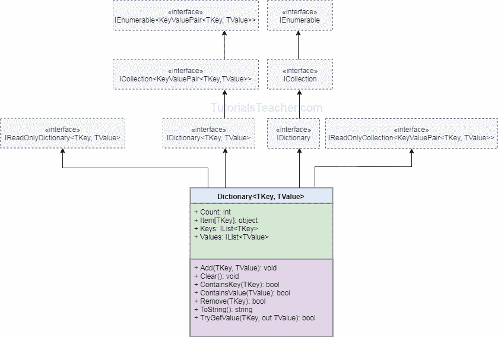

# C# -字典

> 原文：<https://www.tutorialsteacher.com/csharp/csharp-dictionary>

`Dictionary<TKey, TValue>`是一个通用集合，它不按特定顺序存储键值对。

## 词典特征

*   `Dictionary<TKey, TValue>`存储键值对。
*   属于`System.Collections.Generic`命名空间。
*   实现[字典< TKey，Tvalue>T1】界面。](https://docs.microsoft.com/en-us/dotnet/api/system.collections.generic.idictionary-2?view=netframework-4.8)
*   键必须是唯一的，不能为空。
*   值可以为空或重复。
*   可以通过在索引器中传递相关的键来访问值，例如`myDictionary[key]`
*   元素存储为[键值对< TKey，Tvalue>T1】对象。](https://docs.microsoft.com/en-us/dotnet/api/system.collections.generic.keyvaluepair-2?view=netframework-4.8)

## 创建词典

您可以通过传递可以存储的键和值的类型来创建`Dictionary<TKey, TValue>`对象。 下面的例子展示了如何创建字典和添加键值对。

Example: Create Dictionary and Add Elements

```
IDictionary<int, string> numberNames = new Dictionary<int, string>();
numberNames.Add(1,"One"); //adding a key/value using the Add() method
numberNames.Add(2,"Two");
numberNames.Add(3,"Three");

//The following throws run-time exception: key already added.
//numberNames.Add(3, "Three"); 

foreach(KeyValuePair<int, string> kvp in numberNames)
    Console.WriteLine("Key: {0}, Value: {1}", kvp.Key, kvp.Value);

//creating a dictionary using collection-initializer syntax
var cities = new Dictionary<string, string>(){
	{"UK", "London, Manchester, Birmingham"},
	{"USA", "Chicago, New York, Washington"},
	{"India", "Mumbai, New Delhi, Pune"}
};

foreach(var kvp in cities)
    Console.WriteLine("Key: {0}, Value: {1}", kvp.Key, kvp.Value); 
```

在上例中，`numberNames`是一个`Dictionary<int, string>`类型的字典，所以可以存储 int 键和字符串值。 同样的，`cities`是`Dictionary<string, string>`类型的字典，所以可以存储字符串键和字符串值。 字典不能包含重复或空键，而值可以重复或空。 键必须是唯一的，否则会抛出运行时异常。

## 访问字典元素

可以使用索引器访问字典。指定一个键来获取关联的值。也可以使用`ElementAt()`方法从指定的索引中获取一个`KeyValuePair`。

Example: Access Dictionary Elements

```
var cities = new Dictionary<string, string>(){
	{"UK", "London, Manchester, Birmingham"},
	{"USA", "Chicago, New York, Washington"},
	{"India", "Mumbai, New Delhi, Pune"}
};

Console.WriteLine(cities["UK"]); //prints value of UK key
Console.WriteLine(cities["USA"]);//prints value of USA key
//Console.WriteLine(cities["France"]); // run-time exception: Key does not exist

//use ContainsKey() to check for an unknown key
if(cities.ContainsKey("France")){  
    Console.WriteLine(cities["France"]);
}

//use TryGetValue() to get a value of unknown key
string result;

if(cities.TryGetValue("France", out result))
{
    Console.WriteLine(result);
}

//use ElementAt() to retrieve key-value pair using index
for (int i = 0; i < cities.Count; i++)
{
    Console.WriteLine("Key: {0}, Value: {1}", 
                                            cities.ElementAt(i).Key, 
                                            cities.ElementAt(i).Value);
} 
```

## 更新词典

通过在索引器中指定键来更新键的值。如果字典中不存在某个键，它会抛出`KeyNotFoundException`，因此在访问未知键之前使用`ContainsKey()`方法。

Example: Update Dictionary Elements

```
var cities = new Dictionary<string, string>(){
	{"UK", "London, Manchester, Birmingham"},
	{"USA", "Chicago, New York, Washington"},
	{"India", "Mumbai, New Delhi, Pune"}
};

cities["UK"] = "Liverpool, Bristol"; // update value of UK key
cities["USA"] = "Los Angeles, Boston"; // update value of USA key
//cities["France"] = "Paris"; //throws run-time exception: KeyNotFoundException

if(cities.ContainsKey("France")){
    cities["France"] = "Paris";
} 
```

## 删除字典中的元素

`Remove()`方法从字典中删除现有的键值对。 方法删除字典中的所有元素。

Example: Remove Dictionary Elements

```
var cities = new Dictionary<string, string>(){
	{"UK", "London, Manchester, Birmingham"},
	{"USA", "Chicago, New York, Washington"},
	{"India", "Mumbai, New Delhi, Pune"}
};

cities.Remove("UK"); // removes UK 
//cities.Remove("France"); //throws run-time exception: KeyNotFoundException

if(cities.ContainsKey("France")){ // check key before removing it
    cities.Remove("France");
}

cities.Clear(); //removes all elements 
```

结构

下图说明了通用字典类的层次结构。

<figure>[](../../Content/images/csharp/generic-dictionary.png)</figure>

了解 docs.microsoft.com 的[字典方法和属性](https://docs.microsoft.com/en-us/dotnet/api/system.collections.generic.dictionary-2?view=netframework-4.8#properties)。