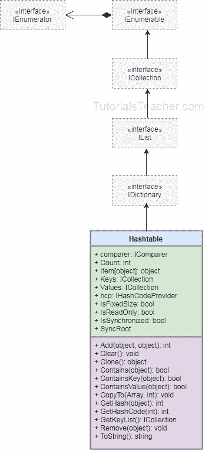

# C# -哈希表

> 原文：<https://www.tutorialsteacher.com/csharp/csharp-hashtable>

`Hashtable`是一个存储键值对的非泛型集合，类似于泛型[字典< TKey，TValue >](/csharp/csharp-dictionary) 集合。 它通过计算每个键的哈希码来优化查找，并将其存储在内部不同的桶中，然后在访问值时匹配指定键的哈希码。

## 哈希表特征

*   `Hashtable`存储键值对。
*   属于`System.Collection`命名空间。
*   实现 [IDictionary](https://docs.microsoft.com/en-us/dotnet/api/system.collections.idictionary?view=netframework-4.8) 接口。
*   键必须是唯一的，不能为空。
*   值可以为空或重复。
*   可以通过在索引器中传递相关的键来访问值，例如`myHashtable[key]`
*   元素存储为 [DictionaryEntry](https://docs.microsoft.com/en-us/dotnet/api/system.collections.dictionaryentry?view=netframework-4.8) 对象。

## 创建哈希表

下面的示例演示了创建哈希表和添加元素。

Example: Create and Add Elements

```
Hashtable numberNames = new Hashtable();
numberNames.Add(1,"One"); //adding a key/value using the Add() method
numberNames.Add(2,"Two");
numberNames.Add(3,"Three");

//The following throws run-time exception: key already added.
//numberNames.Add(3, "Three"); 

foreach(DictionaryEntry de in numberNames)
    Console.WriteLine("Key: {0}, Value: {1}", de.Key, de.Value);

//creating a Hashtable using collection-initializer syntax
var cities = new Hashtable(){
	{"UK", "London, Manchester, Birmingham"},
	{"USA", "Chicago, New York, Washington"},
	{"India", "Mumbai, New Delhi, Pune"}
};

foreach(DictionaryEntry de in cities)
    Console.WriteLine("Key: {0}, Value: {1}", de.Key, de.Value); 
```

`Hashtable`集合可以包含[词典](/csharp/csharp-dictionary)的所有元素，如下图所示。

Example: Add Dictionary in Hashtable

```
Dictionary<int, string> dict = new Dictionary<int, string>();
dict.Add(1, "one");
dict.Add(2, "two");
dict.Add(3, "three");

Hashtable ht = new Hashtable(dict); 
```

## 更新哈希表

通过在索引器中传递一个键，可以从`Hashtable`中检索现有键的值。 `Hashtable`是非泛型集合，因此您必须在检索时键入强制转换值。

Example: Update Hashtable

```
//creating a Hashtable using collection-initializer syntax
var cities = new Hashtable(){
	{"UK", "London, Manchester, Birmingham"},
	{"USA", "Chicago, New York, Washington"},
	{"India", "Mumbai, New Delhi, Pune"}
};

string citiesOfUK = (string) cities["UK"]; //cast to string
string citiesOfUSA = (string) cities["USA"]; //cast to string

Console.WriteLine(citiesOfUK);
Console.WriteLine(citiesOfUSA);

cities["UK"] = "Liverpool, Bristol"; // update value of UK key
cities["USA"] = "Los Angeles, Boston"; // update value of USA key

if(!cities.ContainsKey("France")){
    cities["France"] = "Paris";
} 
```

## 移除哈希表中的元素

`Remove()`方法删除与`Hashtable`中指定的匹配的键值。 如果在哈希表中找不到指定的键，它将抛出`KeyNotfoundException`，因此在移除之前使用`ContainsKey()`方法检查现有的键。

使用`Clear()`方法一次移除所有元素。

Example: Remove Elements from Hashtable

```
var cities = new Hashtable(){
	{"UK", "London, Manchester, Birmingham"},
	{"USA", "Chicago, New York, Washington"},
	{"India", "Mumbai, New Delhi, Pune"}
};

cities.Remove("UK"); // removes UK 
//cities.Remove("France"); //throws run-time exception: KeyNotFoundException

if(cities.ContainsKey("France")){ // check key before removing it
    cities.Remove("France");
}

cities.Clear(); //removes all elements 
```

次结构

下图说明了哈希表类的层次结构。

](../../Content/images/csharp/hashtable.png)

C# Hashtable

</figure>

*Further Reading* **   [哈希表和字典的区别](/articles/difference-between-hashtable-and-dictionary-in-csharp)
*   [哈希表属性和方法](https://docs.microsoft.com/en-us/dotnet/api/system.collections.hashtable?view=netframework-4.8#properties "Hashtable class members")。*