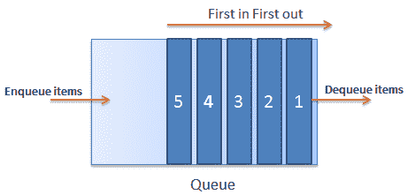

# C# `Queue`

> 原文：<https://www.tutorialsteacher.com/csharp/csharp-queue>

`Queue`是一种特殊类型的集合，以先进先出的方式存储元素，与[`Stack`<T>T5 集合完全相反。它按照元素添加的顺序包含元素。 C# 包括通用`Queue<T>`和非通用`Queue`集合。建议使用通用`Queue<T>`集合。](/csharp/csharp-stack)

## `Queue`<t>特征</t>

*   `Queue<T>`为 FIFO(先进先出)集合。
*   它属于`System.Collection.Generic`命名空间。
*   `Queue<T>`可以包含指定类型的元素。它提供编译时类型检查，并且不执行装箱拆箱，因为它是泛型的。
*   可以使用`Enqueue()`方法添加元素。不能使用集合初始值设定项语法。
*   可以使用`Dequeue()`和`Peek()`方法检索元素。它不支持索引器。

下图说明了`Queue`集合:

[](../../Content/images/csharp/csharp-queue.png)

## 创建`Queue`

您可以通过为其可以存储的元素类型指定类型参数来创建`Queue<T>`的对象。 以下示例使用`Enqueue()`方法在`Queue<T>`中创建和添加元素。 A `Queue`集合允许空值(对于引用类型)和重复值。

Example: Create and Add Elements in the Queue

```
Queue<int> callerIds = new Queue<int>();
callerIds.Enqueue(1);
callerIds.Enqueue(2);
callerIds.Enqueue(3);
callerIds.Enqueue(4);

foreach(var id in callerIds)
    Console.Write(id); //prints 1234 
```

## `Queue`<t>属性和方法</t>

| 财产 | 使用 |
| --- | --- |
| 数数 | 返回`Queue`中元素的总数。 |

| 方法 | 使用 |
| --- | --- |
| 入队 | 将项目添加到`Queue`中。 |
| 出列 | 从`Queue`的开头返回一个项目，并将其从`Queue`中移除。 |
| 聚醚醚酮 | 返回`Queue`中的第一项，而不删除它。 |
| 包含(T) | 检查项目是否在`Queue`中 |
| 清除() | 从`Queue`中移除所有项目。 |

## 从`Queue`中检索元素

`Dequeue()`和`Peek()`方法用于检索`Queue`集合中的第一个元素。 `Dequeue()`从`Queue`中移除并返回第一个元素，因为`Queue`以先进先出的顺序存储元素。在空`Queue`中调用`Dequeue()`方法会抛出`InvalidOperation`异常。 所以，在调用`Queue`之前，一定要检查`Queue`的总计数是否大于零。

Example: Reading Queue

```
Queue<string> strQ = new Queue<string>();
strQ.Enqueue("H");
strQ.Enqueue("e");
strQ.Enqueue("l");
strQ.Enqueue("l");
strQ.Enqueue("o");

Console.WriteLine("Total elements: {0}", strQ.Count); //prints 5

while (strQ.Count > 0)
    Console.WriteLine(strQ.Dequeue()); //prints Hello

Console.WriteLine("Total elements: {0}", strQ.Count); //prints 0 
```

`Peek()`方法总是从`Queue`集合中返回第一个项目，而不将其从`Queue`中移除。 在空`Queue`中调用`Peek()`方法会引发运行时异常`InvalidOperationException`。

Example: Peek()

```
Queue<string> strQ = new Queue<string>();
strQ.Enqueue("H");
strQ.Enqueue("e");
strQ.Enqueue("l");
strQ.Enqueue("l");
strQ.Enqueue("o");

Console.WriteLine("Total elements: {0}", strQ.Count); //prints 5

if(strQ.Count > 0){
    Console.WriteLine(strQ.Peek()); //prints H
    Console.WriteLine(strQ.Peek()); //prints H
}

Console.WriteLine("Total elements: {0}", strQ.Count); //prints 5 
```

## 包含()

`Contains()`方法检查`Queue`中是否存在项目。 如果指定项目存在，则返回真，否则返回假。

包含()签名:`bool Contains(object obj);`

Example: Contains()

```
Queue<int> callerIds = new Queue<int>();
callerIds.Enqueue(1);
callerIds.Enqueue(2);
callerIds.Enqueue(3);
callerIds.Enqueue(4);

callerIds.Contains(2); //true
callerIds.Contains(10); //false 
```