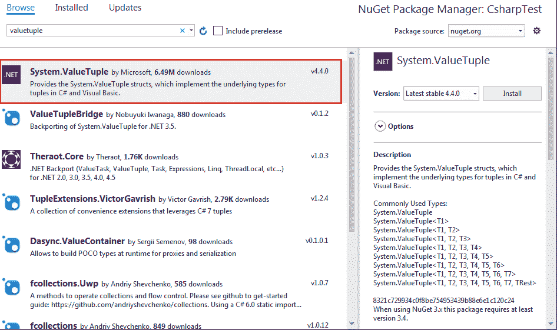

# C# - ValueTuple

> 原文:[https://www.tutorialsteacher.com/csharp/valuetuple](https://www.tutorialsteacher.com/csharp/valuetuple)

C# 7.0(。NET Framework 4.7)引入了`ValueTuple`结构，这是[元组](/csharp/csharp-tuple)的值类型表示。

ValueTuple 仅在中可用。NET 框架 4.7。如果您在项目中没有看到 ValueTuple，那么您需要安装 ValueTuple。(.. NET Framework 4.7 或更高版本，或者。NET 标准库 2.0 或更高版本已经包含 ValueTuple。)

要安装 ValueTuple 包，请在解决方案资源管理器中右键单击该项目，然后选择**管理 NuGet 包..**。 这将打开 NuGet 包管理器。点击**浏览**选项卡，在搜索框中搜索值元组，选择**系统。ValueTuple** 包，如下图。

<figure>[](../../Content/images/csharp/install-valuetuple.png) </figure>

## 值元组初始化

很容易创建和初始化`ValueTuple`。 可以使用括号`()`并指定其中的值来创建和初始化它。

```
var person = (1, "Bill", "Gates");

//equivalent Tuple
//var person = Tuple.Create(1, "Bill", "Gates"); 
```

也可以通过指定每个元素的类型来初始化`ValueTuple`，如下图所示。

Example: ValueTuple<button class="copy-btn pull-right" title="Copy example code">*Copy*</button> *```
ValueTuple<int, string, string> person = (1, "Bill", "Gates");
person.Item1;  // returns 1
person.Item2;   // returns "Bill"
person.Item3;   // returns "Gates" 
```

以下是为每个成员声明类型的简单方法。

Example: ValueTuple<button class="copy-btn pull-right" title="Copy example code">*Copy*</button> *```
 (int, string, string) person = (1, "James", "Bond");
person.Item1;  // returns 1
person.Item2;   // returns "James"
person.Item3;   // returns "Bond" 
```

注意，我们没有在上面的元组初始化语句中使用`var`；相反，我们在括号内提供了每个成员值的类型。

元组至少需要两个值。以下不是元组。

```
var number = (1);  // int type, NOT a tuple
var numbers = (1,2); //valid tuple 
```

与`Tuple`不同，`ValueTuple`可以包含八个以上的值。

```
var numbers = (1, 2, 3, 4, 5, 6, 7, 8, 9, 10, 11, 12, 13, 14); 
```

## 命名成员

我们可以为`ValueTuple`属性指定名称，而不是像项目 1、项目 2 等那样的默认属性名称。

Example: Named Members of ValueTuple<button class="copy-btn pull-right" title="Copy example code">*Copy*</button> *```
(int Id, string FirstName, string LastName) person = (1, "Bill", "Gates");
person.Id;   // returns 1
person.FirstName;  // returns "Bill"
person.LastName; // returns "Gates" 
```

我们还可以在右侧用值分配成员名称，如下所示。

```
var person = (Id:1, FirstName:"Bill", LastName: "Gates"); 
```

请注意，我们可以在左侧或右侧提供成员名称，但不能在两侧都提供。左侧优先于右侧。下面将忽略右侧的名称。

```
// PersonId, FName, LName will be ignored.
(int Id, string FirstName, string LastName) person = (PersonId:1, FName:"Bill", LName: "Gates");

// PersonId, FirstName, LastName will be ignored. It will have the default names: Item1, Item2, Item3.
(string, string, int) person = (PersonId:1, FName:"Bill", LName: "Gates"); 
```

我们还可以将变量指定为成员值。

```
string firstName = "Bill", lastName = "Gates";
var per = (FirstName: firstName, LastName: lastName); 
```

## 作为参数的值元组

ValueType 也可以是方法的参数类型或返回类型。以下方法接受一个`ValueTuple`类型参数。

Example: ValueTuple As Parameter<button class="copy-btn pull-right" title="Copy example code">*Copy*</button> *```
static void Main(string[] args)
{
    DisplayTuple((1, "Bill", "Gates"));
}

static void DisplayTuple((int, string, string) person)
{
    Console.WriteLine("{0}, {1}, {2}", person.Item1, person.Item2, person.Item3);
} 
```

下面从方法中返回一个 ValueTuple。

Example: ValueTuple As Return Type<button class="copy-btn pull-right" title="Copy example code">*Copy*</button> *```
static void Main(string[] args)
{
    var person = GetPerson();
    Console.WriteLine("{0}, {1}, {2}", person.Item1, person.Item2, person.Item3);
}

static (int, string, string) GetPerson() 
{
    return (1, "Bill", "Gates");
} 
```

您也可以为从方法返回的`ValueTuple`指定成员名称。

Example: ValueTuple As Return Type<button class="copy-btn pull-right" title="Copy example code">*Copy*</button> *```
static void Main(string[] args)
{
    var person = GetPerson();
    Console.WriteLine("{0}, {1}, {2}", person.Id, person.FirstName, person.LastName);
}

static (int Id, string FirstName, string LastName) GetPerson() 
{
    return (Id:1, FirstName: "Bill", LastName: "Gates");
} 
```

## 解构

`ValueTuple`的单个成员可以通过解构它来检索。 解构声明语法将`ValueTuple`分成几部分，并将这些部分分别分配给新变量。

Example: Deconstruct ValueTuple<button class="copy-btn pull-right" title="Copy example code">*Copy*</button> *```
static void Main(string[] args)
{
    // change property names
    (int PersonId, string FName, string LName) = GetPerson();
}
static (int, string, string) GetPerson() 
{
    return (Id:1, FirstName: "Bill", LastName: "Gates");
} 
```

我们也可以使用 var 来代替显式数据类型名称。

Example: Deconstruct ValueTuple<button class="copy-btn pull-right" title="Copy example code">*Copy*</button> *```
static void Main(string[] args)
{
    // use var as datatype
    (var PersonId, var FName, var LName) = GetPerson();
}
static (int, string, string) GetPerson() 
{
    return (Id:1, FirstName: "Bill", LastName: "Gates");
} 
```

`ValueTuple`还允许对不打算使用的成员进行解构中的“丢弃”。

```
// use discard _ for the unused member LName
(var id, var FName, _) = GetPerson(); 
```

