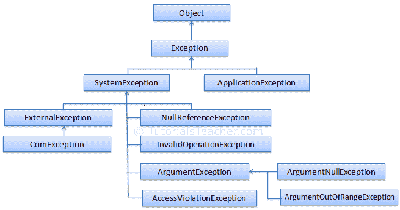
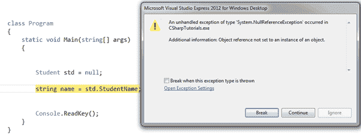

# C#中内置的异常类

> 原文:[https://www.tutorialsteacher.com/csharp/csharp-exception](https://www.tutorialsteacher.com/csharp/csharp-exception)

在这里，您将了解 C#中内置的异常类。

C#。NET 包含针对每个可能错误的内置异常类。[异常](https://docs.microsoft.com/en-us/dotnet/api/system.exception?view=netframework-4.8)类是所有异常类的基类。 T3】

下面是中异常类的层次结构。NET:

<figure>

<figcaption>Exception Classes in .NET</figcaption>

</figure>

在上图中，`Exception`类是`SystemException`和`ApplicationException`类的基类。`SystemException`类是中所有内置异常类的基类。NET 框架。

建议将`ApplicationException`作为所有自定义异常类的基类(如果可以使用非系统异常类，并且您需要新的异常类来处理业务规则违规或其他应用程序相关错误，则应创建自定义异常类)。它旨在区分应用程序定义的异常和系统定义的异常。 然而，微软现在建议从`Exception`类而不是`ApplicationException`类中派生自定义异常类。

下图显示了当您在运行时访问空对象属性时，在 Visual Studio 调试模式下如何抛出`NullReferenceException`。

<figure>

<figcaption>NullReferenceException</figcaption>

</figure>

## 内置异常类

下表列出了. NET 中重要的内置异常类

| 异常类 | 描述 |
| --- | --- |
| 推理异常 | 当传递给方法的非 null 参数无效时引发。 |
| [参数 NullException](https://docs.microsoft.com/en-us/dotnet/api/system.argumentnullexception?view=netframework-4.8) | 将 null 参数传递给方法时引发。 |
| [argumenterofrange exception](https://docs.microsoft.com/en-us/dotnet/api/system.argumentoutofrangeexception?view=netframework-4.8) | 当参数值超出有效值范围时引发。 |
| [DivideByZeroException](https://docs.microsoft.com/en-us/dotnet/api/system.dividebyzeroexception?view=netframework-4.8) | 当整数值被零除时引发。 |
| filenotfounindexception | 当指定位置不存在物理文件时引发。 |
| [格式异常](https://docs.microsoft.com/en-us/dotnet/api/system.formatexception?view=netframework-4.8) | 当值的格式不适合通过转换方法(如解析)从字符串转换时引发。 |
| [IndexOutOfRangeException](https://docs.microsoft.com/en-us/dotnet/api/system.indexoutofrangeexception?view=netframework-4.8) | 当数组索引超出数组或集合的下限或上限时引发。 |
| 无效操作抑制 | 当方法调用在对象的当前状态下无效时引发。 |
| [keynotfounindexception](https://docs.microsoft.com/en-us/dotnet/api/system.collections.generic.keynotfoundexception?view=netframework-4.8) | 当用于访问集合中成员的指定键不存在时引发。 |
| 紧急支援例外 | 当不支持方法或操作时引发。 |
| 零参考例外 | 当程序访问 null 对象的成员时引发。 |
| 超流异常 | 当算术、转换或转换操作导致溢出时引发。 |
| [outofmemoreryexception](https://docs.microsoft.com/en-us/dotnet/api/system.outofmemoryexception?view=netframework-4.8) | 当程序没有足够的内存来执行代码时引发。 |
| [StackOverflowException](https://docs.microsoft.com/en-us/dotnet/api/system.stackoverflowexception?view=netframework-4.8) | 当内存中的堆栈溢出时引发。 |
| 时间异常 | 分配给操作的时间间隔已过期。 |

发生错误时，应用程序代码或默认处理程序会处理异常。在下一节学习如何处理练习。