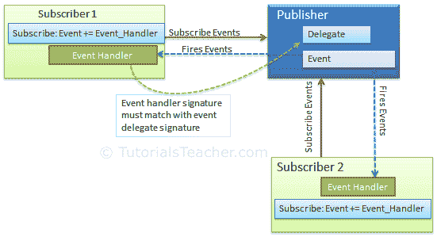

# C# -事件

> 原文:[https://www.tutorialsteacher.com/csharp/csharp-event](https://www.tutorialsteacher.com/csharp/csharp-event)

事件是由对象发送的通知，用于通知操作的发生。事件在。NET 遵循[观察者设计模式](https://docs.microsoft.com/en-us/dotnet/standard/events/observer-design-pattern)。

引发事件的类称为<u>发布者</u>，收到通知的类称为<u>订阅者</u>。一个事件可以有多个订阅者。 通常，发布者会在某个动作发生时引发事件。订阅者希望在某个操作发生时得到通知，他们应该注册一个事件并处理它。

在 C# 中，事件是一个封装的[委托](/csharp/csharp-delegates)。它依赖于委托。[委托](/csharp/csharp-delegates)定义订阅者类的事件处理程序方法的签名。

下图说明了 C# 中的事件。

[](../../Content/images/csharp/event-model.png) 

Event Publisher & Subscriber


## 宣布一个事件

一个事件可以分两步声明:

1.  声明委托。
2.  用`event`关键字声明委托的一个变量。

下面的示例演示如何在 publisher 类中声明事件。

Example: Declaring an Event

```
public delegate void Notify();  // delegate

public class ProcessBusinessLogic
{
    public event Notify ProcessCompleted; // event

} 
```

在上面的例子中，我们声明了一个委托`Notify`，然后在`ProcessBusinessLogic`类中使用“event”关键字声明了一个委托类型为`Notify`的事件`ProcessCompleted`。 因此，`ProcessBusinessLogic`类被称为出版商。 委托指定`ProcessCompleted`事件处理程序的签名。它指定订阅服务器类中的事件处理程序方法必须具有 void 返回类型，并且没有参数。

现在，让我们看看如何提高`ProcessCompleted`事件。考虑以下实现。

Example: Raising an Event

```
public delegate void Notify();  // delegate

public class ProcessBusinessLogic
{
    public event Notify ProcessCompleted; // event

    public void StartProcess()
    {
        Console.WriteLine("Process Started!");
        // some code here..
        OnProcessCompleted();
    }

    protected virtual void OnProcessCompleted() //protected virtual method
    {
        //if ProcessCompleted is not null then call delegate
        ProcessCompleted?.Invoke(); 
    }
} 
```

上图，`StartProcess()`方法在最后调用方法`onProcessCompleted()`，引发事件。 通常，要引发事件，受保护的虚拟方法应该用名称`On<EventName>`来定义。 受保护和虚拟使派生类能够重写引发事件的逻辑。但是，派生类应该始终调用基类的`On<EventName>`方法，以确保注册的委托接收到事件。

`OnProcessCompleted()`方法使用`ProcessCompleted?.Invoke();`调用委托。这将调用在`ProcessCompleted`事件中注册的所有事件处理程序方法。

订户类必须注册到`ProcessCompleted`事件，并使用签名与`Notify`委托匹配的方法来处理它，如下所示。

Example: Consume an Event

```
class Program
{
    public static void Main()
    {
        ProcessBusinessLogic bl = new ProcessBusinessLogic();
        bl.ProcessCompleted += bl_ProcessCompleted; // register with an event
        bl.StartProcess();
    }

    // event handler
    public static void bl_ProcessCompleted()
    {
        Console.WriteLine("Process Completed!");
    }
} 
```

以上，`Program`类是`ProcessCompleted`事件的订阅者。 它使用+=运算符向事件注册。请记住，这与我们在多播委托的调用列表中添加方法的方式相同。 `bl_ProcessCompleted()`方法处理事件，因为它匹配`Notify`代表的签名。

## 内置事件处理程序委托

。NET Framework 包括最常见事件的内置委托类型[事件处理程序](https://docs.microsoft.com/en-us/dotnet/api/system.eventhandler)和[事件处理程序<事件处理程序>T4。 通常，任何事件都应该包括两个参数:事件的来源和事件数据。对所有不包含事件数据的事件使用`EventHandler`委托。对于包含要发送给处理程序的数据的事件，使用](https://docs.microsoft.com/en-us/dotnet/api/system.eventhandler-1)[事件处理程序< TEventArgs >](https://docs.microsoft.com/en-us/dotnet/api/system.eventhandler-1) 委托。

上面显示的示例可以使用`EventHandler`委托，而无需声明自定义`Notify`委托，如下所示。

Example: EventHandler

```
class Program
{
    public static void Main()
    {
        ProcessBusinessLogic bl = new ProcessBusinessLogic();
        bl.ProcessCompleted += bl_ProcessCompleted; // register with an event
        bl.StartProcess();
    }

    // event handler
    public static void bl_ProcessCompleted(object sender, EventArgs e)
    {
        Console.WriteLine("Process Completed!");
    }
}

public class ProcessBusinessLogic
{
    // declaring an event using built-in EventHandler
    public event EventHandler ProcessCompleted; 

    public void StartProcess()
    {
        Console.WriteLine("Process Started!");
        // some code here..
        OnProcessCompleted(EventArgs.Empty); //No event data
    }

    protected virtual void OnProcessCompleted(EventArgs e)
    {
        ProcessCompleted?.Invoke(this, e);
    }
} 
```

在上例中，事件处理程序`bl_ProcessCompleted()`方法包括两个与事件处理程序委托匹配的参数。 同样，当我们使用`OnProcessCompleted()`方法中的`Invoke()`引发事件时，传递`this`作为发送方和`EventArgs.Empty`。 因为我们的事件不需要任何数据，它只是通知订阅者过程已经完成，所以我们通过了`EventArgs.Empty`。

## 传递事件数据

大多数事件向订阅者发送一些数据。[事件参数](https://docs.microsoft.com/en-us/dotnet/api/system.eventargs)类是所有事件数据类的基类。 。NET 包括许多内置的事件数据类，例如[serial datareceivedeventargs](https://docs.microsoft.com/en-us/dotnet/api/system.io.ports.serialdatareceivedeventargs)。 它遵循以事件参数结束所有事件数据类的命名模式。您可以通过派生事件参数类来为事件数据创建自定义类。

使用[事件处理程序< TEventArgs >](https://docs.microsoft.com/en-us/dotnet/api/system.eventhandler-1) 将数据传递给处理程序，如下所示。

Example: Passing Event Data

```
class Program
{
    public static void Main()
    {
        ProcessBusinessLogic bl = new ProcessBusinessLogic();
        bl.ProcessCompleted += bl_ProcessCompleted; // register with an event
        bl.StartProcess();
    }

    // event handler
    public static void bl_ProcessCompleted(object sender, bool IsSuccessful)
    {
        Console.WriteLine("Process " + (IsSuccessful? "Completed Successfully": "failed"));
    }
}

public class ProcessBusinessLogic
{
    // declaring an event using built-in EventHandler
    public event EventHandler<bool> ProcessCompleted; 

    public void StartProcess()
    {
        try
        {
            Console.WriteLine("Process Started!");

            // some code here..

            OnProcessCompleted(true);
        }
        catch(Exception ex)
        {
            OnProcessCompleted(false);
        }
    }

    protected virtual void OnProcessCompleted(bool IsSuccessful)
    {
        ProcessCompleted?.Invoke(this, IsSuccessful);
    }
} 
```

在上面的示例中，我们将一个布尔值传递给处理程序，该值指示流程是否成功完成。

如果您想要传递多个值作为事件数据，那么创建一个从 EventArgs 基类派生的类，如下所示。

Example: Custom EventArgs Class

```
class ProcessEventArgs : EventArgs
{
    public bool IsSuccessful { get; set; }
    public DateTime CompletionTime { get; set; }
} 
```

以下示例显示了如何将自定义`ProcessEventArgs`类传递给处理程序。

Example: Passing Custom EventArgs

```
class Program
{
    public static void Main()
    {
        ProcessBusinessLogic bl = new ProcessBusinessLogic();
        bl.ProcessCompleted += bl_ProcessCompleted; // register with an event
        bl.StartProcess();
    }

    // event handler
    public static void bl_ProcessCompleted(object sender, ProcessEventArgs e)
    {
        Console.WriteLine("Process " + (e.IsSuccessful? "Completed Successfully": "failed"));
        Console.WriteLine("Completion Time: " + e.CompletionTime.ToLongDateString());
    }
}

public class ProcessBusinessLogic
{
    // declaring an event using built-in EventHandler
    public event EventHandler<ProcessEventArgs> ProcessCompleted; 

    public void StartProcess()
    {
        var data = new ProcessEventArgs();

        try
        {
            Console.WriteLine("Process Started!");

            // some code here..

            data.IsSuccessful = true;
            data.CompletionTime = DateTime.Now;
            OnProcessCompleted(data);
        }
        catch(Exception ex)
        {
            data.IsSuccessful = false;
            data.CompletionTime = DateTime.Now;
            OnProcessCompleted(data);
        }
    }

    protected virtual void OnProcessCompleted(ProcessEventArgs e)
    {
        ProcessCompleted?.Invoke(this, e);
    }
} 
```

因此，您可以在 C# 中创建、引发、注册和处理事件。

学习[c# 中委托和事件有什么区别？](/articles/difference-between-delegate-and-event-csharp)。

  Points to Remember :

1.  事件是委托的包装。这取决于代表。
2.  使用带有委托类型变量的“event”关键字来声明事件。
3.  普通事件使用内置委托<u>事件处理程序</u>或<u>事件处理程序<事件处理程序>T3。</u>
4.  发布者类引发事件，订阅者类注册事件并提供事件处理程序方法。
5.  用事件名称命名引发以“开”为前缀的事件的方法。
6.  处理程序方法的签名必须与委托签名匹配。
7.  使用+=运算符注册事件。使用-=运算符取消订阅。不能使用=运算符。
8.  使用事件处理程序<teventargs>传递事件数据。</teventargs>
9.  派生 EventArgs 基类来创建自定义事件数据类。
10.  事件可以被声明为静态的、虚拟的、密封的和抽象的。
11.  接口可以包含事件作为成员。
12.  如果有多个订阅者，则会同步调用事件处理程序。