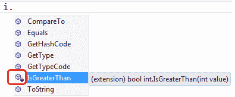

# C# 扩展方法

> 原文：<https://www.tutorialsteacher.com/csharp/csharp-extension-method>

扩展方法，顾名思义，是附加的方法。扩展方法允许您在不修改、派生或重新编译原始类、结构或接口的情况下注入其他方法。扩展方法可以添加到您自己的自定义类中 .NET 框架类，或第三方类或接口。

在以下示例中，`IsGreaterThan()`是 int 类型的扩展方法，如果 int 变量的值大于提供的整数参数，则返回 true。

Example: Extension Method

```
int i = 10;

bool result = i.IsGreaterThan(100); //returns false 
```

`IsGreaterThan()`方法不是 int 数据类型(Int32 结构)的方法。这是程序员为 int 数据类型编写的扩展方法。IsGreaterThan()扩展方法将通过包含定义它的命名空间而在整个应用中可用。

在 visual studio 的 intellisense 中，扩展方法有一个特殊的符号，因此您可以轻松区分类方法和扩展方法。

[](../../Content/images/csharp/extension-method.png)

Extension Method Symbol in visual studio intellisense


现在让我们看看如何编写扩展方法。

 LINQ is built upon extension methods that operate on IEnumerable and IQeryable type.

扩展方法实际上是静态类中定义的一种特殊的静态方法。要定义扩展方法，首先要定义一个静态类。

例如，在下面的示例中，我们在`ExtensionMethods`命名空间下创建了一个`IntExtensions`类。IntExtensions 类将包含适用于 int 数据类型的所有扩展方法。(命名空间和类可以使用任何名称。)

Example: Create a Class for Extension Methods

```
namespace ExtensionMethods
{
    public static class IntExtensions
    {

    }
} 
```

现在，将静态方法定义为扩展方法，其中扩展方法的第一个参数指定扩展方法适用的类型。我们将在 int 类型上使用这个扩展方法。所以第一个参数必须在 int 之前加上 ***这个*** 修饰符。

例如，`IsGreaterThan()`方法对 int 进行操作，所以第一个参数是，`this int i`。

Example: Define an Extension Method

```
namespace ExtensionMethods
{
    public static class IntExtensions
     {
        public static bool IsGreaterThan(this int i, int value)
        {
            return i > value;
        }
    }
} 
```

现在，您可以在任何想要使用扩展方法的地方包含扩展方法名称空间。

Example: Extension method

```
using ExtensionMethods;

class Program
{
    static void Main(string[] args)
    {
        int i = 10;

        bool result = i.IsGreaterThan(100); 

        Console.WriteLine(result);
    }
} 
```

Output:```
false
```*Note:**The only difference between a regular static method and an extension method is that the first parameter of the extension method specifies the type that it is going to operator on, preceded by the ***this*** keyword.**  Points to Remember :

1.  扩展方法是最初不包含在类中的附加自定义方法。
2.  扩展方法可以添加到自定义、 .NET 框架或第三方类、结构或接口。
3.  扩展方法的第一个参数必须是扩展方法适用的类型，前面有**这个**关键字。
4.  通过包含扩展方法的命名空间，可以在应用的任何地方使用扩展方法。*