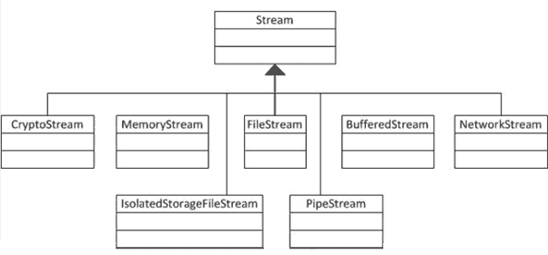
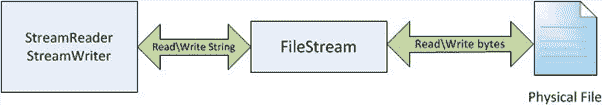

# C# -流

> 原文:[https://www.tutorialsteacher.com/csharp/csharp-stream-io](https://www.tutorialsteacher.com/csharp/csharp-stream-io)

C# 包括以下标准 IO(输入/输出)类，用于从不同的来源读取/写入，如文件、内存、网络、独立存储等。

**溪流:** *系统。IO.Stream* 是一个抽象类，提供了传输字节(读、写等)的标准方法。)到源。它就像一个传输字节的包装类。需要从特定源读取/写入字节的类必须实现 Stream 类。

下列类继承 Stream 类以提供从特定源读取/写入字节的功能:

**FileStream** 从物理文件读取字节或向物理文件写入字节，无论它是. txt 文件。exe。jpg 或任何其他文件。文件流是从流类派生的。

**内存流:**内存流读取或写入存储在内存中的字节。

**缓冲数据流:**缓冲数据流从其他数据流中读取或写入字节，以提高某些输入/输出操作的性能。

**网络流:**网络流从网络套接字读取或写入字节。

**管道流:**管道流从不同的进程读取或写入字节。

**crypto stream:**crypto stream 用于将数据流链接到加密转换。

下图显示了流类的层次结构:

<figure>

<figcaption>Stream Classes Hierarchy</figcaption>

</figure>

## 流动读者和作家

**Stream reader**:Stream reader 是一个助手类，用于通过使用编码值将字节转换为字符来从流中读取字符。它可以用来从不同的流中读取字符串(字符)，如文件流、内存流等。

**Stream writer**:Stream writer 是一个通过将字符转换为字节将字符串写入流的助手类。它可用于将字符串写入不同的流，如文件流、内存流等。

**binary reader**:binary reader 是一个从字节中读取原语数据类型的辅助类。

**binary writer**:binary writer 用二进制写原语类型。

<figure>

<figcaption>Stream IO</figcaption>

</figure>

上图显示`FileStream`从物理文件中读取字节，然后`StreamReader`通过将这些字节转换为字符串来读取字符串。同理，`StreamWriter`取一个字符串，转换成字节写入`FileStream`，然后`FileStream`将字节写入物理文件。因此，`FileStream`处理字节，而`StreamReader`和`StreamWriter`处理字符串。

  Points to Remember :

1.  `Stream`是一个抽象类，用于从不同的源传输字节。它是所有其他类的基类，向不同的源读取/写入字节。
2.  `FileStream`类提供对物理文件的字节读写功能。
3.  读取器和写入器类提供了从流类(文件流、内存流等)读取字节并将字节转换为适当编码的功能。
4.  `StreamReader`通过将字节转换为字符串，提供了从 FileStream 读取字符串的助手方法。StreamWriter 提供了一个助手方法，通过将字符串转换为字节来将字符串写入 FileStream。

在下一节中，学习如何读取/写入文件系统。