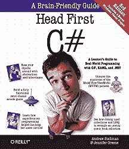
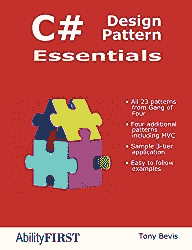
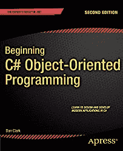

# C#学习资源

> 原文:[https://www . tutorial stearner . com/cs harp/cs harp-有用-资源](https://www.tutorialsteacher.com/csharp/csharp-useful-resources)

## 多景点课程

[pluralsight.com](https://pluralsight.pxf.io/V02D3)是世界上最好的直接向行业专家学习技术的网站。在多瞄准镜上查看 [C#课程。](https://pluralsight.pxf.io/AooYLj)

## C#书籍

   