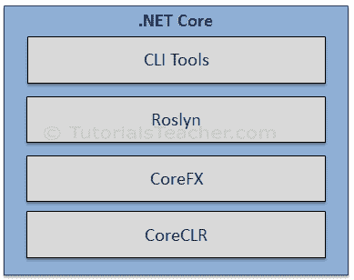

# 。NET Core 概述

> 原文：<https://www.tutorialsteacher.com/core/dotnet-core>

。NET Core 是的新版本。NET Framework，这是一个由微软维护的免费、开源、通用的开发平台。它是一个跨平台框架，运行在 Windows、macOS 和 Linux 操作系统上。

。NET Core Framework 可用于构建移动、桌面、web、云、IoT、机器学习、微服务、游戏等不同类型的应用。

。NET Core 是从零开始编写的，使其成为模块化、轻量级、快速和跨平台的框架。它包括运行基本的。NET Core 应用。其他功能作为 NuGet 包提供，您可以根据需要将其添加到应用程序中。这样一来。NET Core 应用程序加快了性能，减少了内存占用，变得易于维护。

## 为什么？NET Core？

有一些限制。NET 框架。例如，它只在 Windows 平台上运行。还有，你需要用不同的。NET APIs，适用于不同的 Windows 设备，如 Windows 桌面、Windows 商店、Windows 电话和网络应用程序。除此之外。NET 框架是一个机器范围的框架。对它所做的任何更改都会影响依赖它的所有应用程序。了解更多背后的动机。网芯[这里](https://devblogs.microsoft.com/dotnet/introducing-net-core/)。

如今，跨设备运行的应用程序很常见；web 服务器上的后端，面向消费者的 windows 桌面、web 和移动应用程序上的管理前端。因此，需要一个适用于所有地方的单一框架。所以，考虑到这一点，微软创造了。NET Core。的主要目标。NET Core 是做。NET Framework 开源、跨平台兼容，可用于各种垂直领域，从数据中心到基于触摸的设备。

## 。净核心特征

**开源框架:**。NET Core 是一个由微软维护的[开源框架](https://dotnet.microsoft.com/platform/open-source) ，可在 GitHub 上以 [MIT](https://github.com/dotnet/runtime/blob/master/LICENSE.TXT) 和 [Apache 2](https://www.apache.org/licenses/LICENSE-2.0) 许可证获得。 是一个[。NET 基础项目](https://dotnetfoundation.org/)。

您可以使用以下 GitHub 存储库查看、下载或贡献源代码:

*   语言编译器平台罗斯林:[https://github.com/dotnet/roslyn](https://github.com/dotnet/roslyn)T2】
*   。NET Core 运行时:[https://github.com/dotnet/runtime](https://github.com/dotnet/runtime)T2】
*   。NET Core 软件开发工具包存储库。[https://github.com/dotnet/sdk](https://github.com/dotnet/sdk)T2】
*   ASP.NET Core 储存库。[https://github.com/dotnet/aspnetcore](https://github.com/dotnet/aspnetcore)T2】

**跨平台:**。NET Core 运行在 Windows、macOS 和 Linux 操作系统上。执行代码并生成相同输出的每个操作系统都有不同的运行时。

**跨架构一致:**在不同的指令集架构(包括 x64、x86 和 ARM)中以相同的行为执行代码。

**应用范围广:**可以开发和运行各种类型的应用。NET Core 平台如移动、桌面、web、云、IoT、机器学习、微服务、游戏等。

**支持多种语言:**可以使用 C#、F#、Visual Basic 等编程语言进行开发。NET Core 应用程序。可以使用自己喜欢的 IDE，包括 Visual Studio 2017/2019、Visual Studio Code、崇高文本、Vim 等。

**模块化架构:**。NET Core 支持使用 NuGet 包的模块化架构方法。对于可以添加到中的各种功能，有不同的 NuGet 包。NET Core 项目。甚至是。NET Core 库是作为 NuGet 包提供的。默认的 NuGet 包。NET Core 应用模型是[微软。netapp](https://www.nuget.org/packages/Microsoft.NETCore.App)。

这样，它减少了内存占用，提高了性能，并且易于维护。

**CLI 工具:**。NET Core 包括用于开发和持续集成的[命令行工具](/core/net-core-command-line-interface)(命令行界面)。

**灵活部署:**。NET Core 应用程序可以在用户范围或系统范围内部署，也可以使用 [Docker Containers](https://docs.microsoft.com/en-us/dotnet/core/docker/introduction) 。

**兼容:**兼容。使用[的. NET 框架和 Mono APIs。NET 标准规范](https://docs.microsoft.com/en-us/dotnet/standard/net-standard)。

## 。NET Core 版本历史记录

| 版本 | 最新版本 | 可视化工作室 | 出厂日期 | 支持结束 |
| --- | --- | --- | --- | --- |
| 。NET 5 | 预览 1 | VS 2019 | 2020 年 3 月 16 日 |  |
| 。NET Core 3.x -最新 | 3.1.3 | VS 209 | 2020 年 3 月 24 日 | 2022 年 3 月 12 日 |
| 。NET Core 2.x | 2.1.17 | VS 2017，2019 | 2020 年 3 月 24 日 | 2021 年 8 月 21 日 |
| 。NET Core 1.x | 1.1.13 | VS 2017 | 2019 年 5 月 14 日 | 2019 年 5 月 27 日 |

两者都有。NET 3.1，以及。NET Core 2.1 将会有长期的支持。

。NET Core 3.x 应用程序只能在。NET Core 框架。

。NET Core 2.x 应用程序运行于。NET Core 以及。NET 框架。

## 。净核心组成

那个。NET Core 框架由以下部分组成:

.NET Core

*   命令行界面工具:一套用于开发和部署的工具。
*   罗斯林:C# 和 Visual Basic 的语言编译器
*   CoreFX:一组框架库。
*   一个基于 JIT 的命令语言运行时。

## 有用的链接

*   找到。NET Core 类型和成员声明、文件和程序集。NET Core 源码浏览器。
*   找人帮忙。[上的净核心类型。网络核心应用编程接口参考文档](https://docs.microsoft.com/dotnet/api/?view=netcore-3.0)。
*   了解。网芯详细介绍[https://docs.microsoft.com/en-us/dotnet/core](https://docs.microsoft.com/en-us/dotnet/core/)T2】
*   下载。NET Core 运行时和 SDK 来自[https://dotnet.microsoft.com/download/dotnet-core](https://dotnet.microsoft.com/download/dotnet-core)T2】