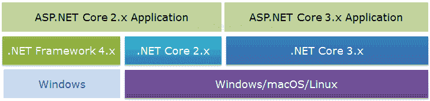

# ASP.NET Core 概况

> 原文：<https://www.tutorialsteacher.com/core/aspnet-core-introduction>

ASP.NET Core 是 ASP.NET 网络框架的新版本，主要目标是运行。NET Core 平台。

ASP.NET Core 是一个免费、开源和跨平台的框架，用于构建基于云的应用程序，如网络应用程序、物联网应用程序和移动后端。它设计为在云上和内部运行。

和一样。NET Core，它是以最小的开销模块化设计的，然后可以根据应用程序的需求添加其他更高级的特性作为 NuGet 包。这带来了高性能，需要更少的内存，更小的部署规模，并且易于维护。

ASP.NET Core 是微软和社区支持的开源框架，所以你也可以从 Github 上的[ASP.NET Core 资源库贡献或下载源代码。](https://github.com/dotnet/aspnetcore)

ASP.NET 3 . x 仅在上运行。NET Core 3.x，而 ASP.NET Core 2 . x 运行在。NET Core 2.x 以及。NET 框架。

ASP.NET Core

## 为什么是 ASP.NET Core？

*   **支持多平台:**ASP.NET Core 应用可以在 Windows、Linux、Mac 上运行。因此，您不需要使用不同的框架为不同的平台构建不同的应用。
*   **快:**ASP.NET 芯不再依赖 System.Web.dll 进行浏览器-服务器通信。ASP.NET Core 允许我们包括我们的应用程序需要的包。这减少了请求管道，提高了性能和可伸缩性。
*   **IoC 容器:**包括内置的用于自动依赖注入的 IoC 容器，使其具有可维护性和可测试性。
*   **与现代 UI 框架的集成:**它允许您使用和管理现代 UI 框架，如 AngularJS、ReactJS、Umber、Bootstrap 等。使用 Bower(一个网络包管理器)。
*   **托管:**ASP.NET 芯 web 应用可以在多个平台上托管，任何 web 服务器如 IIS、Apache 等。 它不仅仅依赖于作为标准的 IIS。NET 框架。
*   **代码共享:**它可以让你构建一个可以和其他一起使用的类库。. NET 框架，如。NET Framework 4.x 或 Mono。因此，单个代码库可以跨框架共享。
*   **并行应用版本控制:**ASP.NET Core 运行于。NET Core，它支持同时运行多个版本的应用程序。
*   **更小的部署空间:**ASP.NET Core 应用程序运行于。NET Core，它比完整的小。NET 框架。所以，应用程序只使用。NET CoreFX 将具有较小的部署大小。这减少了部署占用空间。

## 。净芯 vs ASP.NET 芯

| 。净核心 | ASP.NET Core |
| --- | --- |
| 开源和跨平台 | 开源和跨平台 |
| 。NET Core 是一个运行时，用于执行构建在其上的应用程序。 | ASP.NET Core 是一个网络框架，用于在其上构建网络应用、物联网应用和移动后端。NET Core 或。NET 框架。 |
| 安装。NET Core 运行时来运行和安装应用程序。NET Core 软件开发工具包来构建应用程序。 | ASP.NET Core 没有单独的运行时和软件开发工具包。。NET Core 运行时和软件开发工具包包括 ASP.NET Core 库。 |
| 。NET Core GitHub 资源库:
[。NET Core Runtime](https://github.com/dotnet/runtime)
[。NET Core SDK](https://github.com/dotnet/sdk) | ASP.NET Core GitHub 资源库:[https://github.com/dotnet/aspnetcore](https://github.com/dotnet/aspnetcore)T2】 |
| 。NET Core 3.1 -最新版本 | ASP.NET Core 3.1
ASP.NET Core 没有单独的版本控制。它和。NET Core 版本。 |

让我们下载并安装。NET Core/ASP。NET Core 在下一章。