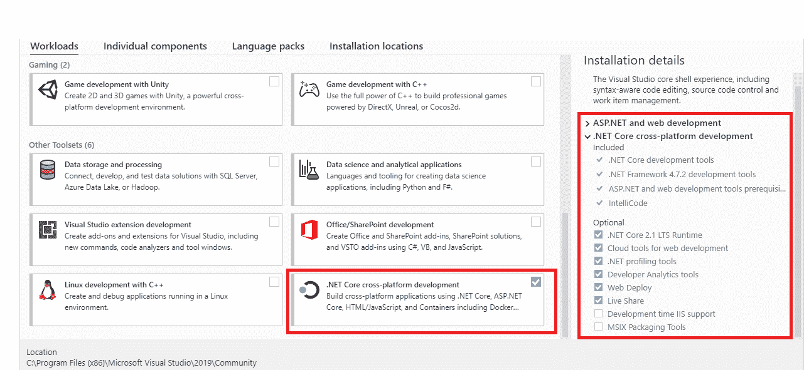
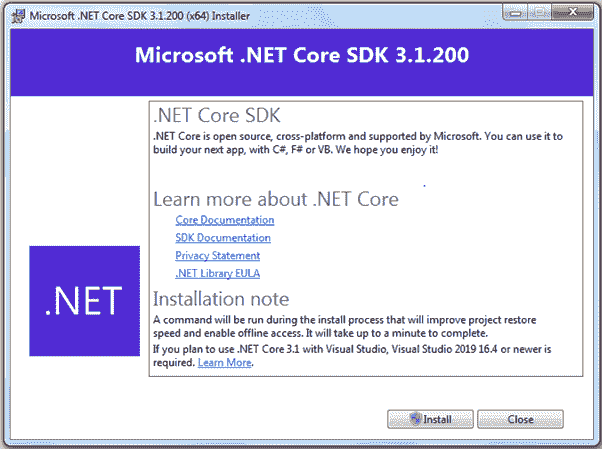

# 安装 ASP.NET Core

> 原文：<https://www.tutorialsteacher.com/core/aspnet-core-environment-setup>

在这里，您将学习为构建准备开发环境 .NET Core/ASP .NET Core 应用。

 .NET Core 可以通过两种方式安装:通过安装 Visual Studio 2017/2019 或通过安装 .NET Core 运行时或软件开发工具包。

 .NET Core 安装程序已经包含 ASP.NET Core 库，因此没有单独的 ASP.NET Core 安装程序。

## 安装 Visual Studio

目前， .NET Core 2.1 和 .NET Core 3.1 有长期的支持。Visual Studio 2017 支持 .NET Core 2.1，而 Visual Studio 2019 支持这两个版本。

可以使用自己喜欢的 IDE，如 Visual Studio、Visual Studio Code、崇高文本等。开发、恢复、构建和运行 .NET Core 应用。这里，我们将使用 Visual Studio 2019。

如果您的开发电脑上没有 Visual Studio，那么建议安装最新的 Visual Studio 2019。如果您已经安装了 Visual Studio 2017 或 2019，那么您已经安装了 .NET Core 2.1。

从[这里](https://visualstudio.microsoft.com/downloads/)下载安装基于你的操作系统的 Visual Studio 2019。根据您的许可证选择合适的版本。社区版对学生、开源贡献者和个人都是免费的。

在安装过程中，选择” .NET Core 跨平台开发”的工作负载。这将安装 .NET Core 2.1。但是，您需要安装 .NET Core 3.1 SDK 单独发布。

 

安装后，您可以通过打开命令提示符(或苹果电脑中的终端)并键入 **dotnet - version** 并按回车键来验证它。这将显示安装的版本和使用信息，如下所示。

<samp>C:\Users\dev>dotnet --version
2.1.805</samp>

## 安装 .NET Core 3.x

如您所见，Visual Studio 2019 安装程序包括 .NET Core 2.1，但不是 .NET Core 3.x .需要单独安装。

下载的最新版本 .NET Core，转到[https://dotnet.microsoft.com/download](https://dotnet.microsoft.com/download)选择你正在使用的平台。

 

Install .NET Core SDK for Windows

如上所述 .NET Core 运行时和 .NET Core SDK 是不同的东西。 .NET Core 运行时仅用于运行 .NET Core 应用，而 .NET Core SDK 包括开发工具和库 .NET Core 应用。为了建立一个开发环境，我们需要安装 .NET Core SDK，适用于我们用于开发的平台，如 Windows、Linux 或 Mac。我们将在这里安装 .NET Core SDK，因为我们正在为构建准备一个开发环境 .NET Core 应用。如果你想逃跑 .NET Core 应用，然后安装。服务器、云或客户端桌面上的 NET Core 运行时。

点击**下载 .NET Core SDK** 按钮下载最新版本 .NET Core SDK 安装程序。它会下载 .NET Core 3.1 SDK。

下载安装程序后，单击它开始安装。

 

点击**安装**按钮，按照向导进行安装 .NET Core 3.1 软件开发工具包。

安装后，现在可以开发了 .NET Core/ASP .NET Core 应用。接下来让我们了解一下。