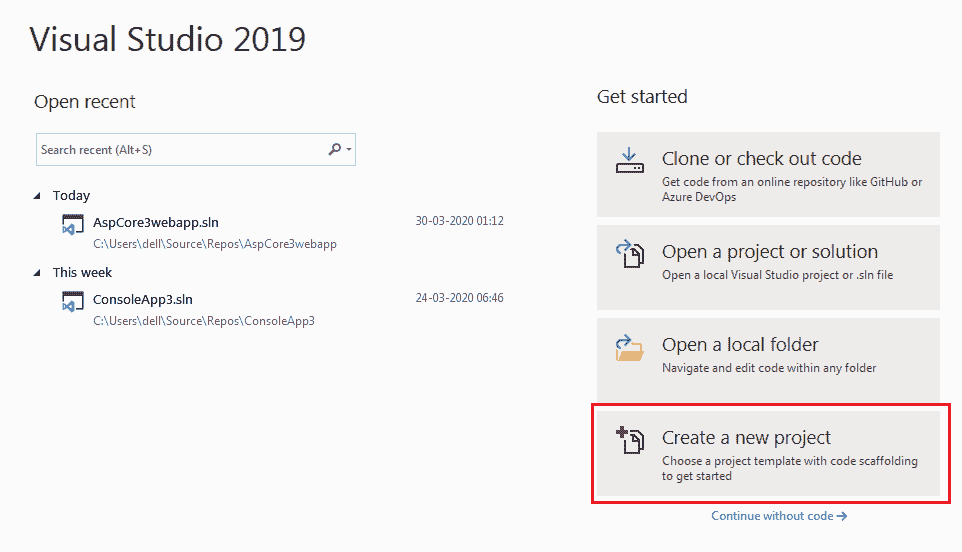
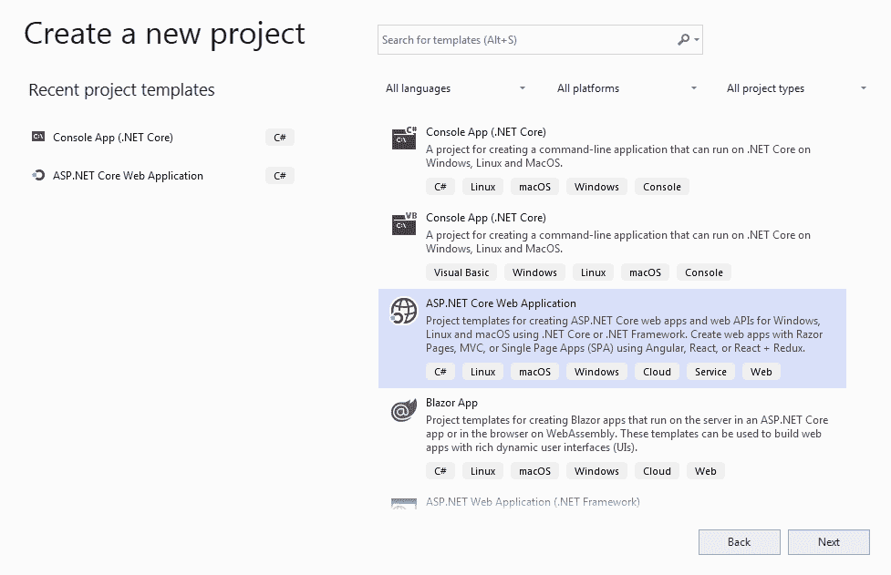
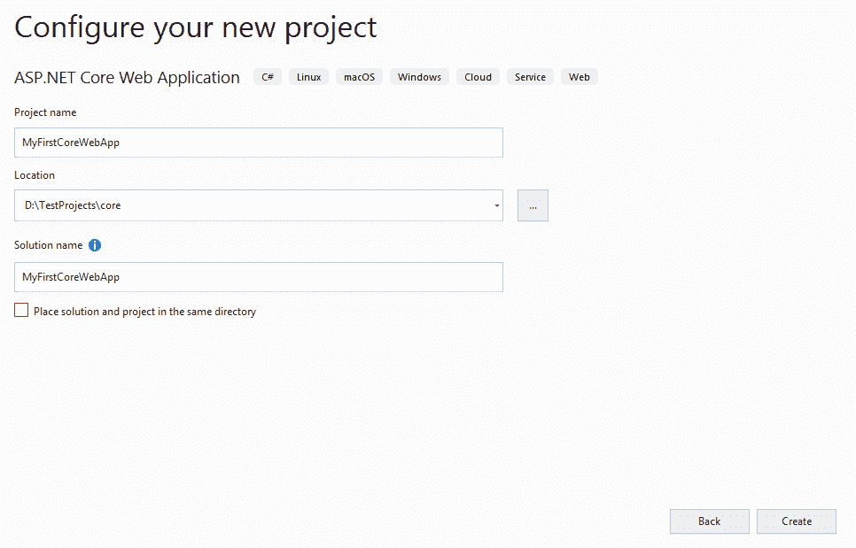
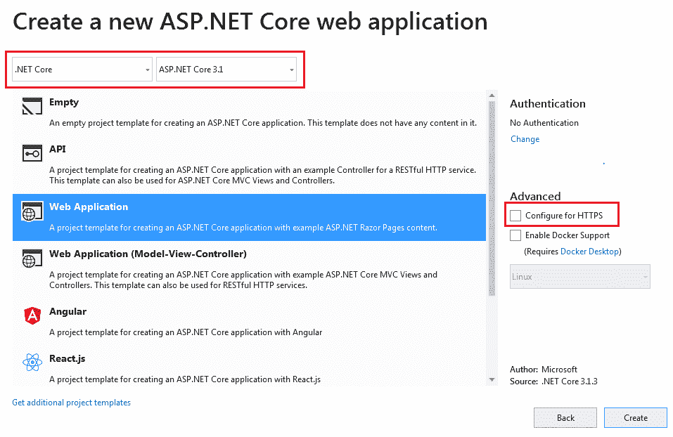
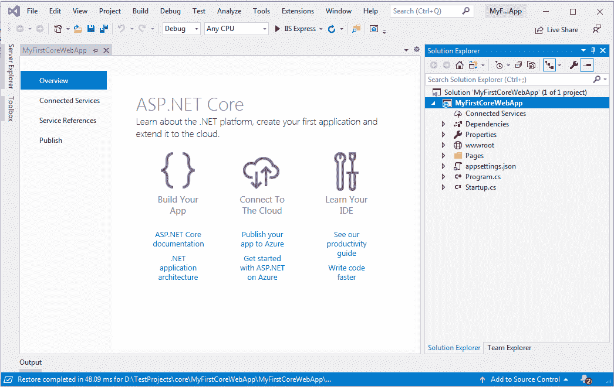
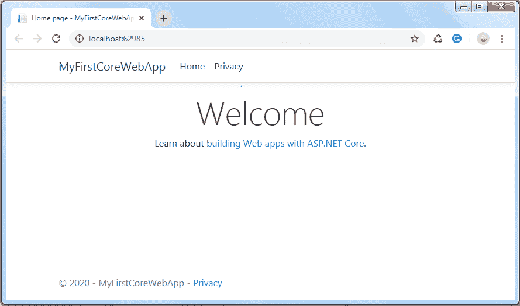
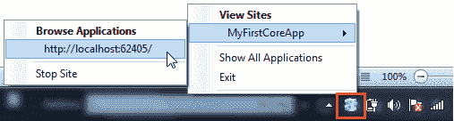

# 创建 ASP.NET Core 应用程序

> 原文：<https://www.tutorialsteacher.com/core/first-aspnet-core-application>

在这里，我们将学习如何在 Visual Studio 2019 中创建我们的第一个 ASP.NET Core 3.0 应用程序。

打开 Visual Studio 2019，点击**新建项目**，如下图。

[<picture><source srcset="../../Content/images/core/create-newproject-vs2019.webp" type="image/webp"> <source srcset="../../Content/images/core/create-newproject-vs2019.png" type="image/png">  </picture>](../../Content/images/core/create-newproject-vs2019.png) 

Create a New ASP.NET Core 3.0 Project

“创建新项目”对话框包括不同的。NET Core 3.0 应用程序模板。每个都将根据应用程序类型创建预定义的项目文件和文件夹。这里我们将创建一个简单的 web 应用，所以选择**ASP.NET Core Web 应用**模板，点击**下一步**，如下图。

[<picture><source data-srcset="../../Content/images/core/create-newproject2-vs2019.webp" type="image/webp"> <source data-srcset="../../Content/images/core/create-newproject2-vs2019.PNG" type="image/png">  </picture>](../../Content/images/core/create-newproject2-vs2019.PNG) 

<noscript>&#13; <a href="../../Content/images/core/create-newproject2-vs2019.PNG" target="_blank">&#13; &#13; </a>&#13;</noscript>

Select Application Template

接下来，为 ASP.NET Core 应用程序提供适当的名称、位置和解决方案名称。在本例中，我们将给出名称“MyFirstCoreWebApp”，并点击**创建**按钮，如下所示。

[<picture><source data-srcset="../../Content/images/core/create-webapp-vs2019.webp" type="image/webp"> <source data-srcset="../../Content/images/core/create-webapp-vs2019.PNG" type="image/png">  </picture>](../../Content/images/core/create-webapp-vs2019.PNG) 

<noscript>&#13; <a href="../../Content/images/core/create-webapp-vs2019.PNG" target="_blank">&#13; &#13; </a>&#13;</noscript>

Configure Project

接下来，选择合适的 ASP.NET Core 网络应用模板，如空、应用编程接口、网络应用、MVC 等。这里我们要创建一个 web 应用，所以选择 **Web 应用**模板。此时我们不想要 HTTPS，所以取消选中**为 HTTPS 配置**复选框，如下图所示。此外，请确保您选择了适当的。NET Core 和 ASP.NET Core 版本。点击**创建**按钮创建项目。

[<picture><source data-srcset="../../Content/images/core/select-template-vs2019.webp" type="image/webp"> <source data-srcset="../../Content/images/core/select-template-vs2019.PNG" type="image/png">  </picture>](../../Content/images/core/select-template-vs2019.PNG) 

<noscript>&#13; <a href="../../Content/images/core/select-template-vs2019.PNG" target="_blank">&#13; &#13; </a>&#13;</noscript>

Select Web Application Template

这将在 Visual Studio 2019 中创建新的 ASP.NET Core 网站项目，如下所示。等待一段时间，直到 Visual Studio 恢复项目中的包。恢复过程意味着 Visual Studio 将自动添加、更新或删除项目中作为 NuGet 包配置的依赖项。

[<picture><source data-srcset="../../Content/images/core/web-project.webp" type="image/webp"> <source data-srcset="../../Content/images/core/web-project.PNG" type="image/png">  </picture>](../../Content/images/core/web-project.PNG) 

<noscript>&#13; <a href="../../Content/images/core/web-project.PNG" target="_blank">&#13; &#13; </a>&#13;</noscript>

Create ASP.NET Core 3 Application

我们将在下一章了解项目结构。要运行此网络应用程序，请点击 **IIS Express** 或按 Ctrl + F5。 这将打开浏览器并显示以下结果。

[<picture><source data-srcset="../../Content/images/core/run-web-app.webp" type="image/webp"> <source data-srcset="../../Content/images/core/run-web-app.PNG" type="image/png">  </picture>](../../Content/images/core/run-web-app.png) 

<noscript>&#13; <a href="../../Content/images/core/run-web-app.png" target="_blank">&#13; &#13; </a>&#13;</noscript>

以上输出来自**页面**文件夹下的`Index.cshtml`页面。

您还可以在系统托盘上看到 IIS express 图标。右击它。您可以在您的开发机器上看到当前运行的 ASP.NET 站点。

[<picture><source data-srcset="../../Content/images/core/system-tray.webp" type="image/webp"> <source data-srcset="../../Content/images/core/system-tray.PNG" type="image/png">  </picture>](../../Content/images/core/system-tray.png) 

<noscript>&#13; <a href="../../Content/images/core/system-tray.png" target="_blank">&#13; &#13; </a>&#13;</noscript>

ASP.NET Core sites in System Tray

因此，我们可以创建一个新的跨平台 ASP.NET Core 3.0 应用程序，运行在。NET Core。

接下来了解项目结构。