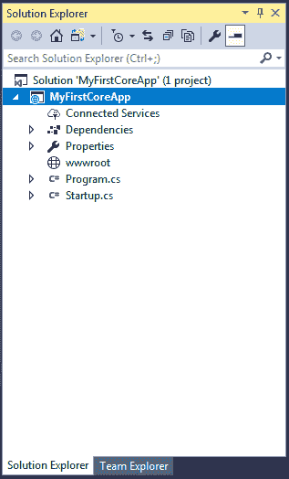
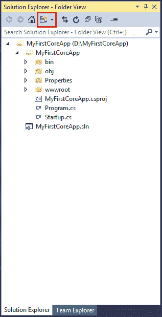
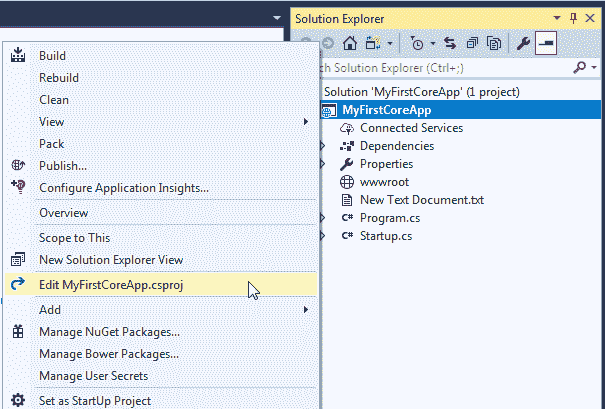
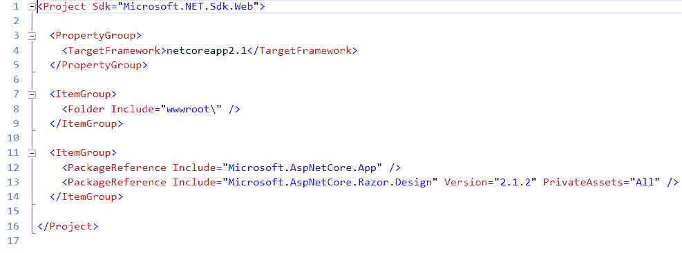
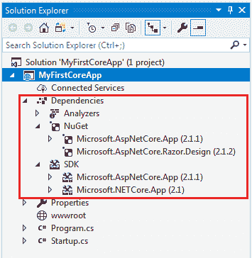
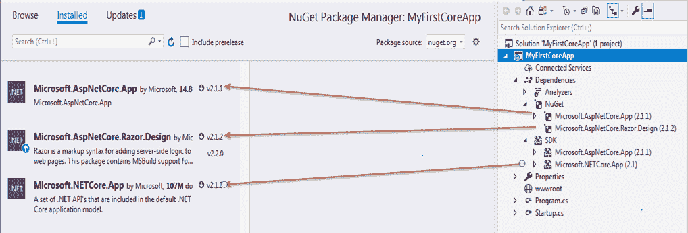
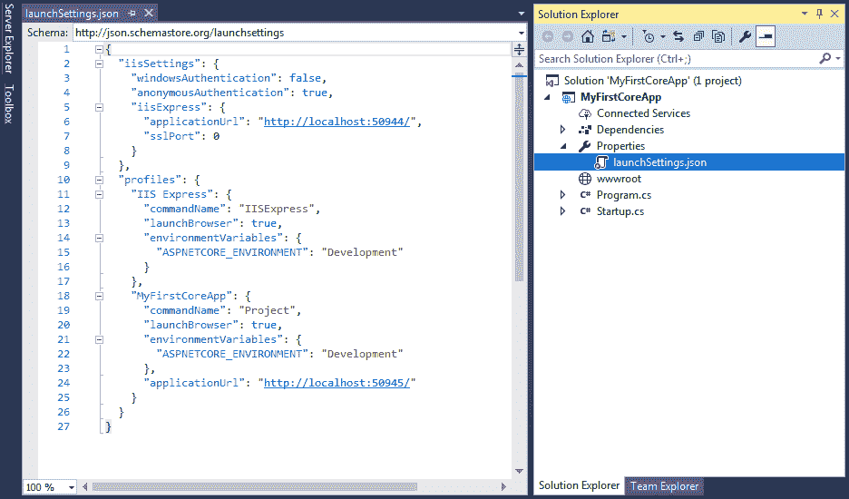
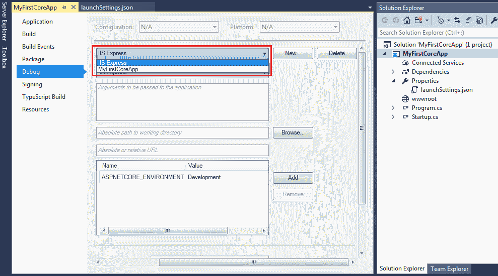

# ASP.NET 核心项目结构

> 原文:[https://www . tutorial stearn . com/core/aspnet-core-application-project-structure](https://www.tutorialsteacher.com/core/aspnet-core-application-project-structure)

在这里，您将了解到 ASP.NET Core 2.0 应用程序模板使用 Visual Studio 2017 创建的每个文件的项目结构和意义。

以下是在 Visual Studio 中创建空的 ASP.NET 核心应用程序时的默认项目结构。

 

ASP.NET Core Project Structure

上面的解决方案资源管理器显示项目解决方案。我们可以通过点击**解决方案和文件夹**图标并选择文件夹视图选项将其更改为文件夹视图。 这将显示包含所有项目文件夹和文件的解决方案资源管理器，如下所示。

 

Solution Explorer - Folder View

*Note:**ASP.NET Core project files and folders are synchronized with physical files and folders. If you add a new file or folder in project folder then it will directly reflect in the solution explorer. You don't need to add it in the project explicitly by right clicking on the project.* *## 。csproj(csproject)

ASP.NET 核心 1.0 没有创造。相反，csproj 文件使用。xproj 和 project.json 文件来管理项目。这在 ASP.NET 核心 2.0 中已经改变。Visual Studio 现在使用。管理项目的 csproj 文件。我们可以编辑。通过右键单击项目并选择**编辑<项目名称>来设置 csproj。csproj** 如下图。

 

Edit .csproj

那个。上述项目的 csproj 如下所示。

 

Edit .csproj

csproj 文件包含与目标相关的设置。NET 框架、项目文件夹、NuGet 包引用等。

## 属国

ASP.NET 核心 2.1 项目中的依赖项包含所有已安装的服务器端 NuGet 包，如下所示。

 

Dependencies

右键单击“依赖项”，然后单击“管理新包”查看已安装的 NuGet 包，如下所示。

 

Dependencies

可以看到，它已经安装了三个软件包，**微软。AspNetCore.App** 包是给 ASP.NET web 应用、 T2】微软的。AspNetCore.Razor.Design 包是给 Razor 引擎的，**微软的。netapp**包是为。NET 核心应用编程接口。

您可以从“管理软件包”窗口或使用软件包管理器控制台将所有其他必需的服务器端依赖项安装为“获取软件包”。

## 性能

“属性”节点包括一个包含 Visual Studio 调试设置配置文件的启动设置. json 文件。以下是默认的 launchSettings.json 文件。

 

launchSettings.json

我们还可以从项目属性的调试选项卡中编辑设置。右键单击项目->选择属性->单击调试选项卡。

 

Project Properties

在调试选项卡中，选择您想要编辑的配置文件，如上所示。你可以改变环境变量，网址等。

在下一章中了解 wwwroot。*