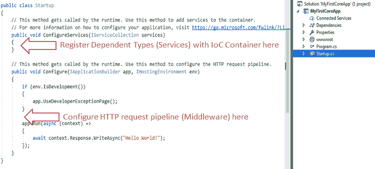

# ASP.NET Core `Startup`类

> 原文：<https://www.tutorialsteacher.com/core/aspnet-core-startup>

这里，我们将在项目的根文件夹中有一个包含在 Startup.cs 中的 Startup 类的概述。

ASP.NET Core 应用必须包括启动类。它就像传统的 Global.asax .NET 应用。顾名思义，它是在应用启动时首先执行的。

在`Program`类的`Main()`方法中配置主机时，可以使用`UseStartup<T>()`方法配置启动类，如下图所示。

```cs
public class Program
{
    public static void Main(string[] args)
    {
        BuildWebHost(args).Run();
    }

    public static IWebHost BuildWebHost(string[] args)
    {
        WebHost.CreateDefaultBuilder(args)
            **.UseStartup<Startup>()**
            .Build();
    }
} 
```

“初创公司”这个名字是根据 ASP.NET Core 会议命名的。但是，我们可以给 Startup 类起任何名字，只需在`UseStartup<T>()`方法中将其指定为泛型参数即可。例如，要将启动类命名为 MyStartup，请将其指定为`.UseStartup<MyStartup>()`。

通过单击解决方案资源管理器中的 Startup.cs，在 Visual Studio 中打开 Startup 类。以下是 ASP.NET Core 2.x 中的默认启动类

[](../../Content/images/core/startup.png)

startup.cs


可以看到，Startup 类包括两个公共方法:**配置服务**和**配置**。

启动类必须包含配置方法，并且可以选择包含配置服务方法。

## 配置服务()

依赖注入模式在 ASP.NET Core 架构中被大量使用。它包括内置的 IoC 容器，使用构造器提供依赖对象。

ConfigureServices 方法是一个可以向内置 IoC 容器注册依赖类的地方。注册依赖类后，它可以在应用的任何地方使用。您只需要将它包含在要使用它的类的构造器的参数中。IoC 容器会自动注入。

ASP.NET Core 将从属类称为服务。所以，每当你读“服务”的时候，就把它理解为一个将要在其他课程中使用的课程。

ConfigureServices 方法包含 IServiceCollection 参数，用于向 IoC 容器注册服务。在下一章中了解更多信息。

## 配置()

在 Configure 方法中，您可以使用内置的 IoC 容器提供的 IApplicationBuilder 实例为应用配置应用请求管道。

ASP.NET Core 引入了中间件组件来定义请求管道，它将在每个请求上执行。您只包括应用所需的中间件组件，从而提高应用的性能。

以下是默认的配置方法。

```cs
public void Configure(IApplicationBuilder app, IHostingEnvironment env)
{
    if (env.IsDevelopment())
    {
        app.UseDeveloperExceptionPage();
    }

    app.Run(async (context) =>
    {
        await context.Response.WriteAsync("Hello World!");
    });
} 
```

如您所见，默认情况下，配置方法包括三个参数:应用构建器、IHostingEnvironment 和 ILoggerFactory。这些服务是由内置的 IoC 容器注入的框架服务。

在运行时，在配置方法之前调用配置服务方法。这是为了让您可以在配置方法中使用的 IoC 容器中注册您的自定义服务。

在[中间件](/core/aspnet-core-middleware)一章中了解更多`Configure`方法。