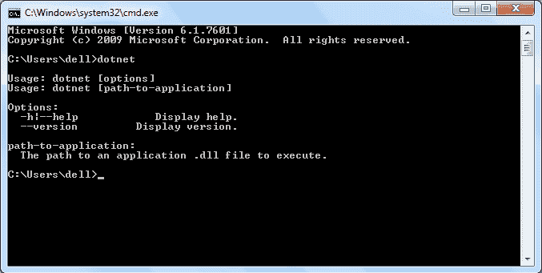
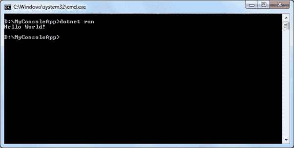
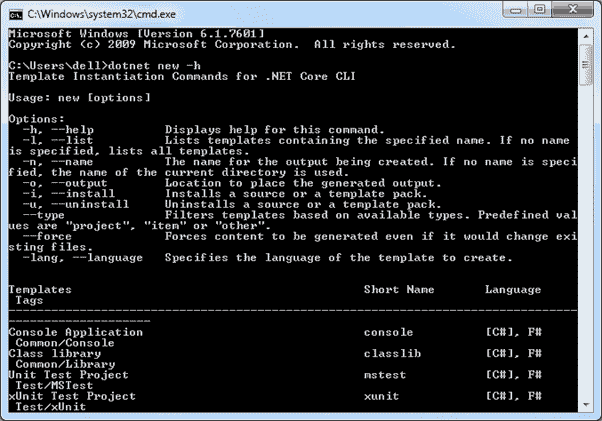

#  .NET Core 命令行界面

> 原文：<https://www.tutorialsteacher.com/core/net-core-command-line-interface>

那个 .NET Core 命令行界面是一种新的跨平台工具，用于创建、恢复包、构建、运行和发布 .NET 应用。

在前一章中，我们使用 Visual Studio 创建了我们的第一个 ASP.NET Core 应用。Visual Studio 在内部使用该命令行界面来恢复、生成和发布应用。其他更高级别的 ide、编辑器和工具都可以使用 CLI 来支持 .NET Core 应用。

那个 .NET Core 命令行界面与一起安装 .NET Core 软件开发工具包。所以我们不需要在开发机上单独安装。我们可以通过在 Windows 中打开命令提示符并编写 dotnet 并按 Enter 键来验证 CLI 是否安装正确。如果它显示如下所示的用法和帮助，则表示它安装正确。

[](../../Content/images/core/dotnet-cli.png)

.NET Core Command-line Interface


## 指令结构

以下是命令结构。

`dotnet <command> <argument> <option>`

所有命令都以名为 dotnet 的驱动程序开始。驱动程序开始执行指定的命令。在 dotnet 之后，我们可以提供命令(也称为动词)来执行特定的动作。每个命令后面都可以有参数和选项。以下是 .NET Core 2.x 命令行界面命令。

| 基本命令 | 描述 |
| --- | --- |
| [新](https://docs.microsoft.com/en-us/dotnet/core/tools/dotnet-new)T2】 | 基于指定的模板创建新的项目、配置文件或解决方案。 |
| [恢复](https://docs.microsoft.com/en-us/dotnet/core/tools/dotnet-restore)T2】 | 恢复项目的依赖项和工具。 |
| [建造](https://docs.microsoft.com/en-us/dotnet/core/tools/dotnet-build)T2】 | 构建项目及其所有依赖项。 |
| [跑](https://docs.microsoft.com/en-us/dotnet/core/tools/dotnet-run)T2】 | 在没有任何显式编译或启动命令的情况下运行源代码。 |
| [发布](https://docs.microsoft.com/en-us/dotnet/core/tools/dotnet-publish)T2】 | 将应用及其依赖项打包到一个文件夹中，以便部署到托管系统。 |
| [测试](https://docs.microsoft.com/en-us/dotnet/core/tools/dotnet-test)T2】 | 执行单元测试。 |
| [vtest](https://docs.microsoft.com/en-us/dotnet/core/tools/dotnet-vstest) | 从指定的文件运行测试。 |
| 包 T2】 | 将代码打包到 NuGet 包中。 |
| [清洁](https://docs.microsoft.com/en-us/dotnet/core/tools/dotnet-clean)T2】 | 清理项目的输出。 |
| [SLN](https://docs.microsoft.com/en-us/dotnet/core/tools/dotnet-sln)T2] | 修改. NET Core 解决方案文件。 |
| [帮助](https://docs.microsoft.com/en-us/dotnet/core/tools/dotnet-help)T2】 | 显示指定命令的帮助 |
| [门店](https://docs.microsoft.com/en-us/dotnet/core/tools/dotnet-store)T2】 | 将指定的程序集存储在运行时包存储中。 |

| 项目修改命令 | 描述 |
| --- | --- |
| [加包](https://docs.microsoft.com/en-us/dotnet/core/tools/dotnet-add-package)T2】 | 向项目添加包引用。 |
| [添加参考](https://docs.microsoft.com/en-us/dotnet/core/tools/dotnet-add-reference) | 添加项目到项目(P2P)引用。 |
| [取出包裹](https://docs.microsoft.com/en-us/dotnet/core/tools/dotnet-remove-package) | 从项目中移除包引用。 |
| [移除引用](https://docs.microsoft.com/en-us/dotnet/core/tools/dotnet-remove-reference) | 删除项目引用 |
| [列表参考](https://docs.microsoft.com/en-us/dotnet/core/tools/dotnet-list-reference) | 列出所有项目到项目的引用 |

| 高级命令 | 描述 |
| --- | --- |
| [取消删除](https://docs.microsoft.com/en-us/dotnet/core/tools/dotnet-nuget-delete)T2】 | 从服务器中删除或取消列出包。 |
| [努 get 本地人](https://docs.microsoft.com/en-us/dotnet/core/tools/dotnet-nuget-locals) | 清除或列出本地 NuGet 资源。 |
| [纽吉特推](https://docs.microsoft.com/en-us/dotnet/core/tools/dotnet-nuget-push) | 将包推送到服务器并发布它。 |
| [msbuild](https://docs.microsoft.com/en-us/dotnet/core/tools/dotnet-msbuild)T2】 | 构建项目及其所有依赖项。 |
| [dotnet 安装脚本](https://docs.microsoft.com/en-us/dotnet/core/tools/dotnet-install-script) | 用于安装的脚本。核心命令行界面工具和共享运行时。 |

让我们创建、恢复、构建和运行 .NET Core 控制台应用使用命令行界面，而不使用 Visual Studio。

## 创建新项目

创建一个新的 .NET Core 项目，我们必须使用新命令后跟模板名参数。我们可以创建控制台、类库、web、mvc、webapi、razor、angular、react 等。使用命令行界面的项目。使用控制台模板创建一个新的 .NET Core 控制台应用。

下面在当前目录中创建新的控制台项目，其名称与当前目录相同。

`dotnet new console`

以下命令创建了一个名为 MyConsoleApp 的新控制台项目。-n 或- name 选项指定项目的名称。

`dotnet new console -n MyConsoleApp`

下面的命令创建了一个名为 myonsolappto my projects 目录的新控制台应用。-o 或- output 选项用于指定应该在其中生成项目的输出目录。

`dotnet new console -n MyConsoleApp -o C:\MyProjects`

创建项目后，导航到命令提示符下的项目目录，以应用特定于项目的命令，在我们的例子中是 C:\ myonsolapp。

## 添加包参考

出于不同的目的，我们经常需要添加 NuGet 包引用。例如，应用以下命令将 Newtonsoft.json 包添加到我们的控制台项目中。

```cs
C:\MyConsoleApp>dotnet add package Newtonsoft.json
```

这将为我们的项目添加 Newtonsoft.json 包。我们可以通过打开来验证。csproj 文件。

## 还原包

要恢复包或更新现有包，我们可以使用下面的 restore 命令。

```cs
C:\MyConsoleApp>dotnet restore
```

## 构建项目

要构建新的或现有的项目，应用`C:\MyConsoleApp>dotnet build`命令。

## 运行项目

要运行我们的控制台项目，应用如下所示的`dotnet run`命令。

[](../../Content/images/core/dotnet-run.png)

如上图所示，它显示了一个输出“你好，世界！”。

## 获得帮助

我们可以得到任何帮助 .NET Core CLI 命令，方法是在我们想要获取帮助的命令末尾键入-h 或-help。例如，dotnet new -h 将显示我们可以使用的新命令、参数和选项的帮助，如下所示。

[](../../Content/images/core/dotnet-help.png)

因此，我们可以使用 .NET Core 命令行界面，用于创建、恢复包、构建、运行和发布不同类型的 .NET Core 应用。