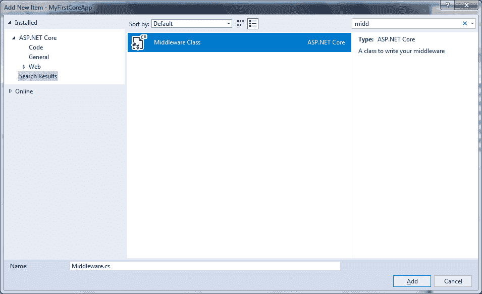

# 在 ASP.NET 核心应用中添加定制中间件

> 原文:[https://www . tutorial stearn . com/core/如何添加自定义中间件-aspnet-core](https://www.tutorialsteacher.com/core/how-to-add-custom-middleware-aspnet-core)

在这里，您将学习如何创建自己的定制中间件并将其添加到 ASP.NET 核心应用程序的请求管道中。

定制中间件组件与任何其他组件一样。NET 类用`Invoke()`方法。但是，为了按顺序执行下一个中间件，它应该在构造函数中有`RequestDelegate`类型参数。

Visual Studio 包含用于创建标准中间件类的模板。为此，右键单击要创建中间件类的项目或文件夹，然后选择添加->新建项目。这将打开添加新项目弹出窗口。如下所示，在右上角的搜索框中搜索“中间件”一词。

<figure>[](../../Content/images/core/custom-middleware.png)

<figcaption>Add Custom Middleware</figcaption>

</figure>

选择中间件类项目并给它一个名称，然后单击添加按钮。这将为中间件添加一个新的类，扩展方法如下所示。

Example: Custom Middleware<button class="copy-btn pull-right" title="Copy example code">*Copy*</button> *```
// You may need to install the Microsoft.AspNetCore.Http.Abstractions package into your project
public class MyMiddleware
{
    private readonly RequestDelegate _next;

    public MyMiddleware(RequestDelegate next)
    {
        _next = next;
    }

    public Task Invoke(HttpContext httpContext)
    {

        return _next(httpContext);
    }
}

// Extension method used to add the middleware to the HTTP request pipeline.
public static class MyMiddlewareExtensions
{
    public static IApplicationBuilder UseMyMiddleware(this IApplicationBuilder builder)
    {
        return builder.UseMiddleware<MyMiddleware>();
    }
} 
```

如上所述，Invoke()方法不是异步的。因此，在调用 next()之前，将其更改为异步并编写您的自定义逻辑；

Example: Async Middleware<button class="copy-btn pull-right" title="Copy example code">*Copy*</button> *```
public class MyMiddleware
{
    private readonly RequestDelegate _next;
    private readonly ILogger _logger;

    public MyMiddleware(RequestDelegate next, ILoggerFactory logFactory)
    {
        _next = next;

        _logger = logFactory.CreateLogger("MyMiddleware");
    }

    public async Task Invoke(HttpContext httpContext)
    {
        _logger.LogInformation("MyMiddleware executing..");

        await _next(httpContext); // calling next middleware

    }
}

// Extension method used to add the middleware to the HTTP request pipeline.
public static class MyMiddlewareExtensions
{
    public static IApplicationBuilder UseMyMiddleware(this IApplicationBuilder builder)
    {
        return builder.UseMiddleware<MyMiddleware>();
    }
} 
```

## 添加自定义中间件

现在，我们需要使用如下所示的 Use extension 方法在请求管道中添加我们的定制中间件。

Example: Add Middleware into Request Pipeline<button class="copy-btn pull-right" title="Copy example code">*Copy*</button> *```
public void Configure(IApplicationBuilder app, IHostingEnvironment env)
{
    app.UseMyMiddleware();

    app.Run(async (context) =>
    {
        await context.Response.WriteAsync("Hello World!");
    });
} 
```

我们也可以使用 IApplicationBuilder 的`app.UseMiddleware<MyMiddleware>()`方法添加中间件。

因此，我们可以在 ASP.NET 核心应用程序中添加定制中间件。***