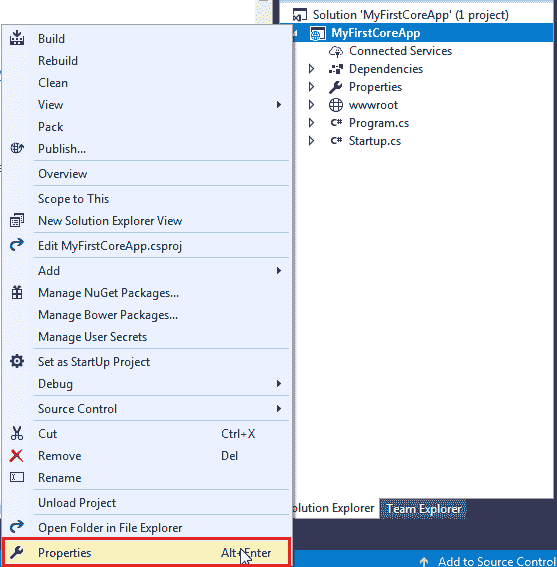
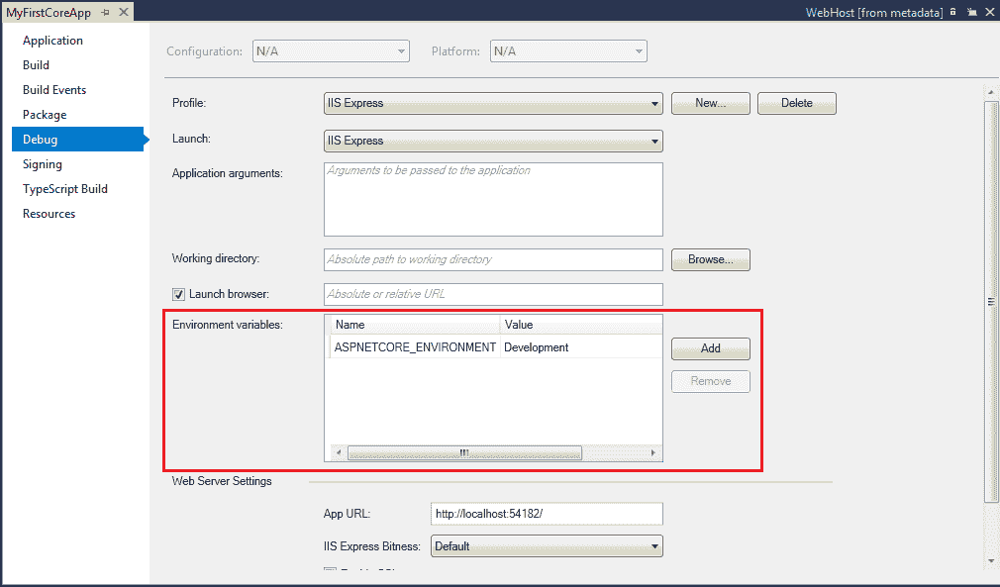

# ASP.NET 核心-环境变量

> 原文:[https://www . tutorial stearn . com/core/aspnet-core-环境变量](https://www.tutorialsteacher.com/core/aspnet-core-environment-variable)

通常，在专业应用程序开发中，在将应用程序发布给真实用户之前，会有多个阶段对其进行测试。按照惯例，这些阶段是开发、准备和生产。作为开发人员，我们可能希望根据应用程序所处的阶段来控制应用程序的行为。环境变量指示应用程序当前运行的运行时环境。

ASP.NET 核心使用名为`ASPNETCORE_ENVIRONMENT`的环境变量来指示运行时环境。该变量的值可以是您需要的任何值，但通常可以是开发、试运行或生产。该值在 Windows 和 Mac OS 中不区分大小写，但在 Linux 中区分大小写。

在 Visual Studio 中，我们可以在项目属性的调试选项卡中设置`ASPNETCORE_ENVIRONMENT`。通过在解决方案资源管理器中右键单击项目并选择“属性”来打开项目属性。

<figure>[](../../Content/images/core/project-properties.png)

<figcaption>Open Project Properties</figcaption>

</figure>

这将打开属性页。单击调试选项卡，您将看到如下所示的环境变量。

<figure>[](../../Content/images/core/environment-variables.png)

<figcaption>Environment Variable</figcaption>

</figure>

你可以根据需要改变价格。该值将保存在如下所示的 launchSettings.json 文件中。

<figure>[](../../Content/images/core/launchsettings2.png)

<figcaption>launchsettings.json</figcaption>

</figure>

您也可以直接在 launchSettings.json 中更改环境变量。

## 运行时访问环境变量

我们可以在代码中获取一个环境变量的值，根据它的值执行一些额外的代码。`IHostingEnvironment`服务包括包含`ASPNETCORE_ENVIRONMENT`变量值的环境名属性。ASP.NET 核心还包括检查环境的扩展方法，例如 IsDevelopment()、IsStating()、IsEnvironment()和 IsProduction()。

`IHostingEnvironment`服务由 ASP.NET 托管层提供，可以通过依赖注入在应用程序的任何地方使用。下面的例子展示了如何在 Startup 类的`Configure`方法中检查环境变量。

Example: Access Environment Variable<button class="copy-btn pull-right" title="Copy example code">*Copy*</button> *```
public void Configure(IApplicationBuilder app, IHostingEnvironment env)
{
    if (env.IsEnvironment("Development"))
    {
        // code to be executed in development environment 

    }

    if (env.IsDevelopment())
    {
        // code to be executed in development environment 

    }

    if (env.IsStaging())
    {
        // code to be executed in staging environment 

    }

    if (env.IsProduction())
    {
        // code to be executed in production environment 

    }
} 
```

在下一章中，了解 ASP.NET 核心应用程序中的所有异常处理，以及如何在那里使用这个环境变量。*