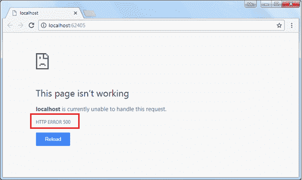
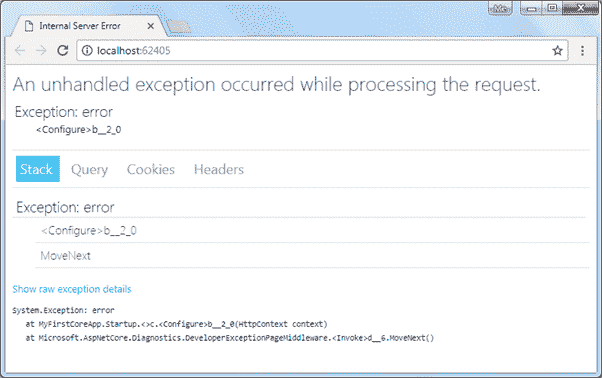
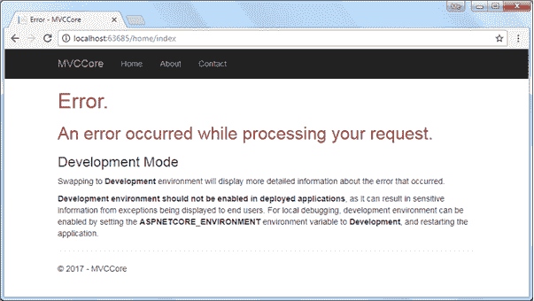

# ASP.NET Core 异常处理

> 原文：<https://www.tutorialsteacher.com/core/aspnet-core-exception-handling>

异常处理是任何应用最重要的特性之一。幸运的是，ASP.NET Core 包含一个中间件，使得异常处理变得容易。在本章中，我们将了解 ASP.NET Core 应用中的异常处理。

默认情况下，ASP.NET Core 会为应用中出现的任何异常返回一个简单的状态代码。考虑以下抛出错误的配置方法示例。

```
public class Startup
{
    public void Configure(IApplicationBuilder app, IHostingEnvironment env)
    {            
        app.Run(context => { throw new Exception("error"); });
    }
} 
```

上述代码将显示以下结果。

[](../../Content/images/core/unhandled-exception-page.png)

## 安装微软。诊断包

为了处理异常和显示用户友好的消息，我们需要安装`Microsoft.AspNetCore.Diagnostics` NuGet 包，并在`Configure()`方法中添加中间件。 如果您正在使用 Visual Studio 模板创建 ASP.NET Core 应用，则该软件包可能已经安装。如果没有，您可以通过 NuGet 管理器添加`Microsoft.AspNetCore.Diagnostics`包。

`Microsoft.AspNetCore.Diagnostics`包包括以下扩展方法，用于处理不同场景下的异常:

1.  UseDeveloperExceptionPage
2.  使用异常句柄

### UseDeveloperExceptionPage

`UseDeveloperExceptionPage`扩展方法将中间件添加到显示开发者友好的异常详细信息页面的请求管道中。这有助于开发人员跟踪开发阶段出现的错误。

由于这个中间件显示敏感信息，建议只在开发环境中添加它。

```
public class Startup
{
    public void Configure(IApplicationBuilder app, IHostingEnvironment env)
    {
        if (env.IsDevelopment() || env.IsStaging())
        {
            app.UseDeveloperExceptionPage();
        }

        app.Run(context => { throw new Exception("error"); });
    }
} 
```

上述代码将显示以下结果。

[](../../Content/images/core/exception.png)

Exception Handling


如上所述，开发人员异常页面包括 4 个选项卡:栈、查询、Cookies 和标题。“栈”选项卡显示栈跟踪的信息，该信息指示错误发生的确切位置。“查询”选项卡显示有关查询字符串的信息。“cookie”选项卡显示由请求设置的 cookie 信息，“标头”选项卡显示标头信息。

### 使用异常句柄

在 MVC Core 应用中，我们可能需要一些其他的控制器来处理所有的异常，并显示自定义的用户友好的错误消息。`UseExceptionHandler`扩展方法允许我们配置自定义错误处理路由。当应用在生产环境下运行时，这很有用。

Example: Exception Handler in MVC 

```
public void Configure(IApplicationBuilder app, IHostingEnvironment env)
{

    if (env.IsDevelopment() || env.IsStaging())
    {
        app.UseDeveloperExceptionPage();
    }
    else 
    {
        app.UseExceptionHandler("/Home/Error");
    }

    //code removed for clarity 
} 
```

在上例中，`UseExceptionHandler("/Home/Error")`设置错误处理程序路径。如果在 MVC 应用中出现错误，那么它将把请求重定向到`/home/error`，它将执行`HomeController`的错误动作方法。

如下所示，在`HomeController`类中创建一个简单的错误动作方法。

HomeController: 

```
public class HomeController : Controller
{
    public HomeController()
    {
    }

    public IActionResult Error()
    {
        return View();
    } 

    // other code removed for the clarity

} 
```

以下是 Error.cshtml 的内容

Error.cshtml 

```
@{
    ViewData["Title"] = "Error";
}

<h1 class="text-danger">Error.</h1>
<h2 class="text-danger">An error occurred while processing your request.</h2>

<h3>Development Mode</h3>
<p>
    Swapping to <strong>Development</strong> environment will display more detailed information about the error that occurred.
</p>
<p>
    <strong>Development environment should not be enabled in deployed applications</strong>, as it can result in sensitive information from exceptions being displayed to end users. For local debugging, development environment can be enabled by setting the <strong>ASPNETCORE_ENVIRONMENT</strong> environment variable to <strong>Development</strong>, and restarting the application.
</p> 
```

现在，当出现错误时，它会显示如下所示的页面。

[](../../Content/images/core/custom-exception-page.png)

Exception Handling


因此，我们可以配置中间件来处理 ASP.NET Core 应用中的异常。

*Note:**Visual Studio automatically creates Error.cshtml under Home folder when you create ASP.NET Core project with MVC template.****