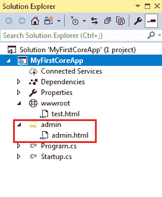

# 从不同于 ASP.NET Core 中 wwwroot 文件夹的文件夹提供静态文件

> 原文：<https://www.tutorialsteacher.com/core/how-to-serve-static-files-from-another-folder-other-than-wwwroot>

您可以配置中间件来提供来自其他文件夹的静态文件以及默认的 web 根文件夹 wwwroot。

例如，我们将从下面的管理文件夹服务器 admin.html，也从 wwwroot 文件夹 test.html。

[](../../Content/images/core/admin.png)

现在，在 Startup 类的 configure()方法中配置 StaticFiles 中间件，如下所示。

Example: Configure StaticFiles Middleware 

```
public class Startup
{
    // This method gets called by the runtime. Use this method to configure the HTTP request pipeline.
    public void Configure(IApplicationBuilder app, IHostingEnvironment env, ILoggerFactory loggerFactory)
    {
        app.UseStaticFiles();

        app.UseStaticFiles(new StaticFileOptions() {
                FileProvider =  new PhysicalFileProvider(Path.Combine(Directory.GetCurrentDirectory(), "Content")),
                RequestPath = new PathString("/Admin")
        });

        app.Run(async (context) =>
        {
            await context.Response.WriteAsync("Hello World!");
        });
    }
} 
```

如您所见，`app.UseStaticFiles()`启用默认的 web 根文件夹 wwwroot 来服务静态文件。

```
app.UseStaticFiles(new StaticFileOptions() {
    FileProvider =  new PhysicalFileProvider(Path.Combine(Directory.GetCurrentDirectory(), "admin")),
    RequestPath = new PathString("/admin")
}); 
```

上面的代码将内容管理文件夹配置为在请求路径/admin 上提供静态文件。所以现在，我们将能够执行 HTTP 请求 HTTP://localhost:1234/admin/admin . html 来显示静态 admin.html 页面。*