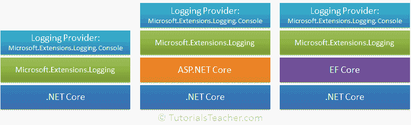
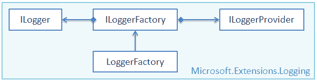
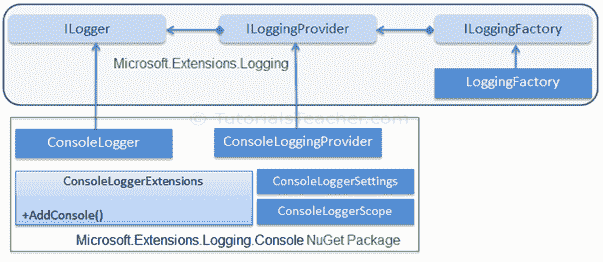
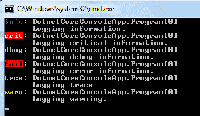

# 登录基础。净核心

> 原文:[https://www . tutorial stearn . com/core/logging-of-in-dotnet-core](https://www.tutorialsteacher.com/core/fundamentals-of-logging-in-dotnet-core)

。NET Core SDK 是一个轻量级的 SDK，它包含了构建应用程序所需的一组最少的功能。我们可以为应用程序所需的其他功能安装 NuGet 包。为此，微软提供了。NET APIs 作为。NET 扩展。

。NET Extensions 是一组开源的、跨平台的 API，用于常用的编程模式和实用程序，如依赖注入、日志记录和应用程序配置。这个项目中的大多数应用编程接口都可以在许多平台上运行。NET 平台，例如。NET Core，。NET 框架、Xamarin 和其他。虽然这些应用程序接口通常用于 ASP.NET 核心应用程序，但并不与 ASP.NET 核心应用程序模型相耦合。它们可以用于控制台应用程序、WinForms 和 WPF 等。您可以在[https://github.com/aspnet/Extensions](https://github.com/aspnet/Extensions)找到扩展的文档和源代码。

所有扩展都包含在`Microsoft.Extensions`名称空间下。您可以在[nuget.org/packages](https://www.nuget.org/packages?q=Microsoft.Extensions)找到所有内置和第三方分机。

日志应用编程接口包含在`Microsoft.Extensions.Logging`包中。日志应用编程接口不能独立工作。它与一个或多个将日志存储或显示到特定介质(如控制台、调试、跟踪侦听器等)的日志提供程序一起工作。

因此，在基于. NET Core 的应用程序中实现日志记录有两个重要的构建块:

1.  日志 API
2.  日志记录提供程序

下图说明了登录。网络核心:

<figure>[](../../Content/images/core/logging-dotnet-core.png) 

<figcaption>.NET Frameworks</figcaption>

</figure>

如上图所示，`Microsoft.Extensions.Logging`中的日志 API 工作在。基于 NET Core 的应用，无论是 ASP.NET Core 还是英孚 Core。您只需要将日志 API 与一个或多个日志提供程序一起使用，就可以在任何。基于. NET 核心的应用程序。

## 日志 API

如前所述，微软在包装[微软中提供了日志 API 作为扩展。扩展。日志](https://docs.microsoft.com/en-us/dotnet/api/microsoft.extensions.logging)作为 NuGet 包提供。

`Microsoft.Extensions.Logging`包括必要的日志记录类和接口。最重要的是 ILogger、ILoggerFactory、ILoggerProvider 接口和 LoggerFactory 类。

下图显示了日志类之间的关系。

<figure>[](../../Content/images/core/logging-api.png) 

<figcaption>Logging API</figcaption>

</figure>

让我们对上面的每一节课都有一个概述。

### ILoggerFactory

`ILoggerFactory`是用于创建合适的`ILogger`类型实例以及添加`ILoggerProvider`实例的工厂界面。

```
public interface ILoggerFactory : IDisposable
{
    ILogger CreateLogger(string categoryName);
    void AddProvider(ILoggerProvider provider);
} 
```

日志应用编程接口包括实现`ILoggerFactory`接口的内置`LoggerFactory`类。我们可以使用它来添加类型为`ILoggerProvider`的实例，并检索指定类别的`ILogger`实例。 更多信息请访问 [ILoggerFactory](https://docs.microsoft.com/en-us/dotnet/api/microsoft.extensions.logging.iloggerfactory) 和 [LoggerFactory](https://docs.microsoft.com/en-us/dotnet/api/microsoft.extensions.logging.loggerfactory) 。

### ILoggerProvider

`ILoggerProvider`管理并创建一个由日志类别指定的合适的日志记录程序。

```
public interface ILoggerProvider : IDisposable
{
    ILogger CreateLogger(string categoryName);
} 
```

我们可以通过实现`ILoggerProvider`接口来创建自己的日志提供者。 更多信息，请访问[iLoggprovider](https://docs.microsoft.com/en-us/dotnet/api/microsoft.extensions.logging.iloggerprovider)。

### 博客作者

`ILogger`接口包括登录底层存储的方法。有许多扩展方法使日志记录变得容易。 访问 [ILogger](https://docs.microsoft.com/en-us/dotnet/api/microsoft.extensions.logging.ilogger) 了解更多信息。

```
public interface ILogger
{
    void Log<TState>(LogLevel logLevel, EventId eventId, TState state, Exception exception, Func<TState, Exception, string> formatter);
    bool IsEnabled(LogLevel logLevel);
    IDisposable BeginScope<TState>(TState state);
} 
```

## 日志记录提供程序

日志记录提供程序将日志显示或存储到特定介质，如控制台、调试事件、事件日志、跟踪侦听器等。微软提供了各种日志提供程序作为 NuGet 包。

下表列出了重要的日志记录提供程序。

| 日志记录提供商的数字获取包 | 输出目标 |
| --- | --- |
| [微软。扩展.日志.控制台](https://www.nuget.org/packages/Microsoft.Extensions.Logging.Console/) | 安慰 |
| [微软。扩展。日志记录。AzureapServices](https://www.nuget.org/packages/Microsoft.Extensions.Logging.AzureAppServices/) | Azure 应用服务“诊断日志”和“日志流”功能 |
| [微软。扩展.记录.调试](https://www.nuget.org/packages/Microsoft.Extensions.Logging.Debug/) | 调试器监视器 |
| [微软。扩展日志事件日志](https://www.nuget.org/packages/Microsoft.Extensions.Logging.EventLog/) | Windows 事件日志 |
| [微软。扩展日志事件源](https://www.nuget.org/packages/Microsoft.Extensions.Logging.EventSource/) | EventSource/EventListener(事件源/事件侦听器) |
| [微软。扩展.日志.追踪源](https://www.nuget.org/packages/Microsoft.Extensions.Logging.TraceSource/) | 跟踪侦听器 |

微软还与各种日志框架团队(包括第三方，如 NLog、Serilog、Loggr、Log4Net 等)合作，扩展与`Microsoft.Extensions.Logging`兼容的提供者列表。 以下是一些第三方日志提供商:

| 日志记录提供程序 | 描述 |
| --- | --- |
| elma。我 | 埃尔马的供应商。Io 服务 |
| [日志](https://github.com/imobile3/Loggr.Extensions.Logging) | 记录器服务的提供者 |
| [【NLG】](https://github.com/NLog/NLog.Extensions.Logging) | NLog 库的提供程序 |
| [串行日志](https://github.com/serilog/serilog-framework-logging) | verilog 库的提供程序 |

让我们用在控制台上显示日志的`Microsoft.Extensions.Logging.Console`包来举一个例子。

## 控制台日志记录提供程序

让我们看看如何使用控制台提供程序的 NuGet 包在控制台上显示日志。

`Microsoft.Extensions.Logging.Console`包包括向控制台发送日志输出的日志类。

下图说明了日志 API 如何与控制台日志提供程序一起工作。

<figure>[](../../Content/images/core/console-logger.png) 

<figcaption>Logging API with Console Logging Provider</figcaption>

</figure>

如上图所示，`ConsoleLogger`执行`ILogger`，而`ConsoleLoggingProvider`执行`ILoggingProvider`。`ConsoleLoggerExtensions`类包括扩展方法`AddConsole()`，它在`LoggerFactory`上增加了一个控制台记录器。

现在，让我们看看如何在控制台上显示日志。NET Core 控制台应用程序。

首先，使用 Console App()创建一个新的控制台应用程序。NET Core)模板。

现在，你需要安装一个`Microsoft.Extensions.Logging`的 NuGet 包。您可以使用“获取包管理器”或在包管理器控制台中执行以下命令来安装它。

<samp>PM> Install-Package Microsoft.Extensions.Logging</samp>

现在，您需要安装您选择的日志记录提供程序。这里，我们将在控制台上发送日志，因此，使用 NPM 安装`Microsoft.Extensions.Logging.Console`包，或者在 Visual Studio 的包管理器控制台中执行以下命令。

<samp>PM> Install-Package Microsoft.Extensions.Logging.Console</samp>

成功安装以上两个包后，您现在可以在。NET Core 控制台应用程序，如下所示。

Example: Logging in .NET Core Console App 

```
namespace DotnetCoreConsoleApp
{
    class Program
    {
        static void Main(string[] args)
        {
            ILoggerFactory loggerFactory = new LoggerFactory(
                            new[] { new ConsoleLoggerProvider((_, __) => true, true) }
                        );
            //or
            //ILoggerFactory loggerFactory = new LoggerFactory().AddConsole();

            ILogger logger = loggerFactory.CreateLogger<Program>();
            logger.LogInformation("This is log message.");
        }
    }
} 
```

Output:<samp>info: DotnetCoreConsoleApp.Program[0]
      This is log message.</samp>

在上面的例子中，我们创建了一个`LoggerFactory`类的对象，并将其分配给`ILoggerFactory`类型变量，如下所示。

```
ILoggerFactory loggerFactory = new LoggerFactory(
    new[] { new ConsoleLoggerProvider ((_, __) => true, true) }
);

```

`LoggerFactory`可以包含一个或多个日志提供者，可用于同时登录多个介质。 的构造函数接受一组不同的记录器提供程序对象作为`new[] { }`。 我们想在控制台上显示日志，所以需要创建一个控制台日志提供者`ConsoleLoggerProvider`的对象。

`ConsoleLoggerProvider`有四个构造器。使用允许 lambda 表达式(Func < >)进行日志过滤，并包含一个操作布尔。 在这里，我们不想过滤任何信息，所以 lambda 表达式将总是返回 true `(_, __) => true`，如下所示。

```
new ConsoleLoggerProvider((_, __) => true, true)

```

然后，我们可以使用`LoggerFactory`的这个对象来创建一个记录器，使用它我们可以记录信息、错误、警告、跟踪、调试等。`loggerFactory.CreateLogger<Program>()`创建一个特定于`Program`类的记录器，以便记录器显示带有上下文信息的消息，例如 DotnetCoreConsoleApp。程序[0]。

大多数日志提供程序都包含`ILoggerFactory`的扩展方法，这是向日志工厂添加提供程序的快捷方式。 例如，要给`LoggerFactory`添加控制台记录器提供程序，只需调用与`ConsoleLoggerProvider`参数相同的`LoggerFactory.AddConsole()`扩展方法，如下所示。

```
public ILoggerFactory loggerFactory = new LoggerFactory().AddConsole(); 
```

这比手动创建记录器提供程序更易读和更易维护。上面的记录器工厂将显示与上面相同的输出。

## 日志级别

日志级别指示日志消息的重要性或严重性。内置日志提供程序包括指示日志级别的扩展方法。

下表列出了中的日志级别。NET 核心。

| 日志级别 | 严重 | 可拓方法 | 描述 |
| --- | --- | --- | --- |
| 微量 | Zero | LogTrace() | 仅为开发人员跟踪目的记录消息。 |
| 调试 | one | 日志调试() | 记录消息用于短期调试。 |
| 信息 | Two | 登录信息() | 记录应用程序流的消息。 |
| 警告 | three | 日志警告() | 记录应用程序流中异常或意外事件的消息。 |
| 错误 | four | LogError() | 记录错误消息。 |
| 批评的 | five | LogCritical() | 记录需要立即关注的故障消息。 |

我们可以使用扩展方法来指示日志消息的级别，如下所示。

```
namespace DotnetCoreConsoleApp
{
    class Program
    {
        static void Main(string[] args)
        {
            ILoggerFactory loggerFactory = new LoggerFactory().AddConsole((_, __) => true);
            ILogger logger = loggerFactory.CreateLogger<Program>();

            logger.LogInformation("Logging information.");
            logger.LogCritical("Logging critical information.");
            logger.LogDebug("Logging debug information.");
            logger.LogError("Logging error information.");
            logger.LogTrace("Logging trace");
            logger.LogWarning("Logging warning.");
        }
    }
} 
```

上面的示例将显示以下输出:

<figure>[](../../Content/images/core/example-output.png) </figure>

登录时访问[。NET Core](https://msdn.microsoft.com/magazine/mt694089) 获取更多详细信息。*