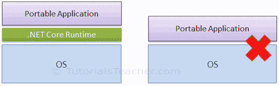
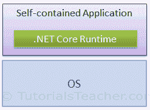

#  .NET Core 应用类型

> 原文：<https://www.tutorialsteacher.com/core/dotnet-core-application-types>

我们可以在 .NET Core。

1.  便携式应用
2.  独立应用

## 便携式应用

便携式应用是期望 .NET Core 运行时。它不能在没有的机器上运行 .NET Core 运行时已安装。

.NET Core Portable Application

## 独立应用

独立应用包括 .NET Core 运行时。它可以在没有的机器上运行 .NET Core 运行时已安装。

.NET Core Self-contained Application

## 配置应用类型

我们可以在 project.json 中使用`Microsoft.NETCore.App`依赖的`type`属性，将 ASP.NET Core 应用配置为可移植或自包含的应用，“类型”:“平台”表示该应用期望 .NET Core 在机器上。这使得它成为一个可移植的应用。

对于独立应用，从依赖项中移除类型平台。这使得它成为一个独立的应用，这意味着 .NET Core 将在您构建和发布应用时包含在内。