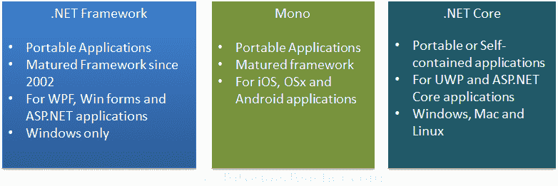
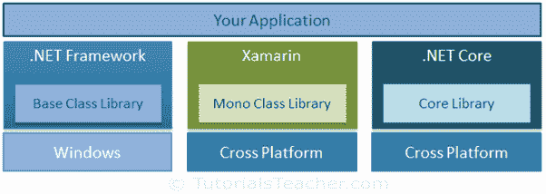

# 中的代码共享。净核心

> 原文：<https://www.tutorialsteacher.com/core/code-sharing-between-dotnet-frameworks>

和。NET Core，我们目前可以用三种不同的。NET 框架，适合不同的平台。传统或标准。NET 框架适用于 Windows，Mono 框架适用于 iOS、OSx 和安卓，并且。适用于 Windows、Mac 和 Linux 的 NET Core。

.NET Frameworks

这些框架使用不同的框架类库。这意味着在一个框架中编写的代码不能与其他框架一起使用。例如，使用开发的控制台应用程序。. NET 框架无法在上运行。NET 核心，反之亦然。因此，不允许代码共享。

一次性编写代码并与其他不同的应用程序共享会很好。NET 框架。不是吗？

Code Sharing

为了解决代码共享的问题，我们可以使用以下三种方法:

1.  创建可移植类库
2.  目标多框架 ASP.NET 核心应用
3.  目标。网络标准

创建可移植类库与其他人共享代码。NET 框架在. NET 中并不是什么新鲜事，在这里了解一下[。](https://docs.microsoft.com/en-us/dotnet/standard/cross-platform/cross-platform-development-with-the-portable-class-library ".NET Core Code Sharing")

在下一章中，了解如何在 ASP.NET 核心应用程序中针对多个框架进行代码共享。