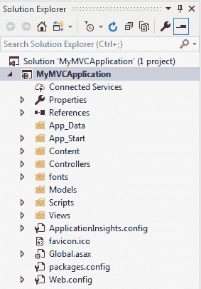
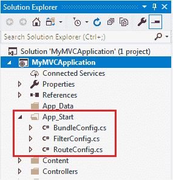
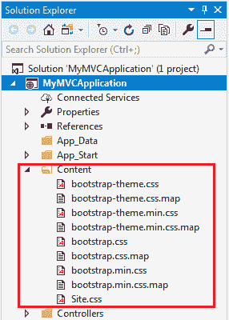
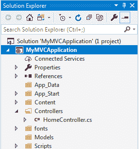
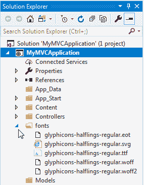
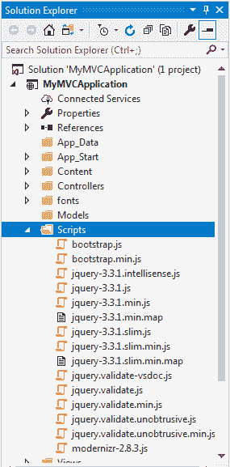
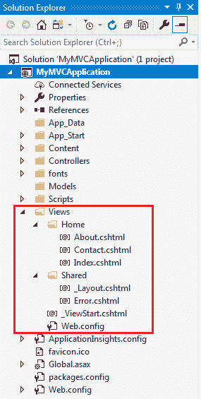

# ASP.NET MVC 文件夹结构

> 原文：<https://www.tutorialsteacher.com/mvc/mvc-folder-structure>

在这里，您将了解 ASP.NET MVC 项目结构。默认情况下，Visual Studio 会创建 ASP.NET MVC 应用程序的以下文件夹结构。

MVC Folder Structure

让我们看看每个文件夹的意义。

### 应用数据

App_Data 文件夹可以包含应用程序数据文件，如 LocalDB、。mdf 文件、XML 文件和其他数据相关文件。IIS 永远不会从 App_Data 文件夹提供文件。

### 应用程序 _ 开始

App_Start 文件夹可以包含应用程序启动时将执行的类文件。通常，这些是配置文件，如 AuthConfig.cs、BundleConfig.cs、FilterConfig.cs、RouteConfig.cs 等。MVC 5 默认包括 BundleConfig.cs、FilterConfig.cs 和 RouteConfig.cs。我们将在后面看到这些文件的意义。

App_Start Folder

### 内容

内容文件夹包含静态文件，如 CSS 文件、图像和图标文件。MVC 5 应用程序默认包括 bootstrap.css、bootstrap.min.css 和 Site.css。

Content Folder

### 控制器

控制器文件夹包含控制器的类文件。A `Controller`处理用户请求并返回响应。MVC 要求所有控制器文件的名称以“控制器”结尾。在下一节中，您将了解控制器。

Controller Folder

### 字体

“字体”文件夹包含应用程序的自定义字体文件。

Fonts folder

### 模型

“模型”文件夹包含模型类文件。通常，模型类包含公共属性，应用程序将使用这些属性来保存和操作应用程序数据。

### 剧本

脚本文件夹包含应用程序的 JavaScript 或 VBScript 文件。默认情况下，MVC 5 包含用于 bootstrap、jquery 1.10 和 modernizer 的 javascript 文件。

Scripts Folder

### 视图

“视图”文件夹包含应用程序的 HTML 文件。通常视图文件是一个. cshtml 文件，您可以在其中编写 html 和 C# 或 VB.NET 代码。

“视图”文件夹包含每个控制器的单独文件夹。例如，所有的。将由 HomeController 呈现的 cshtml 文件将位于视图>主文件夹中。

视图文件夹下的共享文件夹包含不同控制器之间共享的所有视图，例如布局文件。

View Folder

此外，MVC 项目还包括以下配置文件:

### Global.asax

Global.asax 文件允许您编写响应应用程序级事件运行的代码，如 Application_BeginRequest、application_start、application_error、session_start、session_end 等。

### Packages.config

Packages.config 文件由 NuGet 管理，以跟踪您在应用程序中安装了哪些包和版本。

### Web.config

Web.config 文件包含应用程序级配置。

在下一节学习 ASP.NET MVC 框架如何使用路由处理请求。