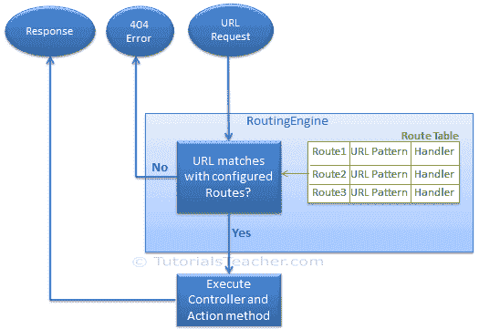
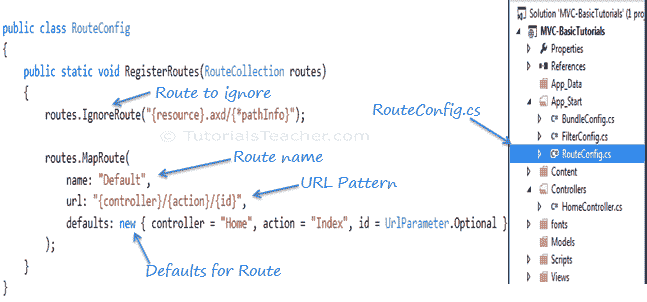
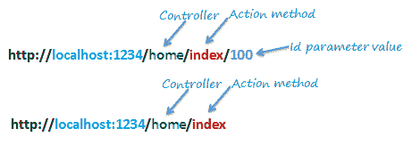
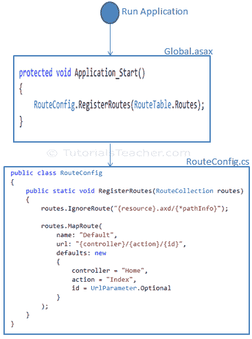

# MVC 中的路由

> 原文：<https://www.tutorialsteacher.com/mvc/routing-in-mvc>

在 ASP.NET 网络表单应用中，每个网址必须与一个特定的匹配。aspx 文件。例如，URL http://domain/student info . aspx 必须与包含用于向浏览器呈现响应的代码和标记的文件 student info . aspx 匹配。

 Routing is not specific to the MVC framework. It can be used with ASP.NET Webform application or MVC application.

ASP.NET 引入了路由，消除了用物理文件映射每个网址的需要。路由使我们能够定义映射到请求处理程序的 URL 模式。该请求处理程序可以是文件或类。在 ASP.NET 网络表单应用中，请求处理程序是。aspx 文件，在 MVC 中，它是 Controller 类和 Action 方法。例如，在 ASP.NET Webforms 中，http://domain/students 可以映射到 http://domain/studentinfo . aspx，在 MVC 中，同样的 URL 可以映射到 Student Controller 和 Index 动作方法。

## 途径

路由定义了网址模式和处理程序信息。应用的所有已配置路由都存储在 RouteTable 中，路由引擎将使用这些路由来为传入的请求确定合适的处理程序类或文件。

下图说明了路由过程。



Routing in MVC


## 配置路由

默认情况下，每个 MVC 应用必须配置(注册)至少一个由 MVC 框架配置的路由。您可以在`RouteConfig`类中注册路由，该类位于`App_Start`文件夹下的`RouteConfig.cs`中。下图说明了如何在`RouteConfig`类中配置路由。



Configure Routes in MVC


从上图可以看到，路由是使用`RouteCollection`的`MapRoute()`扩展方式配置的，其中名称为“默认”，url 模式为`"{controller}/{action}/{id}"`，默认参数为控制器、动作方式和 id 参数。默认值指定如果传入请求 URL 中不存在控制器、动作方法或 id 参数值，则应使用它们。

同样，您可以使用`RouteCollection`类的`MapRoute()`方法配置其他路由。 这个`RouteCollection`其实是 [RouteTable](https://msdn.microsoft.com/en-us/library/system.web.routing.routetable(v=vs.110).aspx) 类的一个属性。

### 网址模式

网址模式仅在网址中的域名部分之后考虑。例如，URL 模式*“{ controller }/{ action }/{ id }”*看起来像 localhost:1234/{ controller }/{ action }/{ id }。“localhost:1234/”之后的任何内容都将被视为控制器名称。同样，控制器名称之后的任何内容都将被视为操作名称，然后是 id 参数的值。



Routing in MVC


如果该网址在域名后不包含任何内容，那么默认控制器和动作方法将处理该请求。例如，`http://localhost:1234`将由默认参数中配置的`HomeController`和`Index()`方法处理。

下表显示了考虑到上述默认路由，哪个控制器、动作方法和标识参数将处理不同的网址。

| 统一资源定位器 | 控制器 | 行动 | 身份 |
| --- | --- | --- | --- |
| http://localhost/home | 家庭控制器 | 索引 | 空 |
| http://localhost/home/index/123 | 家庭控制器 | 索引 | One hundred and twenty-three |
| http://localhost/home/about | 家庭控制器 | 关于 | 空 |
| http://localhost/home/contact | 家庭控制器 | 接触 | 空 |
| http://localhost/student | 学生控制器 | 索引 | 空 |
| http://localhost/student/edit/123 | 学生控制器 | 编辑 | One hundred and twenty-three |

## 多条路由

您也可以使用 MapRoute 扩展方法配置自定义路由。您需要在映射路由中提供至少两个参数，路由名称和网址模式。默认值参数是可选的。

您可以用不同的名称注册多个自定义路由。考虑以下我们注册“学生”路由的示例。

Example: Custom Routes 

```cs
public class RouteConfig
{
    public static void RegisterRoutes(RouteCollection routes)
    {
        routes.IgnoreRoute("{resource}.axd/{*pathInfo}");

        routes.MapRoute(
            name: "Student",
            url: "students/{id}",
            defaults: new { controller = "Student", action = "Index"}
        );

        routes.MapRoute(
            name: "Default",
            url: "{controller}/{action}/{id}",
            defaults: new { controller = "Home", action = "Index", id = UrlParameter.Optional }
        );
    }
} 
```

如上代码所示，`Student`路由的 URL 模式为*学生/{id}* ，指定任何以`domainName/students`开头的 URL 都必须由`StudentController`处理。请注意，我们没有在网址模式中指定`{action}`，因为我们希望每个以学生开头的网址都应该始终使用`StudentController`类的`Index()`动作。我们已经指定了处理任何网址请求的默认控制器和动作，从`domainname/students`开始。

MVC 框架按顺序评估每条路由。它从第一个配置的路由开始，如果传入的 URL 不满足该路由的 URL 模式，那么它将评估第二个路由，以此类推。在上面的例子中，路由引擎将首先评估`Student`路由，如果传入的网址不以`/students`开头，那么它将只考虑第二条路由，即默认路由。

下表显示了不同的网址将如何映射到`Student`路由:

| 统一资源定位器 | 控制器 | 行动 | 身份 |
| --- | --- | --- | --- |
| http://localhost/student/123 | 学生控制器 | 索引 | One hundred and twenty-three |
| http://localhost/student/index/123 | 学生控制器 | 索引 | One hundred and twenty-three |
| http://localhost/student？Id=123 | 学生控制器 | 索引 | One hundred and twenty-three |

## 路由限制

也可以通过配置路径约束对参数值施加限制。例如，以下路由对 id 参数施加了限制，即 id 的值必须是数字。

Example: Route Constraints 

```cs
routes.MapRoute(
        name: "Student",
        url: "student/{id}/{name}/{standardId}",
        defaults: new { controller = "Student", action = "Index", id = UrlParameter.Optional, name = UrlParameter.Optional, standardId = UrlParameter.Optional },
        constraints: new { id = @"\d+" }
    ); 
```

因此，如果您为 id 参数提供非数值，那么该请求将由另一个路由处理，或者，如果没有匹配的路由，那么将抛出`"The resource could not be found"`错误。

## 注册路由

现在，在配置完`RouteConfig`类中的所有路由后，您需要在`Global.asax`的`Application_Start()`事件中注册它，以便它将您的所有路由包含到`RouteTable`中。

Example: Route Registration 

```cs
public class MvcApplication : System.Web.HttpApplication
{
    protected void Application_Start()
    {
        RouteConfig.RegisterRoutes(RouteTable.Routes);
    }
} 
```

下图说明了路由注册过程。



Register Route


因此，路由在 MVC 框架中起着重要的作用。

  Points to Remember :

1.  路由在 MVC 框架中起着重要的作用。路由将 URL 映射到物理文件或类(MVC 中的控制器类)。
2.  路由包含网址模式和处理程序信息。网址模式在域名之后开始。
3.  可以在 RouteConfig 类中配置路由。还可以配置多条自定义路由。
4.  路由约束对参数值施加限制。
5.  路由必须在全局. ascx.cs 文件的 Application_Start 事件中注册。***