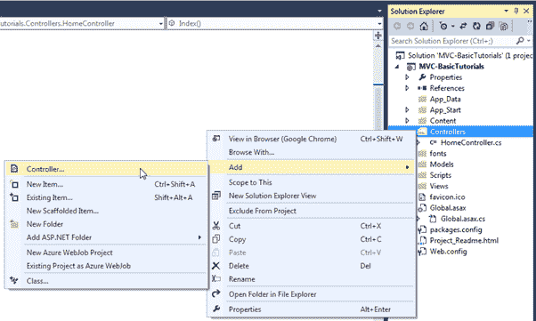
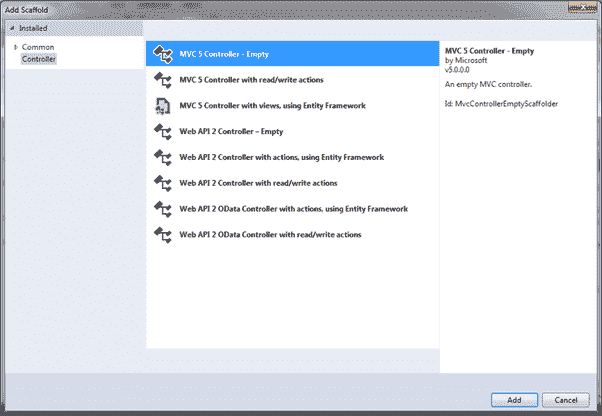
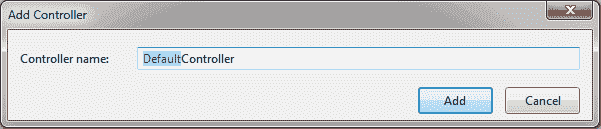
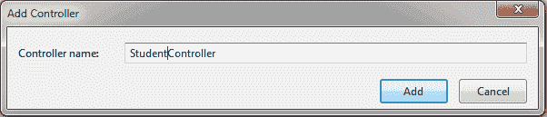
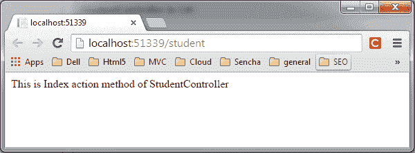

# ASP.NET MVC 中的控制器

> 原文:[https://www.tutorialsteacher.com/mvc/mvc-controller](https://www.tutorialsteacher.com/mvc/mvc-controller)

在本节中，您将了解 ASP.NET MVC 中的控制器。

MVC 架构中的控制器处理任何传入的网址请求。`Controller`是一个类，从基类`System.Web.Mvc.Controller`派生而来。控制器类包含名为**动作**方法的公共方法。控制器及其操作方法处理传入的浏览器请求，检索必要的模型数据并返回适当的响应。

在 ASP.NET MVC 中，每个控制器类名必须以一个单词“controller”结尾。比如首页控制器名称必须是`HomeController`，学生页面必须是`StudentController`。 同样，每个控制器类必须位于 MVC 文件夹结构的`Controller`文件夹中。

## 添加新控制器

现在，让我们在 Visual Studio 的 MVC 应用程序中添加一个新的空控制器。

  MVC will throw "The resource cannot be found" error when you do not append "Controller" to the controller class name.

在前一节中，我们学习了如何创建我们的第一个 MVC 应用程序，它创建了一个默认的`HomeController`。 在这里，我们将创建新的`StudentController`类。

在 Visual Studio 中，右键单击控制器文件夹->选择**添加** - >单击**控制器..**

<figure>[](../../Content/images/mvc/mvc-controller-1.png) 

<figcaption>Add New Controller</figcaption>

</figure>

这将打开“添加支架”对话框，如下所示。

*Note:**Scaffolding is an automatic code generation framework for ASP.NET web applications. Scaffolding reduces the time taken to develop a controller, view, etc. in the MVC framework. You can develop a customized scaffolding template using T4 templates as per your architecture and coding standards.* *<figure>[](../../Content/images/mvc/mvc-controller-2.png) 

<figcaption>Adding Controller</figcaption>

</figure>

添加脚手架对话框包含不同的模板来创建新的`controller`。稍后我们将了解其他模板。现在，选择`"MVC 5 Controller - Empty"`并点击`Add`。将打开`Add Controller`对话框，如下图

<figure>[](../../Content/images/mvc/mvc-controller-3.png) 

<figcaption>Adding Controller</figcaption>

</figure>

在**添加控制器**对话框中，输入控制器的名称。记住，控制器名称必须以`Controller`结尾。 写`StudentController`点击**添加**。

<figure>[](../../Content/images/mvc/mvc-controller-4.png) 

<figcaption>Adding Controller</figcaption>

</figure>

这将在控制器文件夹下的`StudentController.cs`文件中使用`Index()`方法创建`StudentController`类，如下所示。

Example: Controller<button class="copy-btn pull-right" title="Copy example code">*Copy*</button> 

```
using System;
using System.Collections.Generic;
using System.Linq;
using System.Web;
using System.Web.Mvc;

namespace MVC_BasicTutorials.Controllers
{
    public class StudentController : Controller
    {
        // GET: Student
        public ActionResult Index()
        {
            return View();
        }
    }
} 
```

如上图所示，`StudentController`类是从`Controller`类派生出来的。 MVC 中的每一个控制器都必须从这个抽象的`Controller`类中派生出来。这个基础`Controller`类包含可以用于各种目的的辅助方法。

现在，我们将从`StudentController`上方的索引操作方法返回一个伪字符串。将 Index 方法的返回类型从`ActionResult`改为字符串并返回伪字符串如下所示。你将在下一节学习`ActionResult`。

Example: Controller<button class="copy-btn pull-right" title="Copy example code">*Copy*</button> 

```
using System;
using System.Collections.Generic;
using System.Linq;
using System.Web;
using System.Web.Mvc;

namespace MVC_BasicTutorials.Controllers
{
    public class StudentController : Controller
    {
        // GET: Student
        public string Index()
        {
                return "This is Index action method of StudentController";
        }
    }
} 
```

我们已经在路由部分看到，URL 请求`http://localhost/student`或`http://localhost/student/index`由`StudentController`类的`Index()`方法处理，如上所示。 让我们从浏览器中调用它，您将在浏览器中看到以下页面。

<figure>[](../../Content/images/mvc/mvc-controller-5.png) 

<figcaption>Controller</figcaption>

</figure>

  Points to Remember :

1.  控制器处理传入的网址请求。MVC 路由根据 URL 和配置的 Routes 将请求发送到适当的控制器和操作方法。
2.  控制器类中的所有公共方法都称为操作方法。
3.  控制器类必须从系统派生。Web.Mvc.Controller 类。
4.  控制器类名必须以“控制器”结尾。
5.  可以使用不同的脚手架模板创建新的控制器。您也可以创建自定义脚手架模板。***