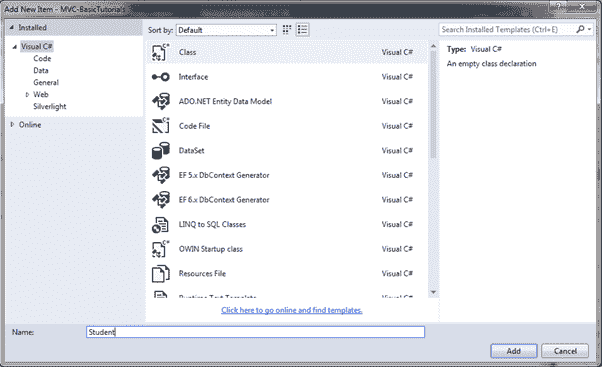

# ASP.NET MVC 中的模型

> 原文:[https://www.tutorialsteacher.com/mvc/mvc-model](https://www.tutorialsteacher.com/mvc/mvc-model)

在本节中，您将了解 ASP.NET MVC 框架中的模型类。

模型类表示 MVC 应用程序中特定于领域的数据和业务逻辑。它将数据的形状表示为公共属性，将业务逻辑表示为方法。

在 ASP.NET MVC 应用程序中，所有的模型类都必须在模型文件夹中创建。

## 添加模型类

让我们创建一个模型类，它应该具有`Student`实体所需的属性。

在 Visual Studio 的 MVC 应用程序中，右键点击`Model`文件夹，选择**添加** - >点击**类..**。 将打开**添加新项目**对话框。

在添加新项目对话框中，输入类名`Student`并点击**添加**。

<figure>[](../../Content/images/mvc/create-model.png)

<figcaption>Create Model Class</figcaption>

</figure>

这将在模型文件夹中添加一个新的`Student`类。 我们希望这个模型类存储学生的 id、姓名和年龄。 所以，我们必须为`Id`、`Name`和`Age`添加公共属性，如下图所示。

Example: Model class 

```
public class Student
{
    public int StudentId { get; set; }
    public string StudentName { get; set;  }
    public int Age { get; set;  }
} 
```

模型类可以在视图中用于填充数据，以及向控制器发送数据。

让我们创建一个视图，并在下一章中使用这个模型。*