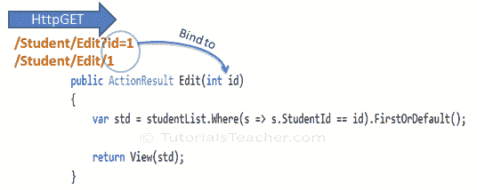
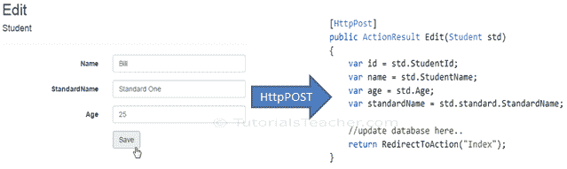
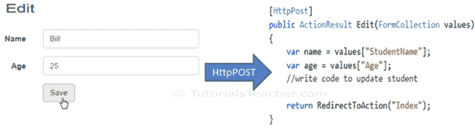
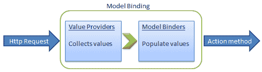

# 在 MVC 中将查询字符串绑定到操作方法参数

> 原文：<https://www.tutorialsteacher.com/mvc/model-binding-in-asp.net-mvc>

在这里，您将了解如何在 ASP.NET MVC 应用程序中将模型对象绑定到动作方法参数。

模型绑定指的是将 HTTP 请求数据(来自查询字符串或表单集合)转换为动作方法参数。这些参数可以是基本类型或复杂类型。

## 绑定到基元类型

HTTP GET 请求将数据嵌入到查询字符串中。MVC 框架自动将查询字符串转换为动作方法参数，前提是它们的名称匹配。例如，以下 GET 请求中的查询字符串`id`将自动映射到`Edit()`动作方法的`id`参数。

[](../../Content/images/mvc/model-binding-1.png)

Model Binding


  This binding is case insensitive. So "id" parameter can be "ID" or "Id".

在具有不同数据类型的操作方法中，也可以有多个参数。查询字符串值将根据匹配的名称转换为参数。

例如，一个 HTTP 请求的查询字符串参数`http://localhost/Student/Edit?id=1&name=John` 将映射到下面的`Edit()`动作方法的`id`和`name`参数。

Example: Convert QueryString to Action Method Parameters 

```
public ActionResult Edit(int id, string name)
{            
    // do something here

    return View();
} 
```

## 绑定到复杂类型

模型绑定也适用于复杂类型。如果属性的名称与视图上的字段匹配，它会自动将视图上的输入字段数据转换为 HttpPost 请求中操作方法的复杂类型参数的属性。

Example: Model classes in C# 

```
public class Student
{
    public int StudentId { get; set; }
    public string StudentName { get; set; }
    public int Age { get; set; }
    public Standard standard { get; set; }
}

public class Standard
{
    public int StandardId { get; set; }
    public string StandardName { get; set; }
} 
```

现在，您可以创建一个包含学生类型参数的操作方法。在以下示例中，编辑操作方法(HttpPost)包括学生类型参数。

Example: Action Method with Class Type Parameter 

```
[HttpPost]
public ActionResult Edit(Student std)
{
    var id = std.StudentId;
    var name = std.StudentName;
    var age = std.Age;
    var standardName = std.standard.StandardName;

    //update database here..

    return RedirectToAction("Index");
} 
```

因此，当表单向`Edit()`动作方法提交 HTTP POST 请求时，MVC 框架会自动将表单集合值映射到 Student 类型参数，如下所示。

[](../../Content/images/mvc/model-class-binding.png)

Model Binding to Complex Type


因此，它自动将表单域绑定到复杂类型的 action 方法参数。

### FormCollection

您也可以在动作方法中包含`FormCollection`类型参数，而不是复杂类型，以从视图表单字段中检索所有值，如下所示。

[](../../Content/images/mvc/formcollection.png)

Model Binding to FormCollection


## 绑定属性

ASP.NET MVC 框架还允许您指定要绑定的模型类的属性。`[Bind]`属性将允许您指定绑定中应包括或排除的模型的确切属性。

在下面的例子中，`Edit()`动作方法将只绑定`StudentId`和`StudentName`模型类的属性。

Example: Binding Parameters 

```
[HttpPost]
public ActionResult Edit([Bind(Include = "StudentId, StudentName")] Student std)
{
    var name = std.StudentName;

    //write code to update student 

    return RedirectToAction("Index");
} 
```

您也可以排除这些属性，如下所示。

Example: Exclude Properties in Binding 

```
[HttpPost]
public ActionResult Edit([Bind(Exclude = "Age")] Student std)
{
    var name = std.StudentName;

    //write code to update student 

    return RedirectToAction("Index");
} 
```

绑定属性将通过只绑定您需要的属性来提高性能。

## 模型绑定过程

正如您所看到的，ASP.NET MVC 框架自动将请求值转换成一个原语或复杂类型的对象。模型绑定是一个两步的过程。首先，它从传入的 HTTP 请求中收集值，其次，它用这些值填充基元类型或复杂类型。

值提供者负责从请求中收集值，模型绑定者负责填充值。

[](../../Content/images/mvc/model-binding-3.png)

Model Binding in ASP.NET MVC


默认值提供程序集合计算来自以下来源的值:

1.  当动作是子动作时，先前绑定的动作参数
2.  表单字段(请求。表单)
3.  JSON 请求正文中的属性值(请求。InputStream)，但仅当请求是 AJAX 请求时
4.  路由数据(路由数据。值)
5.  查询参数(请求。QueryString)
6.  已发布的文件(请求。文件)

MVC 包括 [DefaultModelBinder](https://docs.microsoft.com/en-us/dotnet/api/system.web.mvc.defaultmodelbinder?view=aspnet-mvc-5.2) 类，它有效地绑定了大多数模型类型。*****