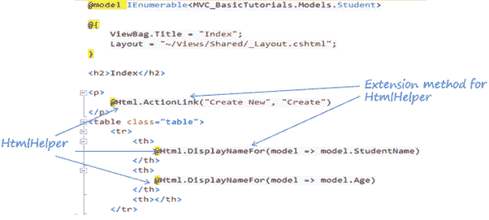

# HTML 助手

> 原文：<https://www.tutorialsteacher.com/mvc/html-helpers>

在这里，您将了解什么是 HTML 助手，以及如何在 razor 视图中使用它们。

`HtmlHelper`类在 Razor 视图中呈现 HTML 控件。 它将模型对象绑定到 HTML 控件，以将模型属性的值显示到这些控件中，并在提交 web 表单时将控件的值分配给模型属性。 所以一定要在 razor 视图中使用`HtmlHelper`类，而不是手动编写 HTML 标签。

下图显示了`HtmlHelper`类在 Razor 视图中的使用。

HTML Helpers

在上图中， **@ Html** 是`HtmlHelper`类的一个对象。 ( @ 符号用于访问 razor 语法中的服务器端对象)。Html 是包含在 razor view `WebViewPage`基类中的`HtmlHelper`类的属性。 `ActionLink()`和`DisplayNameFor()`是包含在`HtmlHelper`类中的扩展方法。

`HtmlHelper`类生成 HTML 元素。例如，`@Html.ActionLink("Create New", "Create")` 会生成锚点标签`<a href="/Student/Create">Create New</a>`。

HtmlHelper 类有很多[扩展方法，创建不同的 HTML 控件。](https://docs.microsoft.com/en-us/previous-versions/aspnet/dd493095(v=vs.118))

下表列出了`HtmlHelper`方法和每个方法呈现的 HTML 控件。

| **延伸法** | **强类型方法** | **Html 控件** |
| --- | --- | --- |
| Html.ActionLink（） | 钠 |  |
| Html.TextBox（） | Html.TextBoxFor() | <input type="textbox"> |
| Html 格式。TextArea() | Html 格式。textareafor() | <input type="textarea"> |
| Html。CheckBox() | Html。CheckBoxFor() | <input type="checkbox"> |
| Html。单选按钮() | Html.RadioButtonFor() | <input type="radio"> |
| Html .下拉列表() | Html.DropDownListFor（） | <select><选项> </选择></select> |
| HTML.ListBox（） | Html.ListBoxFor（） | 多选列表框: |
| Html。隐藏() | Html。HiddenFor() | <input type="hidden"> |
| Html。密码() | Html 格式。PasswordFor() | <input type="password"> |
| Html。显示() | Html 格式。DisplayFor() | HTML 文本:“” |
| Html.label（） | Html.labelFor（） | <label></label> |
| Html。编辑() | Html.EditorFor（） | 根据指定模型属性的数据类型生成 Html 控件，例如，textbox 代表字符串属性，numeric field 代表 int、double 或其他数字类型。 |

调用`HtmlHelper`方法和使用一个 HTML 标签的区别在于`HtmlHelper`方法的设计是为了方便绑定到视图数据或模型数据。

在接下来的几节中学习各种`HtmlHelper`方法。