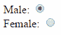

# 在 ASP.NET MVC 中创建单选按钮


在本节中学习如何在 razor 视图中使用`HtmlHelper`生成单选按钮控件。

`HtmlHelper`类包括两个扩展方法来生成 Razor 视图中的`<input type="radio">` HTML 控件:`RadioButtonFor()`和`RadioButton()`。

我们将在本文中使用以下`Student` [模型类](/mvc/mvc-model)。

Example: Student Model 

```cs
public class Student
{
    public int StudentId { get; set; }
    public string StudentName { get; set; }
    public string Gender { get; set; }
} 
```

## Html.RadioButtonFor()

`Html.RadioButtonFor<TModel, TProperty>()`扩展方法是强类型扩展方法。 它为使用 lambda 表达式指定的属性生成`<input type="radio">`控件。

访问 docs.microsoft.com，了解 RadioButtonFor() 的所有[过载。](https://docs.microsoft.com/en-us/dotnet/api/system.web.mvc.html.inputextensions.radiobuttonfor?view=aspnet-mvc-5.2)

Example: Html.RadioButtonFor() in Razor View 

```cs
@model Student

@Html.RadioButtonFor(m => m.Gender,"Male")
@Html.RadioButtonFor(m => m.Gender,"Female") 
```

Html Result:

```cs
<input checked="checked" 
        id="Gender" 
        name="Gender" 
        type="radio" 
        value="Male" />

<input id="Gender" 
        name="Gender" 
        type="radio" 
        value="Female" />
```

在上面的示例中，第一个参数是 lambda 表达式，它指定要与单选按钮控件绑定的模型属性。在上面的例子中，我们为`Gender`属性创建了两个单选按钮。 因此，它生成两个`<input type="RadioButton">`控件，其 id 和名称设置为属性名称`Gender`。 第二个参数是提交表单时发送给服务器的值，这里选择第一个单选按钮将发送`Male`，选择第二个单选按钮将发送`Female`。



## 单选按钮()

`Html.RadioButton()`方法创建一个具有指定名称、isChecked 布尔和 html 属性的单选按钮元素。

访问 docs.microsoft.com，了解 RadioButton()方法的所有[重载。](https://docs.microsoft.com/en-us/dotnet/api/system.web.mvc.html.inputextensions.radiobutton?view=aspnet-mvc-5.2)

Example: Html.RadioButton() in Razor View 

```cs
Male:   @Html.RadioButton("Gender","Male")  
Female: @Html.RadioButton("Gender","Female") 
```

Html Result:

```cs
Male: <input checked="checked" 
        id="Gender" 
        name="Gender" 
        type="radio" 
        value="Male" />

Female: <input id="Gender" 
        name="Gender" 
        type="radio" 
        value="Female" />
```

