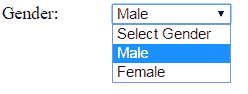

# 在 ASP.NET MVC 中创建下拉列表

> 吴奇珍:t0[https://www . tutorial teacher . com/MVC/html helper-下拉式清单适用于

了解如何在 razor 视图中使用`HtmlHelper`生成 dropdownlist HTML 控件。

[HtmlHelper](https://docs.microsoft.com/en-us/dotnet/api/system.web.mvc.htmlhelper?view=aspnet-mvc-5.2) 类包括两个扩展方法来生成Razor视图中的`<select>`控件:`DropDownListFor()`和`DropDownList()`。

我们将使用以下`Student` [模型类](/mvc/mvc-model)和`Gender`枚举。

Example: Student Model 

```
public class Student
{
    public int StudentId { get; set; }
    public string StudentName { get; set; }
    public Gender StudentGender { get; set; }
}

public enum Gender
{
    Male,
    Female    
} 
```

## Html.DropDownListFor（）

`Html.DropDownListFor<TModel,TProperty>`扩展方法是一种强类型扩展方法，为使用 lambda 表达式指定的属性生成`<select>`元素。

访问 docs.microsoft.com，了解 DropDownListFor 的所有重载方法。

以下示例为上述`StudentGender`属性创建下拉列表。

Example: Html.DropDownListFor() in Razor View 

```
@using MyMVCApp.Models

@model Student

@Html.DropDownListFor(m => m.StudentGender, 
            new SelectList(Enum.GetValues(typeof(Gender))), 
            "Select Gender") 
```

Html Result:

```
<select class="form-control" id="StudentGender" name="StudentGender">
    <option>Select Gender</option> 
    <option>Male</option> 
    <option>Female</option> 
</select>
```

在上例中，`DropDownListFor()`方法中的第一个参数是一个 lambda 表达式，它指定了要与 select 元素绑定的模型属性。 我们已经指定了`StudentGender`属性。第二个参数指定使用`SelectList`对象显示在下拉列表中的项目。第三个参数是可选的，这将是 dropdownlist 的第一项。所以现在它用两个列表项生成`<select>`控件——男&女，如下图。

[](../../Content/images/mvc/htmlhelper-dropdown.png)

## Html .下拉列表()

`Html.DropDownList()`方法生成一个具有指定名称、列表项和 html 属性的`<select>`元素。

访问 docs.microsoft.com，了解 DropDownList()方法的所有[重载。](https://docs.microsoft.com/en-us/dotnet/api/system.web.mvc.html.selectextensions.dropdownlist?view=aspnet-mvc-5.2)

Example: Html.DropDownList() in Razor View 

```
@using MyMVCApp.Models

@model Student

@Html.DropDownList("StudentGender", 
                    new SelectList(Enum.GetValues(typeof(Gender))),
                    "Select Gender",
                    new { @class = "form-control" }) 
```

Html Result:

```
<select class="form-control" id="StudentGender" name="StudentGender">
    <option>Select Gender</option> 
    <option>Male</option> 
    <option>Female</option> 
</select>
```

在上面的例子中，第一个参数是我们想要显示列表项的属性名。第二个参数是要包含在下拉列表中的值列表。我们使用了[枚举](/csharp/csharp-enum)方法来获取`Gender`值。 第三个参数是一个标签，它将是第一个列表项，第四个参数是要在 dropdownlist 上应用的像 CSS 这样的 HTML 属性。***