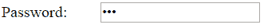

# 在 ASP.Net MVC 中创建密码字段


`HtmlHelper`类包括两种扩展方法来生成 Razor 视图中的密码字段`<input type="password">`元素:`Password()`和`PasswordFor()`。

我们将使用以下带有密码()和密码 For()方法的用户模型。

Example: User Model 

```
public class User
{
    public int UserId { get; set; }
    public string Password { get; set; }
} 
```

## Html 格式。PasswordFor()

`Html.PasswordFor<TModel,TProperty>()`扩展方法是强类型扩展方法。 它为使用 lambda 表达式指定的模型对象属性生成一个`<input type="password">`元素。

访问 docs.microsoft.com，了解 PasswordFor()方法的所有[重载。](https://docs.microsoft.com/en-us/dotnet/api/system.web.mvc.html.inputextensions.passwordfor?view=aspnet-mvc-5.2)

Example: PasswordFor() in Razor View 

```
@model User

@Html.PasswordFor(m => m.Password) 
```

Html Result:

```
<input id="Password" name="Password" type="password" value="" />
```

在上面的例子中，`PasswordFor()`方法中的第一个参数是一个 lambda 表达式，它指定了要与密码文本框绑定的模型属性。 我们已经指定了`Password`属性。它生成以下结果。

[](../../Content/images/mvc/htmlhelper-password.png)

## Html。密码()

`Html.Password()`方法生成具有指定名称、值和 html 属性的输入密码元素。

访问 docs.microsoft.com，了解密码()方法的所有[重载。](https://docs.microsoft.com/en-us/dotnet/api/system.web.mvc.html.inputextensions.password?view=aspnet-mvc-5.2)

Example: Html.Password() in Razor View 

```
@model User

@Html.Password("Password") 
```

Html Result:

```
<input 
        id="Password" 
        name="Password" 
        type="password" 
        value="" />
```

