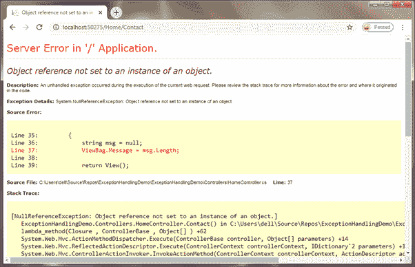
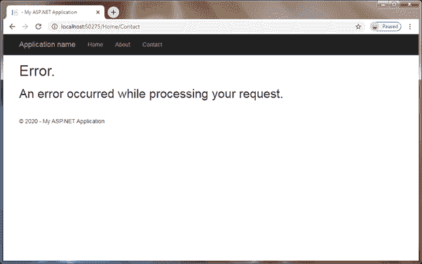

# ASP.NET MVC 中的异常处理

> 原文：<https://www.tutorialsteacher.com/mvc/exception-handling-in-mvc>

在这里，您将学习如何在 ASP.NET MVC 应用中处理异常。

您可以使用 try-catch 块处理动作方法中所有可能的异常。但是，可能存在一些未处理的异常，您希望记录这些异常并向用户显示自定义错误消息或自定义错误页面。

当您在 Visual Studio 中创建一个 MVC 应用时，它不会立即实现任何异常处理技术。发生异常时，它将显示一个错误页面。

例如，考虑以下引发异常的动作方法。

Example: Action Method 

```cs
namespace ExceptionHandlingDemo.Controllers
{
    public class HomeController : Controller
    {
        public ActionResult Contact()
        {
            string msg = null;
            ViewBag.Message = msg.Length; // this will throw an exception

            return View();
        }
} 
```

在浏览器中导航到`/home/contact`，会看到下面的黄页(也叫死亡黄屏)，显示异常类型、发生异常的行号和文件名、栈跟踪等异常详细信息。

[](../../Content/images/mvc/error-page.png)

Default Error Page in MVC


ASP.NET 提供了以下处理异常的方法:

1.  在 web.config 中使用`<customErrors>`元素
2.  使用`HandleErrorAttribute`
3.  覆盖`Controller.OnException`方法
4.  使用 的`Application_Error`事件

## <customerrors>网络配置中的元素</customerrors>

web.config 中`system.web`下的`<customErrors>`元素用于将错误代码配置到自定义页面。它可用于为任何错误代码 4xx 或 5xx 配置自定义页面。但是，它不能用于记录异常或对异常执行任何其他操作。

启用 web.config 中的`<customErrors>`，如下图。

Example: Enable customErrors 

```cs
<system.web> 
    <customErrors mode="On"></customErrors>
</system.web> 
```

您还需要在`FilterConfig.cs`文件中添加`HandleErrorAttribute`过滤器。

Example: Add HandleErrorAttribute Filter 

```cs
public class FilterConfig
{
    public static void RegisterGlobalFilters(GlobalFilterCollection filters)
    {
        filters.Add(new HandleErrorAttribute());
    }
} 
```

将“自定义错误”模式设置为“打开”后，ASP.NET MVC 应用将显示默认的自定义错误页面，如下所示。

[](../../Content/images/mvc/custom-error-page.png)

Custom Error Page


上面的视图是共享文件夹中的 Error.cshtml。它将显示在 500 错误代码上。

`HandleErrorAttribute`过滤器将 Error.cshtml 设置为发生错误时显示的默认视图。

了解更多关于使用 ASP.NET MVC 中的 web.config customErrors 处理异常的信息。

## HandleErrorAttribute

[handleerrortattribute](https://docs.microsoft.com/en-us/dotnet/api/system.web.mvc.handleerrorattribute?view=aspnet-mvc-5.2)是一个属性，可以用来处理动作方法或控制器抛出的异常。您可以使用它来显示动作方法或整个控制器中发生的特定异常的自定义视图。

*Note:**The HandleErrorAttribute attribute can only be used to handle the exception with status code 500\. Also, it does not provide a way to log exceptions.* *为了使用这个属性，你必须在`FilterConfig.RegisterGlobalFilters()`方法和 中添加`HandleErrorAttribute`过滤器，同样，在 web.config 中将模式属性设置为“开”`<customErrors mode="On">`，就像我们在上面的`customErrors`部分所做的那样。

现在，让我们将`[HandleError]`属性应用到动作方法中，如下所示。

Example: HandleErrorAttribute 

```cs
public class HomeController : Controller
{
    [HandleError]
    public ActionResult Contact()
    {
        string msg = null;
        ViewBag.Message = msg.Length;

        return View();
    }
} 
```

以上，我们在`Contact()`动作法上配置了`[HandleError]`属性。 出现异常时，将显示共享文件夹中的 Error.cshtml 视图。`[HandleError]`将错误视图设置为任何异常的默认视图。

`[HandleError]`也可以用来为不同类型的异常配置不同的页面，如下图所示。

Example: Configure Views for Exceptions 

```cs
public class HomeController : Controller
{
    [HandleError]
    [HandleError(ExceptionType =typeof(NullReferenceException), View ="~/Views/Error/NullReference.cshtml")]
    public ActionResult Contact()
    {
        string msg = null;
        ViewBag.Message = msg.Length;

        return View();
    }
} 
```

现在，上面的例子将显示 NullReference.cshtml，因为它抛出`NullReferenceException`。

`[HandleError]`属性范围有限，大多数情况下不建议使用。

## 超越控制器。一种例外方法

处理控制器级异常的另一种方法是覆盖控制器类中的`OnException()`方法。此方法处理所有未处理的错误，错误代码为 500。

它允许您记录异常并重定向到特定视图。不需要启用 web . config 中的`<customErrors>`配置

Example: Handle Exceptions in the Controller 

```cs
public class HomeController : Controller
{
    public ActionResult Contact()
    {
        string msg = null;
        ViewBag.Message = msg.Length;

        return View();
    }

    protected override void OnException(ExceptionContext filterContext)
    {
        filterContext.ExceptionHandled = true;

        //Log the error!!

        //Redirect to action
        filterContext.Result = RedirectToAction("Error", "InternalError");

        // OR return specific view
        filterContext.Result = new ViewResult
        {
            ViewName = "~/Views/Error/InternalError.cshtml"
        };
   }
} 
```

## 使用应用的应用错误事件

记录 MVC 应用任何部分发生的异常的理想方法是在 global.asax 文件中的 Application_Error 事件中处理它。

Example: 

```cs
public class MvcApplication : System.Web.HttpApplication
{
    //other code removed for clarity

    protected void Application_Error()
    {
        var ex = Server.GetLastError();
        //log an exception
    }
} 
```

任何类型的异常和错误代码都会触发`Application_Error`事件。所以，小心处理。

## 建议

在大多数 web 应用中，您应该理想地记录异常，并向用户显示适当的错误消息或页面。因此，建议使用全局`Application_Error`事件记录所有异常，并使用 web.config 中的`<customErrors>`元素将其重定向到适当的页面。

上述异常处理技术将返回带有 200 个状态代码的响应。如果您担心返回特定错误代码作为响应，那么您必须在 web.config 中使用`<httpErrors>`元素。了解[如何在 ASP.NET](/articles/display-custom-error-page-with-error-code-in-aspnet-mvc)显示带有适当错误代码的自定义错误页面。********