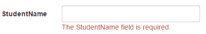

# ASP？ASP？ASP？NET MVC: ValidationMessageFor

> 哎哎哎:# t0]https://www . tutorial connector . com/MVC/html helper-validation message for

`Html.ValidationMessageFor()`是强类型的扩展方法。如果`ModelStateDictionary`对象中的指定字段存在错误，它将显示一条验证消息。

Signature:MvcHtmlString ValidateMessageFor(Expression<Func<dynamic,TProperty>> expression, string validationMessage, object htmlAttributes)

访问 MSDN，了解 ValidationMessageFor()方法的所有[重载。](https://msdn.microsoft.com/en-us/library/system.web.mvc.html.validationextensions.validationmessagefor(v=vs.118).aspx)

下面的`Student`模型类带有`StudentName`上的`Required`验证属性。

Example: Student Model 

```
public class Student
{
    public int StudentId { get; set; }
    [Required]
    public string StudentName { get; set; }
    public int Age { get; set; }
} 
```

以下视图使用`StudentName`的`ValidationMessageFor()`方法。

Example: ValidationMessageFor 

```
@model Student  

@Html.EditorFor(m => m.StudentName) <br />
@Html.ValidationMessageFor(m => m.StudentName, "", new { @class = "text-danger" }) 
```

在上面的例子中，`ValidationMessageFor()`方法中的第一个参数是一个 lambda 表达式，用于指定我们想要显示错误消息的属性。 第二个参数是自定义错误消息(如果有)，第三个参数是 CSS、style 等 HTML 属性。

上面的代码会在你运行的时候生成下面的 HTML。

Html Result: 

```
<input id="StudentName" 
        name="StudentName" 
        type="text" 
        value="" />

<span class="field-validation-valid text-danger" 
        data-valmsg-for="StudentName" 
        data-valmsg-replace="true">
</span> 
```

现在，当用户提交表单而没有输入`StudentName`时，那么 ASP.NET MVC 使用 HTML5 的数据属性进行验证，并且当发生验证错误时将注入默认的验证消息，如下所示。

Html with Validation message: 

```
<span class="field-validation-error text-danger" 
            data-valmsg-for="StudentName" 
            data-valmsg-replace="true">The StudentName field is required.</span> 
```

错误信息将如下图所示。

[](../../Content/images/mvc/validationmessage.png)

## 自定义错误消息

您可以显示自定义错误消息，而不是上面的默认错误消息。您可以在数据注释属性或`ValidationMessageFor()`方法中提供自定义错误消息。

使用数据标注属性的`ErrorMessage`参数提供自己的自定义错误信息，如下图所示。

Example: Custom error message in the Model 

```
public class Student
{
    public int StudentId { get; set; }
    [Required(ErrorMessage="Please enter student name.")]
    public string StudentName { get; set; }
    public int Age { get; set; }
} 
```

您也可以在`ValidationMessage()`方法中指定一条消息作为第二个参数，如下所示。

Example: Custom error message 

```
@model Student  

@Html.Editor("StudentName") <br />
@Html.ValidationMessageFor(m => m.StudentName, "Please enter student name.", new { @class = "text-danger" }) 
```

建议使用`ValidationMessageFor()`而不是`ValidationMessage()`，因为它是强类型的，所以执行速度快，错误概率小。******