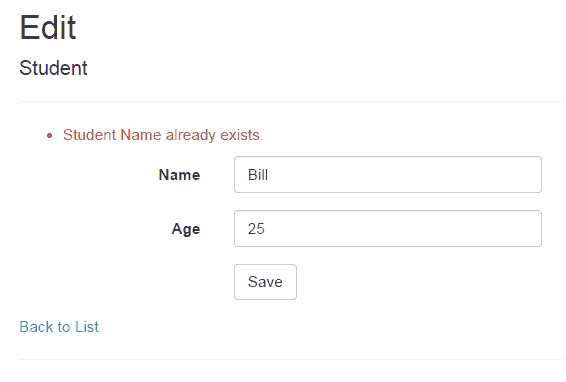

# ASP.NET MVC:验证摘要

> 原文:[https://www . tutorial stearner . com/MVC/html helper-validationsummary](https://www.tutorialsteacher.com/mvc/htmlhelper-validationsummary)

[ValidationSummary()](https://docs.microsoft.com/en-us/dotnet/api/system.web.mvc.html.validationextensions.validationsummary?view=aspnet-mvc-5.2) 扩展方法将网页上所有验证错误的摘要显示为无序列表元素。 也可用于显示自定义错误信息。

`ValidationMessageFor`显示单个字段的错误信息，而`ValidationSummary`显示所有错误信息。

考虑以下具有`Required`和`Range`验证属性的`Student`模型类。

Example: Student Model<button class="copy-btn pull-right" title="Copy example code">*Copy*</button> 

```
public class Student
{
    public int StudentId { get; set; }
    [Required]
    public string StudentName { get; set; }
    [Range(10, 20)]
    public int Age { get; set; }
} 
```

以下视图使用`ValidationSummary()`方法显示所有错误信息。

Example: ValidationMessageFor<button class="copy-btn pull-right" title="Copy example code">*Copy*</button> 

```
@model Student  
@Html.ValidationSummary(false, "", new { @class = "text-danger" })

@Html.HiddenFor(model => model.StudentId)    

@Html.EditorFor(m => m.StudentName) <br />
@Html.EditorFor(m => m.Age) <br /> 
```

上图中`ValidationSummary()`的第一个参数为假，所以会将场级错误显示为汇总。第二个参数用于消息。我们不想在那里提供消息，所以指定一个空字符串。 第三个参数是针对 HTML 属性的，比如消息的 CSS 类。 以上将显示错误信息，如下所示。

<figure>[](../../Content/images/articles/validationsummary-demo.png)</figure>

## 显示自定义错误消息

您也可以使用`ValidationSummary`显示自定义错误信息。

在这里，如果数据库中已经存在学生的名字，我们将显示一条消息。因此，在 HTTP Post 动作方法中，检查数据库中的名称，如果名称已经存在，则在`ModelState`字典中添加错误消息，如下所示。

Example: Edit Action methods:<button class="copy-btn pull-right" title="Copy example code">*Copy*</button> 

```
public class StudentController : Controller
{
    public ActionResult Edit(int id)
    {
        var stud = ... get the data from the DB using Entity Framework

        return View(stud);
    }

    [HttpPost]
    public ActionResult Edit(Student std)
    {
        if (ModelState.IsValid) { //checking model state

            //check whether name is already exists in the database or not
            bool nameAlreadyExists = * check database *       

            if(nameAlreadyExists)
            {
                //adding error message to ModelState
                ModelState.AddModelError("name", "Student Name Already Exists.");

                return View(std);
            }

            return RedirectToAction("Index");
        }

        return View(std);
    }
} 
```

上面，我们使用`ModelState.AddModelError()`方法添加了一个自定义错误消息。 方法将自动显示所有添加到`ModelState`中的错误信息。

<figure>[](../../Content/images/articles/validationsummary-demo2.png)</figure>***