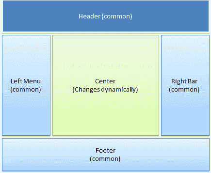
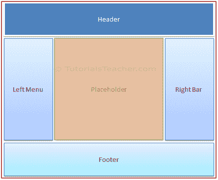
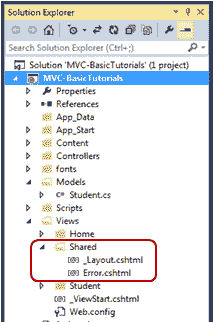
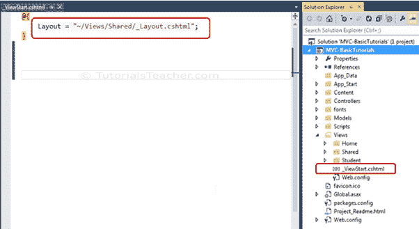
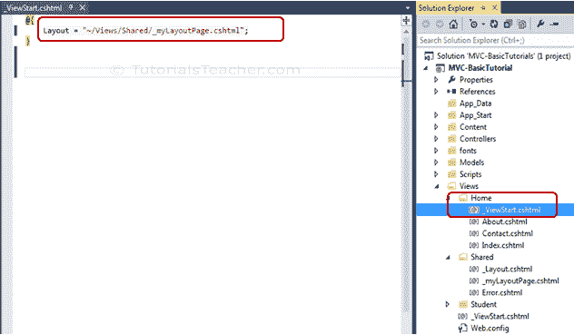
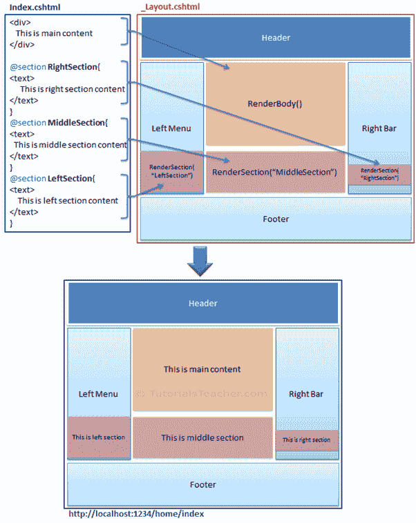

# 什么是 ASP.NET MVC 中的布局视图

> 原文:[https://www . tutorial stearn . com/MVC/layout-view-in-ASP . net-MVC](https://www.tutorialsteacher.com/mvc/layout-view-in-asp.net-mvc)

在本节中，您将了解 ASP.NET MVC 中的布局视图。

应用程序可能包含在整个应用程序中保持不变的特定用户界面部分，如页眉、左侧导航栏、右侧栏或页脚部分。ASP.NET MVC 引入了一个布局视图，它包含了这些常见的用户界面部分，这样我们就不必在每一页中编写相同的代码。布局视图与 ASP.NET web form 应用程序的母版页相同。

例如，应用程序用户界面可能包含页眉、左侧菜单栏、右侧栏和页脚部分，这些部分在每个页面上保持不变。只有中间部分会动态变化，如下所示。

<figure>[](../../Content/images/mvc/layout-view-1.png)

<figcaption>Sample Application UI Parts</figcaption>

</figure>

布局视图允许您定义一个通用的站点模板，该模板可以在多个视图中继承，以在应用程序的多个页面中提供一致的外观。布局视图消除了重复编码，提高了开发速度和易于维护。上述示例用户界面的布局视图将包含页眉、左菜单、右栏和页脚部分。它有一个动态变化的中间部分占位符，如下所示。

<figure>[](../../Content/images/mvc/layout-view-2.png)

<figcaption>Layout View</figcaption>

</figure>

布局视图与其他视图具有相同的扩展名。cshtml 或. vbhtml. Layout 视图与多个视图共享，因此必须存储在`Shared`文件夹中。 默认情况下，当您使用 Visual Studio[创建 MVC 应用程序](/mvc/create-first-asp.net-mvc-application)时，会创建布局视图`_Layout.cshtml`，如下所示。

<figure>[](../../Content/images/mvc/layout-view-3.png)

<figcaption>Layout Views in Shared Folder</figcaption>

</figure>

以下为默认`_Layout.cshtml`。

_Layout.cshtml:<button class="copy-btn pull-right" title="Copy example code">*Copy*</button> 

```
<!DOCTYPE html>
<html>
<head>
    <meta charset="utf-8" />
    <meta name="viewport" content="width=device-width, initial-scale=1.0">
    <title>@ViewBag.Title - My ASP.NET Application</title>
    @Styles.Render("~/Content/css")
    @Scripts.Render("~/bundles/modernizr")
</head>
<body>
    <div class="navbar navbar-inverse navbar-fixed-top">
        <div class="container">
            <div class="navbar-header">
                <button type="button" class="navbar-toggle" data-toggle="collapse" data-target=".navbar-collapse">
                    <span class="icon-bar"></span>
                    <span class="icon-bar"></span>
                    <span class="icon-bar"></span>
                </button>
                @Html.ActionLink("Application name", "Index", "Home", new { area = "" }, new { @class = "navbar-brand" })
            </div>
            <div class="navbar-collapse collapse">
                <ul class="nav navbar-nav">
                    <li>@Html.ActionLink("Home", "Index", "Home")</li>
                    <li>@Html.ActionLink("About", "About", "Home")</li>
                    <li>@Html.ActionLink("Contact", "Contact", "Home")</li>
                </ul>
            </div>
        </div>
    </div>
    <div class="container body-content">
        @RenderBody()
        <hr />
        <footer>
            <p>&copy; @DateTime.Now.Year - My ASP.NET Application</p>
        </footer>
    </div>

    @Scripts.Render("~/bundles/jquery")
    @Scripts.Render("~/bundles/bootstrap")
    @RenderSection("scripts", required: false)
</body>
</html> 
```

如您所见，布局视图包含 HTML Doctype、标题和正文标签。唯一不同的是对`RenderBody()`和`RenderSection()`方法的调用。 调用`RenderBody()`的地方会显示子视图。

## 使用布局视图

将显示在占位符`RenderBody()`中的视图称为子视图。 有多种方法可以指定哪个布局视图将与哪个子视图一起使用。 可以在常用的`_ViewStart.cshtml`中、子视图中或动作方法中指定。

### view state-检视状态

默认的`_ViewStart.cshtml`包含在`Views`文件夹中。 也可以在所有其他`Views`子文件夹中创建。它用于为创建它的文件夹和子文件夹下的所有视图指定通用设置。

将`Layout`属性设置为特定布局视图将适用于该文件夹及其子文件夹下的所有子视图。

例如，**视图**文件夹中的以下`_ViewStart.cshtml`将`Layout`属性设置为`"~/Views/Shared/_Layout.cshtml"`。 因此，`_layout.cshtml`将是包含在`Views`及其子文件夹中的所有视图的布局视图。

<figure>[](../../Content/images/mvc/viewstart.png)

<figcaption>Setting Layout View in _ViewStart.cshtml</figcaption>

</figure>

也可以在`View`文件夹的子文件夹中创建`_ViewStart.cshtml`，为该特定子文件夹中包含的所有视图设置默认布局页面。

例如，`Home`文件夹中的以下`_ViewStart.cshtml`将`Layout`属性设置为`_myLayoutPage.cshtml`。 所以现在，`Index.cshtml`、`About.cshtml`和`Contact.cshtml`将显示在`_myLayoutPage.cshtml`而不是默认的`_Layout.cshml`中。

<figure>[](../../Content/images/mvc/viewstart-home.png)

<figcaption>Layout View in Sub-folders</figcaption>

</figure>

## 在子视图中指定布局视图

您也可以通过在每个子视图中设置`Layout`属性来覆盖`_ViewStart.cshtml`的默认布局视图设置。 例如下面的`Index.cshtml`视图使用`_myLayoutPage.cshtml`即使`_ViewStart.cshtml`设置了`_Layout.cshtml`。

Index.cshtml<button class="copy-btn pull-right" title="Copy example code">*Copy*</button> 

```
@{
    ViewBag.Title = "Home Page";
    Layout = "~/Views/Shared/_myLayoutPage.cshtml";
}

<div class="jumbotron">
    <h1>ASP.NET</h1>
    <p class="lead">ASP.NET is a free web framework for building great Web sites and Web applications using HTML, CSS and JavaScript.</p>
    <p><a href="http://asp.net" class="btn btn-primary btn-lg">Learn more &raquo;</a></p>
</div>

<div class="row">
    <div class="col-md-4">
        <h2>Getting started</h2>
        <p>
            ASP.NET MVC gives you a powerful, patterns-based way to build dynamic websites that
            enables a clean separation of concerns and gives you full control over markup
            for enjoyable, agile development.
        </p>
        <p><a class="btn btn-default" href="http://go.microsoft.com/fwlink/?LinkId=301865">Learn more &raquo;</a></p>
    </div>
    <div class="col-md-4">
        <h2>Get more libraries</h2>
        <p>NuGet is a free Visual Studio extension that makes it easy to add, remove, and update libraries and tools in Visual Studio projects.</p>
        <p><a class="btn btn-default" href="http://go.microsoft.com/fwlink/?LinkId=301866">Learn more &raquo;</a></p>
    </div>
    <div class="col-md-4">
        <h2>Web Hosting</h2>
        <p>You can easily find a web hosting company that offers the right mix of features and price for your applications.</p>
        <p><a class="btn btn-default" href="http://go.microsoft.com/fwlink/?LinkId=301867">Learn more &raquo;</a></p>
    </div>
</div> 
```

## 在操作方法中指定布局页面

在`View()`方法中指定布局视图名称作为第二个参数，如下所示。默认情况下，布局视图将在`Shared`文件夹中搜索。

Example: Specify Layout View in Action Method<button class="copy-btn pull-right" title="Copy example code">*Copy*</button> 

```
public class HomeController : Controller
{
    public ActionResult Index()
    {
        return View("Index", "_myLayoutPage"); //set "_myLayoutView" as layout view
    }
} 
```

## 渲染方法

ASP.NET MVC 布局视图使用以下方法呈现子视图。

| 方法 | 描述 |
| --- | --- |
| RenderBody() | 呈现子视图中不在命名节内的部分。布局视图必须包括`RenderBody()`方法。 |
| 渲染部分(字符串名称) | 呈现命名节的内容，并指定该节是否是必需的。 |

下图说明了`RenderBody()`和`RenderSection()`方法的使用。

<figure>[](../../Content/images/mvc/layout-view-rendering.png)

<figcaption>Rendering Methods</figcaption>

</figure>

如上图所示，`_Layout.cshtml`包括`RenderBody()`法和`RenderSection()`法。 以上，`Index.cshtml`包含使用`@section`命名的部分，其中每个部分的名称与布局视图`_Layout.cshtml`的`RenderSection()`方法中指定的名称相匹配，例如`@Section RightSection`。 在运行时，`Index.cshtml`的命名部分，如`LeftSection`、`RightSection`、`MiddleSection`将在调用`RenderSection()`方法的适当位置呈现。 不在任何指定部分中的`Index.cshtml`视图的其余部分将在调用`RenderBody()`时呈现。

让我们在下一节创建一个新的布局视图来理解上面的渲染方法。

了解渲染主体和渲染部分方法之间的[差异。](/articles/difference-between-renderbody-and-rendersection-mvc)***