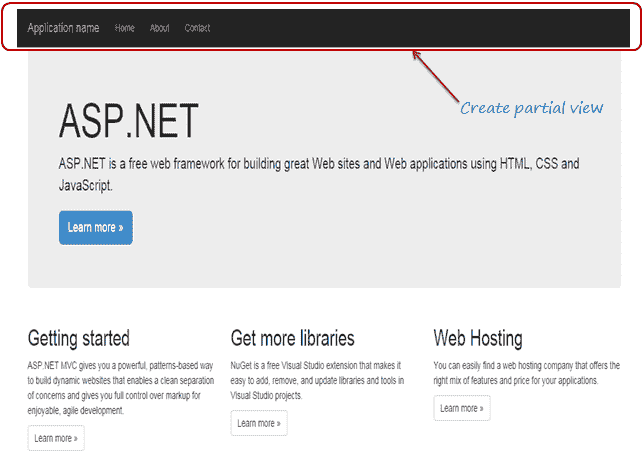
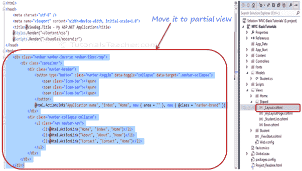
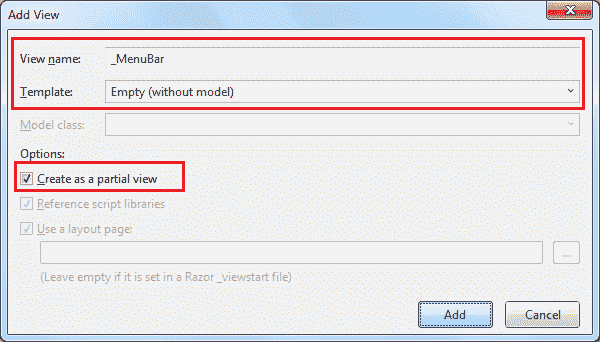
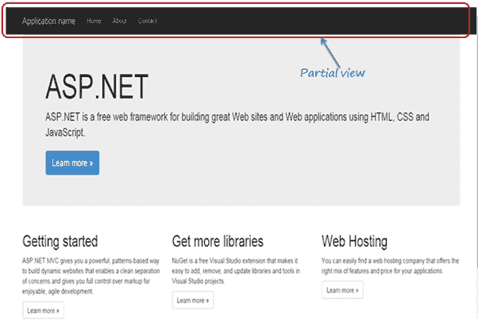

# 创建和渲染局部视图

> 原文：<https://www.tutorialsteacher.com/mvc/partial-view-in-asp.net-mvc>

在这里，您将了解什么是局部视图，以及如何在 ASP.NET MVC 应用中使用它。

部分视图是网页的可重用部分。包含 HTML 代码的是`.cshtml`或`.vbhtml`文件。 可用于一个或多个[视图](/mvc/mvc-view)或[布局视图](/mvc/layout-view-in-asp.net-mvc)。 可以在多个地方使用同一个局部视图，消除多余的代码。

让我们为下面的菜单创建一个局部视图，这样我们就可以在多个[布局视图](/mvc/layout-view-in-asp.net-mvc)中使用同一个菜单，而不用到处重写相同的代码。

[](../../Content/images/mvc/partial-view-1.png) 

Partial View


我们之前创建了我们的第一个 MVC 应用。打开`_Layout.cshtml`文件，你会看到上面菜单栏的如下 HTML 代码。 我们将在单独的局部视图中剪切并粘贴该代码。

[](../../Content/images/mvc/partial-view-2.png) 

Partial Views


## 创建新的局部视图

要创建局部视图，右键单击`Shared`文件夹- >单击**添加** - >单击**视图..**打开添加视图弹出窗口，如下图所示。

您可以在任何`View`文件夹中创建局部视图。但是，建议您在`Shared`文件夹中创建所有部分视图，以便它们可以在多个视图中使用。

[](../../Content/images/mvc/add-partial-view.png) 

Add Partial View


在`Add New Item`弹出窗口中，输入局部视图名称，选择“创建为局部视图”复选框。 我们不需要在这个局部视图中使用任何模型，所以保持模板下拉列表为空(没有模型)，然后点击**添加**按钮。这将在`Shared`文件夹中创建一个空的局部视图。

您现在可以为导航栏剪切上述代码并粘贴到`_MenuBar.cshtml`中，如下所示:

_MenuBar.cshtml 

```
<div class="navbar navbar-inverse navbar-fixed-top">
    <div class="container">
        <div class="navbar-header">
            <button type="button" class="navbar-toggle" data-toggle="collapse" data-target=".navbar-collapse">
                <span class="icon-bar"></span>
                <span class="icon-bar"></span>
                <span class="icon-bar"></span>
            </button>
            @Html.ActionLink("Application name", "Index", "Home", new { area = "" }, new { @class = "navbar-brand" })
        </div>
        <div class="navbar-collapse collapse">
            <ul class="nav navbar-nav">
                <li>@Html.ActionLink("Home", "Index", "Home")</li>
                <li>@Html.ActionLink("About", "About", "Home")</li>
                <li>@Html.ActionLink("Contact", "Contact", "Home")</li>
            </ul>
        </div>
    </div>
</div>
```

因此，您可以创建新的局部视图。让我们看看如何渲染局部视图。

## 渲染局部视图

您可以使用 HTML 帮助器方法在父视图中渲染局部视图:`@html.Partial()`、`@html.RenderPartial()`和`@html.RenderAction()`。

## Html。部分()

`@Html.Partial()`方法渲染指定的局部视图。它接受部分视图名称作为字符串参数，并返回`MvcHtmlString`。 它返回一个 HTML 字符串，所以你有机会在渲染前修改 HTML。

访问 docs.microsoft.com，了解 Partial() 方法的[重载。](https://docs.microsoft.com/en-us/dotnet/api/system.web.mvc.html.partialextensions.partial?view=aspnet-mvc-5.2#overloads)

现在，使用`@html.Partial("_MenuBar")`将`_MenuBar`局部视图包含在`_Layout.cshtml`中，如下图所示。

_MenuBar 

```
<!DOCTYPE html>
<html>
<head>
    <meta charset="utf-8" />
    <meta name="viewport" content="width=device-width, initial-scale=1.0">
    <title>@ViewBag.Title - My ASP.NET Application</title>
    @Styles.Render("~/Content/css") 
    @Scripts.Render("~/bundles/modernizr")
</head>
<body>

    @Html.Partial("_MenuBar")

    @* you can modify result as below   *@
    @* var result = Html.Partial("_MenuBar") *@
    <div class="container body-content">
        @RenderBody()
        <hr />
        <footer>
            <p>&copy; @DateTime.Now.Year - My ASP.NET Application</p>
        </footer>
    </div>
    @Scripts.Render("~/bundles/jquery")
    @Scripts.Render("~/bundles/bootstrap")
    @RenderSection("scripts", required: false)
</body>
</html>
```

## Html。RenderPartial()

`@html.RenderPartial()`方法与`@html.Partial()`方法相同，只是它将指定部分视图的结果 HTML 直接写入 HTTP 响应流。所以，你可以在渲染前修改它的 HTML。

访问 docs.microsoft.com，了解 RenderPartial() 方法的[重载。](https://docs.microsoft.com/en-us/dotnet/api/system.web.mvc.html.renderpartialextensions?view=aspnet-mvc-5.2#methods)

Example: Html.RenderPartial() 

```
<!DOCTYPE html>
<html>
<head>
    <meta charset="utf-8" />
    <meta name="viewport" content="width=device-width, initial-scale=1.0">
    <title>@ViewBag.Title - My ASP.NET Application</title>
    @Styles.Render("~/Content/css") 
    @Scripts.Render("~/bundles/modernizr")
</head>
<body>
    @{
    **Html.RenderPartial("_MenuBar");** 
    }
    <div class="container body-content">
        @RenderBody()
        <hr />
        <footer>
            <p>&copy; @DateTime.Now.Year - My ASP.NET Application</p>
        </footer>
    </div>
        @Scripts.Render("~/bundles/jquery")
        @Scripts.Render("~/bundles/bootstrap")
        @RenderSection("scripts", required: false)
</body>
</html>
```

`RenderPartial()`方法返回 void，所以末尾需要分号，所以必须括在`@{ }`内。

## Html。RenderAction()

`@html.RenderAction()`方法执行指定的动作方法并渲染结果。指定的动作方法必须标记`[ChildActionOnly]`属性，并使用`PartialView()`方法返回`PartialViewResult`。

访问 docs.microsoft.com，了解 RenderAction() 方法的[重载。](https://docs.microsoft.com/en-us/dotnet/api/system.web.mvc.html.childactionextensions.renderaction?view=aspnet-mvc-5.2#overloads)

要使用`RenderAction()`方法渲染局部视图，首先创建一个 HttpGet 动作方法，并应用如下所示的`ChildActionOnly`属性。

Example: Action Method Parameters 

```
public class HomeController : Controller
{
    [ChildActionOnly]
    public ActionResult RenderMenu()
    {
        return PartialView("_MenuBar");
    }
} 
```

现在，在布局视图中调用`html.RenderAction("RenderMenu", "Home")`，如下图所示。

Example: Html.RenderPartial() 

```
<!DOCTYPE html>
<html>
<head>
    <meta charset="utf-8" />
    <meta name="viewport" content="width=device-width, initial-scale=1.0">
    <title>@ViewBag.Title - My ASP.NET Application</title>
    @Styles.Render("~/Content/css") 
    @Scripts.Render("~/bundles/modernizr")
</head>
<body>
    @{
        Html.RenderAction("RenderMenu", "Home"); 
    }
    <div class="container body-content">
        @RenderBody()
        <hr />
        <footer>
            <p>&copy; @DateTime.Now.Year - My ASP.NET Application</p>
        </footer>
    </div>
        @Scripts.Render("~/bundles/jquery")
        @Scripts.Render("~/bundles/bootstrap")
        @RenderSection("scripts", required: false)
</body>
</html>
```

无论使用何种渲染方法，您都将在浏览器中看到以下结果。

[](../../Content/images/mvc/partial-view-5.png) 

这样，您可以在 ASP.NET MVC 应用中为网页的不同部分创建一个局部视图。

学习【html 之间的区别。部分和 Html。渲染部分。*****